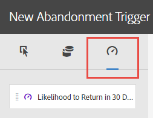

# Triggers

## Información general sobre Triggers {#topic_4F21FCE9A64E46E8B6D51F494FA652A7}

*Triggers* le permite identificar, definir y supervisar los comportamientos clave de los clientes y generar comunicación entre las varias soluciones para volver a atraer visitantes. Puede usar Triggers en las decisiones en tiempo real y la personalización.

* Configurar remarketing rápido para abandonos del carrito, con o sin productos eliminados
* Formularios y solicitudes incompletos
* Cualquier acción o secuencia de acciones en el sitio

**Tipos de Triggers**

Generalmente, un Trigger (activador) puede tardar entre 15 y 90 minutos en iniciar una campaña de marketing. Esto varía según la implementación de la recopilación de datos, la carga en el canal, la configuración personalizada del Trigger definido y el flujo de trabajo en Adobe Campaign.

* **Abandono:** puede crear un Trigger que se desencadene cuando un visitante vea un producto, pero no agregue nada al carro de compra. Configure la [Puntuación de tendencia](../activation/triggers.md#concept_A506150674AD45DB98D3CC07E560D334) para comprender la tendencia de los clientes después de abandonar un carro de compras.
* **Acción:** puede crear Triggers, por ejemplo, para que se desencadenen después de que los usuarios se suscriban a un boletín, de una suscripción por correo electrónico o cuando se soliciten tarjetas de crédito (confirmaciones). Si tiene un comercio minorista, puede crear un Trigger para visitantes que se suscriben a un programa de fidelidad. Si se dedica al sector de los medios de comunicación y el entretenimiento, cree Triggers para visitantes que vean un determinado programa y que podrían estar interesados en responder a una encuesta.
* **Inicio y fin de sesión:** cree un Trigger para los eventos de inicio y fin de sesión.

## Crear un Trigger de Experience Cloud {#task_821F37183AC045E5AC8EED20317598FE}

Cree un Trigger de abandono y configure las condiciones del activador y de la puntuación de tendencia. Por ejemplo, puede especificar los criterios de las reglas de un Trigger durante una visita, por ejemplo, métricas como Abandonos del carro de compras, o dimensiones como el nombre del producto. Cuando se cumplen las reglas, se ejecuta el Trigger.

<!-- t_create-trigger.xml -->

>[!NOTE]
>
>Actualmente, existe un límite técnico de 100 Triggers.

1. En Experience Cloud, haga clic en  y, a continuación, en **[!UICONTROL Activation]**.
1. Localice la tarjeta [!UICONTROL Triggers] y después haga clic en **[!UICONTROL Launch]**.

   

1. Haga clic en **[!UICONTROL Nuevo Trigger]** y después especifique el tipo de Trigger:

   

1. Configure el Trigger rellenando los siguientes campos y arrastrando métricas y dimensiones a los contenedores de la regla:

   | Elemento | Descripción |
   |--- |--- |
   | Nombre | Nombre alternativo de este Trigger. |
   | Descripción | Descripción de este Trigger, el uso que le dará, etc. |
   | Report Suite | El [grupo de informes](https://marketing.adobe.com/resources/help/en_US/analytics/getting-started/report-suites.html) de Analytics utilizado para este activador. Este ajuste identifica los datos de informes que se van a utilizar. |
   | Visit must include La visita no debe incluir un Trigger sin una acción posterior Incluir metadatos | Puede definir criterios o comportamientos de los visitantes que quiera que se produzcan, así como comportamientos que no quiere que tengan lugar.  Por ejemplo, las reglas de un Trigger sencillo de abandono del carro de compras podrían ser:<ul><li>La visita debe incluir: Adición al carro (métrica) y Existe. (Puede acotar aún más la regla con una vista de producto específica o con dimensiones como Tipos de explorador).</li><li>La visita no debe incluir: Cierre de compra.</li><li>Activar tras no realizar una acción durante: 10 minutos.</li><li>Include Meta Data: le permite agregar una dimensión de Campaign determinada o variables que resultan relevantes para el comportamiento de un visitante. Este campo puede resultar útil para que Adobe Campaign cree el mensaje de correo electrónico adecuado para remarketing.</li></ul> Puede especificar una lógica Cualquiera (Any), Y (And) u O (Or) entre contenedores, según los criterios que determine para la regla. |
   | Contenedor | Los contenedores se encuentran en el lugar donde se establecen y almacenan las reglas, condiciones o filtros que definen un Trigger. Si quiere que haya eventos que tengan lugar al mismo tiempo, póngalos en el mismo contenedor. De este modo, cada contenedor procesa de forma independiente a nivel de visita.  Por ejemplo, si tiene dos contenedores unidos por el operador Y, puede esperar que se activen las reglas cuando dos visitas cumplan los requisitos. |
   | Iniciar nueva sesión después de | Cree un Trigger para los eventos de inicio y fin de sesión. |

1. (Opcional) En los Triggers de abandono, puede aplicar [Puntuación de tendencia](../activation/triggers.md#concept_A506150674AD45DB98D3CC07E560D334).

   

1. Haga clic en **[!UICONTROL Guardar]**.
1. Use triggers for [real-time remarketing](https://docs.campaign.adobe.com/doc/standard/en/EMA_Transactional_messaging_Marketing_Cloud_Triggers.html) in [!DNL Adobe Campaign].

### Ejemplos de Triggers

**Trigger de abandono del carro de compras**

Por ejemplo, en la siguiente página se muestran reglas que podría usar para un Trigger de abandono del carro de compras en función de los productos que se han visto durante una visita.

**Trigger referente**

El siguiente Trigger se dispara cuando se produce una visita con el producto Botas para hombres y el referente de Facebook. Para que los dos criterios (  *productos* y *remitente del reenvío*) se evalúen en la misma visita, se deben agregar al mismo contenedor.

## Puntuación de tendencia {#concept_A506150674AD45DB98D3CC07E560D334}

<!-- propensity-scoring.xml -->

Comprenda la tendencia de los clientes a regresar después de haber abandonado un carro de compras. La puntuación de tendencia está integrada en Experience Cloud Triggers y se encuentra disponible para los Triggers de abandono.

Por ejemplo, algunos clientes abandonan los carros de compras para aprovechar los incentivos que reciben por correo electrónico para regresar al carro de compras. Para reducir la pérdida de ingresos, el algoritmo de Puntuación de tendencia ayuda a identificar a los usuarios relevantes que abandonan los carros de compras y probablemente no regresarían de no ser por el incentivo.

Puede:

* Evitar la sobreexposición de los clientes al remarketing.
* Identificar a los usuarios adecuados que abandonaron el carro de compras y asignar su actividad al mensaje adecuado.
* Aumentar los ingresos determinando qué clientes regresarán y cuáles no.

## El valor de la puntuación de tendencia  {#section_CA99874A25434CC0BF01D0DA61608889}

Puede realizar una búsqueda de datos para identificar comportamientos o patrones ocultos en los datos. En concreto, la puntuación de tendencia le ayuda a identificar grupos de clientes similares que utilizan medios más específicos y objetivos en lugar de una segmentación o filtrado sencillos. Además, la puntuación de tendencia le permite crear funciones de predicción para identificar el comportamiento de clientes de gran valor para su empresa.

Una vez identificada una audiencia de gran valor, puede motivarla a participar para conseguir el máximo efecto. Por ejemplo, si su empresa presta servicios a otras empresas, podría tener posibles clientes a los que realizar llamadas comerciales para, posteriormente, puntuar a dichos posibles clientes e identificar la probabilidad de convertir sin conexión. Dado que todos los posibles clientes generan un aumento de costes, crear un incentivo para identificar a los clientes potenciales que muestran la mayor probabilidad de convertir una venta es la forma más eficaz y económica de concentrar sus recursos.

La puntuación de tendencia permite identificar los factores más importantes a la hora de predecir una puntuación concreta o aumentar la probabilidad de que se produzca un evento, pero también se puede aplicar para responder a preguntas específicas:

* ¿El cliente va a realizar una conversión?
* ¿El cliente va a responder a un correo electrónico?
* ¿El cliente va a volver a comprar?

La puntuación de tendencia le permite responder a estas preguntas e identificar a aquellos visitantes que muestren una inclinación a realizar una acción que posteriormente se podrá elaborar y puntuar.
