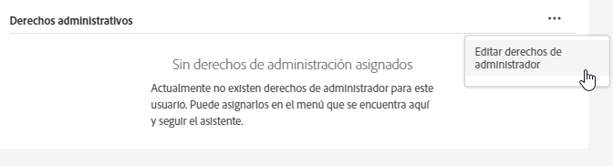

# Administración de usuarios y productos de Experience Cloud

Obtenga más información sobre el inicio de sesión en Admin Console y la administración de permisos de usuarios, perfiles de producto y compatibilidad de exploradores en Experience Cloud.

>[!IMPORTANT]
>
>La siguiente información está diseñada específicamente para aplicaciones de Experience Cloud. Esta información complementa la información administrativa más general de la [Guía del usuario de administración de Enterprise](https://helpx.adobe.com/es/enterprise/admin-guide.html) para todos los productos en la nube de Adobe.

Puede ver una lista, que puede ordenarse y filtrarse, de todos los usuarios de Experience Cloud y sus detalles en la herramienta de administración. Consulte [Vista de los usuarios de Experience Cloud en la herramienta de administración](admin-tool-experience-cloud.md).

## ¿Qué es un perfil de producto? {#section_AB50558124D541CF80A0D3D76D35A4BF}

Los [!UICONTROL perfiles de producto] son grupos de productos y servicios que puede asignar a los usuarios. En Experience Cloud, los permisos se basan en el perfil de un producto, no en el usuario. (Sin embargo, puede delegar derechos administrativos a usuarios específicos).

Por ejemplo, en Analytics puede configurar una colección de herramientas de creación de informes, como Analysis Workspace y Report Builder, además de grupos de informes, métricas y dimensiones. Puede dar permiso a los usuarios para acceder a un perfil de producto añadiéndolos a este.

* Consulte [Asignar permisos de acceso de Analytics a un perfil de producto](admin-getting-started.md#task_040673FE3E3E429B9531FBCB8B6A4391) en esta página.
* Consulte [Delegación de funciones administrativas en usuarios](#delegate-rights) en esta página

## Administración de perfiles de producto de Experience Cloud {#task_16335111C52D40E9BAC73D0699584DBF}

Puede crear un perfil de producto y asignarlo a un grupo de permisos.

Al invitar a un usuario a una organización, puede darle acceso a productos y perfiles de productos. También puede delegar permisos administrativos limitados en un usuario. Del mismo modo, puede crear grupos de usuarios y luego agregar el grupo a un perfil de productos para habilitar el acceso.

1. En [Admin Console](https://adminconsole.adobe.com/enterprise/), haga clic en **[!UICONTROL Productos]**.
1. Haga clic en el nombre de su organización.
1. Haga clic en **[!UICONTROL Nuevo perfil]**.
1. Configure los detalles del perfil y, después, haga clic en **[!UICONTROL Guardar]**.

Para obtener más información (y ayuda sobre la administración de productos de Creative Cloud y Document Cloud), consulte [Identidad](https://helpx.adobe.com/es/enterprise/admin-guide.html/es/enterprise/using/identity.ug.html) en la [Guía del usuario de administración](https://helpx.adobe.com/es/enterprise/admin-guide.html/es/enterprise/using/users.ug.html).

**Ayuda relacionada**

* [Administre productos y perfiles](https://helpx.adobe.com/es/enterprise/admin-guide.html/es/enterprise/using/manage-products.ug.html) en la Guía del usuario de administración.
* [Permisos de usuario de Enterprise](https://experienceleague.adobe.com/docs/target/using/administer/manage-users/enterprise/property-channel.html?lang=es) en la ayuda de Adobe Target para obtener más información.
* Vídeo: [Configurar espacios de trabajo de Adobe Target en Adobe Admin Console](https://helpx.adobe.com/es/target/kb/how-to-configure-target-workspaces-in-adobe-admin-console0.html)

<!-- ## What's new in Experience Cloud user management {#concept_06A0A13362F644FB90F947238407637A}

Learn about the latest features in Experience Cloud user and product management.

### Business ID type

Adobe is introducing an identity type called Business ID. This identity type improves the control of user and product management. Adobe is migrating all Adobe IDs (owned by individuals) that are used for business to the new enterprise Business IDs owned by your organization.

If you are an existing Experience Cloud customer, Adobe will migrate all your users with Adobe IDs in the Admin Console to Business IDs. If you are a new enterprise or teams customer, you will add users to the Admin Console using one of the available identity types: Business ID, Enterprise ID, or Federated ID.

What to do

* Your users will need to accept Terms of Use (TOU) changes prior to accounts being migrated to Type2e. 
* Users that belong to multiple organizations might see a Profile Selection screen during the login workflow and need to select the correct one. This ensures that they are logging into the correct organization. (There might be multiple profiles to choose from if a user was a member of multiple organizations before the migration.)

Beginning May 2020, enterprise administrators cannot use the Adobe ID for new organizations created in the Admin Console. Latest: https://wiki.corp.adobe.com/pages/viewpage.action?spaceKey=engage&title=Type2e+DX+GTM-->

## Delegación de funciones administrativas en usuarios {#delegate-rights}

En Admin Console, puede delegar derechos administrativos limitados en otros miembros de la organización. Las funciones delegadas permiten a los usuarios administrar el acceso al software de los usuarios finales, proporcionar capacidades de implementación de acceso y funcionar como delegados de asistencia.

Por ejemplo, puede:

* Permita que su director creativo conceda acceso a Creative Cloud.
* Permita que su director de marketing conceda acceso a Experience Cloud.
* Mantenga estas dos funciones separadas para que no puedan solapar las funciones de cada uno.

Al utilizar estas funciones, puede delegar la administración a otros sin proporcionar más capacidad de la que necesitan.

1. En Admin Console, haga clic en **[!UICONTROL Usuarios]** y, a continuación, haga clic en el nombre del usuario.

   

1. Haga clic en **[!UICONTROL Editar derechos de administrador]**.

   

1. Especifique los derechos de administración del usuario.
1. Haga clic en **[!UICONTROL Guardar]**.

## Administración de usuarios y productos de Analytics {#section_97DE101F92CD494AB073893680992F1A}

Puede asignar permisos de acceso a informes de Analytics (grupos de informes, métricas, dimensiones, etc.) a un perfil de producto.

Por ejemplo, puede crear un perfil de producto que contenga varias herramientas de Analytics ([!UICONTROL Analysis Workspace], [!UICONTROL Reports &amp; Analytics] y [!UICONTROL Report Builder]). Estos perfiles contienen permisos para métricas y dimensiones específicas (incluyendo eVars), así como funciones como la creación de segmentos o métricas calculadas.

1. Inicie sesión en [Admin Console](https://adminconsole.adobe.com/enterprise) y haga clic en **[!UICONTROL Productos]**.
1. En la página [!UICONTROL Productos], haga clic en su producto y después en **[!UICONTROL Permisos]** (disponible solo para administradores).
1. Configure los permisos del perfil:

| Elemento | Descripción |
|--- |--- |
| Grupos de informes | Habilite permisos para grupos de informes específicos. |
| Métricas | Habilite permisos para tráfico, conversión, eventos personalizados, eventos de soluciones, reconocimiento de contenido, etc. |
| Dimensiones | Personalice el acceso de usuarios a nivel granular con eVars, informes de tráfico, informes de soluciones e informes de rutas. |
| Herramientas de grupos de informes | Habilite permisos de usuario para Servicios web, Administración de grupos de informes, Herramientas e informes y Elementos de tablero. |
| Herramientas de Analytics | Habilite permisos de usuario para elementos generales (facturación, registros, etc.), administración de la compañía, herramientas, acceso a servicios web, Report Builder e integración de Data Connectors. Las configuraciones de empresa de la categoría Personalizar Admin Console se han trasladado a las herramientas de Analytics. |

**Migración de cuentas de usuario**

Hay disponible una herramienta de migración de ID de usuario de Analytics para ayudar a los administradores a migrar cuentas de Administración de usuarios de Analytics a [Adobe Admin Console](https://adminconsole.adobe.com/enterprise/).

La migración de cuentas se está poniendo a disposición de los clientes por fases. Adobe le avisará y ayudará cuando le llegue el momento de migrar las cuentas de usuario existentes desde **[!UICONTROL Herramientas de administración]** > **[!UICONTROL Administración de usuarios]** a Admin Console.

Tras la migración, los usuarios iniciarán sesión con su Adobe ID (o Enterprise ID) y se autenticarán en sus soluciones y servicios de Experience Cloud en [experience.adobe.com](https://experience.adobe.com). Si los usuarios intentan iniciar sesión con accesos heredados ([!DNL my.omniture.com], [!DNL sc.omniture.com] y [!DNL experiencecloud.adobe.com]), se los redirigirá a [!DNL experience.adobe.com].

**Ayuda relacionada**

Para obtener más información, consulte [Migración de ID de usuario de Analytics](https://experienceleague.adobe.com/docs/analytics/admin/user-product-management/user-management/migrate-users/c-migration-tool.html?lang=es).

## Administración de Adobe Target: Perfiles de producto frente a espacios de trabajo {#section_3860AF177C9E4C7E9C390D36A414F353}

En Adobe Target, un espacio de trabajo es un perfil de producto. Permite que una organización asigne un conjunto de usuarios específico a un conjunto de propiedades concretas. En muchos aspectos, un espacio de trabajo es parecido a un grupo de informes en Adobe Analytics.

Consulte:

* [Permisos de usuario de Enterprise](https://experienceleague.adobe.com/docs/target/using/administer/manage-users/enterprise/property-channel.html?lang=en)
* [Administrar productos y perfiles](https://helpx.adobe.com/enterprise/admin-guide.html/enterprise/using/manage-products.ug.html)
* Vídeo: [Configurar espacios de trabajo de Adobe Target en Adobe Admin Console](https://helpx.adobe.com/target/kb/how-to-configure-target-workspaces-in-adobe-admin-console0.html)

## Administración de perfiles de producto, inquilinos y grupos de seguridad de Campaign {#section_09CDF75366444CF5810CF321B7C712F3}

Un *inquilino* en Campaign se muestra como un *producto* en la página Productos de Admin Console.

El *grupo de seguridad* se muestra como un perfil de producto.

Consulte [Administración de grupos y usuarios](https://experienceleague.adobe.com/docs/campaign-standard/using/administrating/users-and-security/managing-groups-and-users.html?lang=es) para obtener información sobre los grupos de seguridad y la asignación de usuarios a los grupos de seguridad.

## Administración de la recopilación de datos de Experience Platform (Launch) {#section_F2DA6778DD2D48AA8F794041971EE6B1}

La [!UICONTROL recopilación de datos] de Experience Platform ([!UICONTROL Launch]) se muestra en la página [!UICONTROL Productos] en [!UICONTROL Admin Console]. Puede incluir otras soluciones y servicios en un perfil de productos de Launch.

Invite a los usuarios a [!UICONTROL Platform Launch], y asigne funciones y derechos de usuario.

Consulte [Permisos de usuario](https://experienceleague.adobe.com/docs/launch/using/admin/user-permissions.html?lang=es#admin) para obtener información sobre los permisos de usuario en Admin Console y configurar opciones específicas de Launch, incluida la asignación de derechos a perfiles.

## Experience Manager as a Cloud Service

Los clientes de Adobe Enterprise están representados como organizaciones en Adobe [!UICONTROL Admin Console]. Los clientes de Experience Manager pueden utilizar Adobe [!UICONTROL Admin Console] para administrar sus derechos de producto y la autenticación IMS en Experience Manager as a [!UICONTROL Cloud Service].

Consulte la [Compatibilidad de IMS con Experience Manager as a Cloud Service](https://experienceleague.adobe.com/docs/experience-manager-cloud-service/security/ims-support.html?lang=es).

## Audience Manager {#section_C31E3FA8A1E14463B1B3E07235F1983C}

Cree usuarios de Audience Manager y asígnelos a grupos. También puede establecer límites de vista (características, segmentos, destinos y [!DNL AlgoModel]).

Consulte [Administración](https://experienceleague.adobe.com/docs/audience-manager/user-guide/features/administration/administration-overview.html?lang=es) en la ayuda de Audience Manager.

## Exploradores admitidos en Experience Cloud

* [!DNL Microsoft® Edge] (Microsoft® ha [dejado de ofrecer soporte](https://www.microsoft.com/es-es/WindowsForBusiness/End-of-IE-support) a Internet Explorer 8, 9 y 10. Debido a esto, Adobe no corrige los problemas notificados en relación con estas versiones específicas de Internet Explorer).
* [!DNL Google Chrome]
* [!DNL Firefox]
* [!DNL Safari]
* [!DNL Opera]

**Nota:** Aunque la interfaz de Experience Cloud admite estos exploradores, es posible que las aplicaciones individuales no los admitan todos. (Por ejemplo, [Analytics](https://experienceleague.adobe.com/docs/analytics/admin/sys-reqs.html?lang=es) no es compatible con [!DNL Opera] y [ Adobe Target](https://experienceleague.adobe.com/docs/target/using/implement-target/before-implement/supported-browsers.html?lang=es) no es compatible con [!DNL Safari]).

### Soluciones y requisitos del producto

* [Analytics](https://experienceleague.adobe.com/docs/analytics/admin/sys-reqs.html?lang=en)
* [Report Builder ](https://experienceleague.adobe.com/docs/analytics/analyze/report-builder/report-builder-setup/system-requirements.html?lang=es)
* [Adobe Target](https://experienceleague.adobe.com/docs/target/using/implement-target/before-implement/supported-browsers.html?lang=en)
