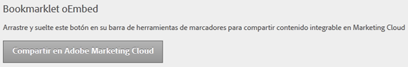

# Incrustación de contenido

Puede incrustar contenido de una página web en Experience Cloud.

En [!UICONTROL Administración], arrastre el botón **[!UICONTROL Compartir en Adobe Experience Cloud]** a la barra de herramientas de Marcadores del explorador.

Cuando se encuentra en una página web que admite contenido incrustado (como, por ejemplo, temas de ayuda), haga clic en **[!UICONTROL Compartir en Adobe Experience Cloud]** en la barra de herramientas.
