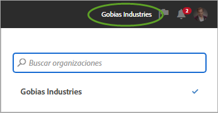
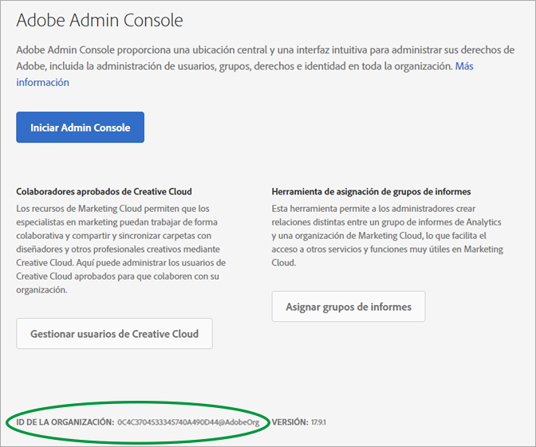
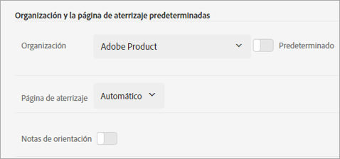

# Organizaciones y vinculación de cuentas

Obtenga más información sobre la gestión de organizaciones y la vinculación de cuentas de solución a Experience Cloud.

<!-- accounts-experience-cloud.xml -->

## Identificación de la organización {#concept_384D169B0B724B799D573B8ECB5C39BF}

Una *organización* es la entidad que habilita un administrador a fin de configurar grupos y usuarios, y para controlar el inicio de sesión único en Experience Cloud. La organización funciona como una empresa de inicio de sesión que abarca todos los productos y soluciones de Experience Cloud. La mayoría de las veces, la organización es el nombre de empresa. Sin embargo, una empresa puede tener muchas organizaciones.

Es posible que también deba localizar el identificador de su organización con el fin de obtener asistencia. Mediante el menú **[!UICONTROL Organización]** puede verificar que esté en la organización correcta o cambiar de una organización a otra.

## Búsqueda del identificador de organización {#concept_EA8AEE5B02CF46ACBDAD6A8508646255}

El **identificador de organización** es el ID asociado con la empresa que ha seleccionado en Experience Cloud. Se trata de una cadena alfanumérica de 24 caracteres seguida de @AdobeOrg (que debe incluirse).

Para ver el identificador de su organización, vaya a la página de inicio de Experience Cloud o haga clic en ( ) y, a continuación, haga clic en **[!UICONTROL Administración]**. Puede encontrar el ID de organización en la parte inferior de la página [!UICONTROL Introducción a Experience Cloud] o la página [!UICONTROL Administración].

## Vinculación de una cuenta de solución a un Adobe ID {#task_FD389E78640848919E247AC5E95B8369}

Normalmente, los administradores de Experience Cloud otorgan acceso a soluciones y servicios. En circunstancias excepcionales, es posible que deba vincular las credenciales de solución a un Adobe ID.

1. Siga los pasos de la invitación del correo electrónico para utilizar Experience Cloud.
1. Inicie sesión con su Adobe ID o Enterprise ID.
1. Haga clic en el selector de soluciones. ( ).

   

   Las soluciones a las que tiene acceso se muestran coloreadas.
1. Haga clic en la solución deseada.

   

   Este tipo de mensaje se muestra si es parte del grupo apropiado (y tiene permisos para la solución) pero todavía no ha vinculado sus credenciales de cuenta a su Adobe ID.
1. Haga clic en **[!UICONTROL Vincular cuenta]** y, a continuación, proporcione las credenciales.

## Especificación de una organización y una página de aterrizaje predeterminadas {#concept_6A191B42A9874A9780882903BA18F071}

Puede especificar la organización y la página de aterrizaje predeterminadas que se pueden utilizar cuando inicia sesión.

En su perfil, haga clic en **[!UICONTROL Editar perfil]**.

En Organización y la página de aterrizaje predeterminadas, puede personalizar la forma de iniciar sesión.

## Solución de problemas de vinculación de cuentas {#concept_DFCB29A3B4834FC59AA29E0BBA301584}

Ayuda para problemas que se derivan de la vinculación de cuentas.

Normalmente, la vinculación de cuentas falla porque Adobe ID está vinculado a un usuario anterior. Cuando la vinculación de cuentas falla, puede:

* [Póngase en contacto con el servicio de asistencia de Adobe](https://helpx.adobe.com/es/marketing-cloud/contact-support.html).
* Acceder a la solución mediante el inicio de sesión estándar mientras el problema se soluciona.
