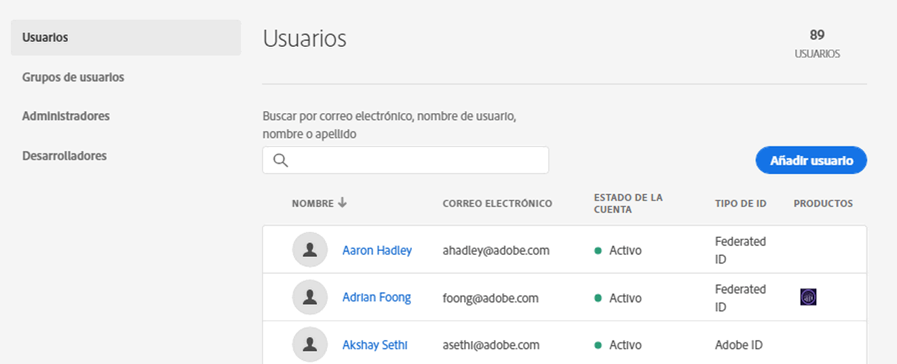
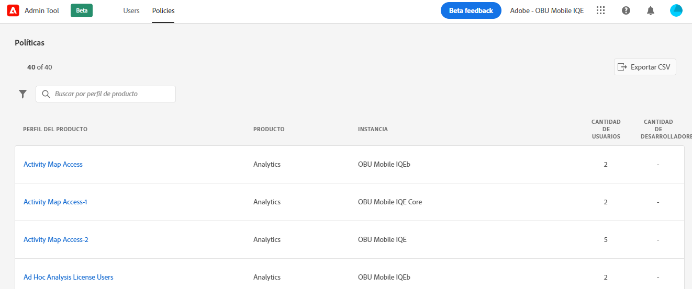

# Vea los usuarios y las directivas de Experience Cloud en la herramienta de administración

Los administradores pueden ver una lista de los usuarios y las directivas de Experience Cloud que pueden ordenar y filtrar y sus detalles en la herramienta de administración. Los detalles del usuario incluyen el acceso al producto, las funciones y la información a la que accedió por última vez. Los detalles de la directiva incluyen la lista de usuario, grupo, desarrollador, integración y administrador de una directiva (perfil de producto), así como información detallada sobre sus permisos y recursos.

>[!NOTE]
>
>La administración de usuarios y productos está configurada en [Admin Console](admin-getting-started.md).

1. Iniciar sesión en `https://experience.adobe.com/.`

   

1. En [!UICONTROL Acceso rápido], seleccione **[!UICONTROL Herramienta de administración.]**

   (Como alternativa, en la URL de página de inicio puede reemplazar _inicio_ por _admin_).

   Se abre la página [!UICONTROL Usuarios].

## Página Usuarios

Esta página muestra la lista completa de usuarios con acceso a Experience Cloud en su organización. Proporciona información sobre la asignación de derechos de la solución y el último inicio de sesión. Puede buscar, ordenar y filtrar vistas personalizadas de la lista del usuario.

| Elemento | Descripción |
|---|---|
| [!UICONTROL Nombre] | Nombre y apellido del usuario. Puede ordenar esta columna de la A a la Z y de la Z a la A. Seleccione el nombre de un usuario para ver más detalles sobre él. |
| [!UICONTROL Correo electrónico] | La dirección de correo electrónico asociada al usuario. La columna puede ordenarse de la A a la Z y de la Z a la A. |
| [!UICONTROL Tipo de ID] | Tipo de identidad de la cuenta del usuario. El filtro se puede aplicar a tipos de ID específicos de la vista. Consulte [Administrar tipos de identidad](https://helpx.adobe.com/es/enterprise/using/identity.html) para obtener más información. |
| [!UICONTROL Soluciones] | Resumen de las soluciones de Experience Cloud a las que puede acceder el usuario. Puede aplicar filtros para reducir la lista de los usuarios con acceso específico a la solución. |
| [!UICONTROL Último inicio de sesión] | Hora y fecha del inicio de sesión más reciente del usuario en Experience Cloud. Esta columna se puede ordenar por fechas en orden ascendente o descendente.   **Importante:** A partir del 13 de enero de 2020, los datos de inicio de sesión de un usuario se conservarán durante 365 días. Esta información está pensada para mostrar la actividad de inicio de sesión actual en el Experience Cloud y no para recomendar que se realicen acciones en cuentas inactivas antes del 13 de enero de 2020. |

## Personalización de la vista de lista del usuario

Puede buscar, ordenar o filtrar las columnas para personalizar la lista del usuario.

* Busque usuarios por nombre o correo electrónico. Las búsquedas coinciden con la cadena de texto que escriba.
* Ordene la columna por valores ascendentes o descendentes. Esta ordenación se aplica a las columnas [!UICONTROL Name,] [!UICONTROL Email,] y [!UICONTROL Last Login].
* Para aplicar varios filtros a los usuarios de la lista con criterios específicos, seleccione el icono **[!UICONTROL Filtrar por]**. Cuando se aplican varias categorías de filtro, las búsquedas contienen Dominio de correo electrónico `AND` TIPO DE ID `AND` Solución.

| Elemento | Descripción |
|---------|----------|
| Filtro [!UICONTROL Dominio de correo electrónico] | Busque cadenas de caracteres en la columna Correo electrónico para reducir los resultados a uno o varios dominios. Añada varios filtros pulsando Intro después de cada término de búsqueda. |
| Filtro [!UICONTROL Tipo de ID] | Elija entre los tipos de ID disponibles. Se pueden usar varios tipos de ID como filtro. |
| Filtro [!UICONTROL Solución] | Elija entre las soluciones disponibles. Varios filtros de soluciones buscan resultados que contengan Solución 1 `OR` Solución 2. |

## Ver detalles del usuario

En la página [!UICONTROL Usuarios], para ver los detalles de un usuario, seleccione el correo electrónico del usuario.

Una vista detallada de cada usuario muestra detalles importantes sobre el acceso a la solución del usuario, las funciones de administración y del producto y la información de acceso más reciente.

## Información sobre esta sección

Esta sección muestra un resumen de la cuenta de usuario, que incluye:

* Avatar del usuario y distintivo del administrador del sistema (si corresponde)
* Nombre
* Correo electrónico
* Nombre de usuario (las cuentas de Federated ID pueden tener nombres de usuario diferentes de las direcciones de correo electrónico)
* [Tipo de ID](https://helpx.adobe.com/enterprise/using/identity.html)
* País
* Último inicio de sesión

## Resumen de soluciones

Esta sección muestra un resumen de las soluciones de Experience Cloud a las que el usuario puede acceder. Incluye la función administrativa del producto cuando corresponde.

## Lista de acceso a productos detallados

Esta sección muestra una lista completa de todos los miembros de perfiles de producto para el usuario.

| Elemento | Descripción |
|---------|----------|
| [!UICONTROL Producto] | Nombre del producto asociado con el perfil del producto. |
| [!UICONTROL Instancia] | Nombre de la instancia (como la compañía de inicio de sesión o el inquilino) asociados al producto y al perfil del producto. |
| [!UICONTROL Perfil del producto] | Nombre único del perfil del producto. |
| [!UICONTROL Grupo que lo asigna] | Nombre del grupo de usuarios que asocia al usuario a un perfil de productos. Los resultados en blanco indican que el usuario se asignó directamente al perfil del producto, no a través de un grupo. |
| [!UICONTROL Funciones del producto] | Asignación de funciones del usuario dentro del perfil del producto. Actualmente, esta información solo se aplica a perfiles de productos de Adobe Target. |

## Página Directivas

Esta página muestra la lista completa de las directivas de Experience Cloud en su organización. Proporciona información sobre productos, instancias, usuarios y desarrolladores. Puede buscar, ordenar y filtrar vistas personalizadas de la lista de directivas.

| Elemento | Descripción |
|---|---|
| [!UICONTROL Perfil del producto] | Nombre del perfil del producto. Las columnas se pueden ordenar de la A a la Z y de la Z a la A. Para ver más detalles sobre la directiva, seleccione el nombre de un perfil de producto. |
| [!UICONTROL Producto] | Producto asociado con el perfil del producto. La columna puede ordenarse de la A a la Z y de la Z a la A. |
| [!UICONTROL Instancia] | La instancia (por ejemplo, inquilino o empresa de inicio de sesión) asociada al perfil del producto. Los productos que no tienen instancias únicas o inquilinos muestran un &quot; -&quot; para el valor. La columna puede ordenarse de la A a la Z y de la Z a la A. |
| [!UICONTROL Cantidad de usuarios] | Cantidad única de usuarios asociados al perfil del producto, incluida la asignación directa y la asignación de grupos. Las columnas pueden ordenarse de menor a mayor o de mayor a menor. |
| [!UICONTROL Cantidad de desarrolladores] | Recuento de funciones de desarrollador asociadas al perfil del producto. Las columnas pueden ordenarse de menor a mayor o de mayor a menor. |

## Personalización de la visualización de listas de directivas

Puede buscar, ordenar o filtrar las columnas para personalizar la lista de directivas.

* Busque perfiles de producto por nombre. Las búsquedas coinciden con la cadena de texto que escriba.
* Ordene la columna por valores ascendentes o descendentes. Esta clasificación se aplica a [!UICONTROL Product Profile,] [!UICONTROL Product,] [!UICONTROL Instance,] [!UICONTROL Number of users,] y [!UICONTROL Number of Developers,] Columns.
* Seleccione el icono **[!UICONTROL Filtrar por]** para aplicar varios filtros a los perfiles de producto de la lista con criterios específicos. Cuando se aplican varias categorías de filtro, las búsquedas contienen Grupos asociados a la solución `AND`Instancia `AND`.

| Elemento | Descripción |
|---------|----------|
| Filtro de [!UICONTROL instancia] | Busque cadenas de caracteres en la columna de instancia para reducir los resultados a una o varias instancias. Añada varios filtros pulsando Intro después de cada término de búsqueda. |
| Filtro [!UICONTROL Solución] | Elija entre las soluciones disponibles. Varios filtros de soluciones buscan resultados que contengan Solución 1 `OR` Solución 2. |

## Detalles de la directiva de vista

En la página [!UICONTROL Directivas], para ver los detalles de una directiva, seleccione el nombre del perfil del producto.

Una vista detallada de cada perfil de producto muestra información importante sobre los temas del perfil del producto (usuarios, grupos, etc.). También muestra los permisos y recursos activados por el perfil del producto.

Los detalles del perfil del producto se pueden exportar a archivos CSV. La opción [!UICONTROL Exportar CSV] genera dos archivos CSV:

* Detalles del asunto (usuarios, grupos de usuarios, desarrolladores, integraciones, administradores)
* Elementos de permisos y recursos

## Sección de resumen

Esta sección muestra un resumen del perfil de producto, que incluye:

* Nombre del perfil del producto
* Cantidad de usuarios
* Cantidad de desarrolladores
* Cantidad de integraciones
* Productos asociados
* Instancia

## Lista detallada del asunto

Esta sección muestra una lista completa de todos los usuarios, grupos de usuarios, desarrolladores, integraciones y administradores asignados al perfil del producto.

| Tabulación | Descripción |
|---------|----------|
| [!UICONTROL Usuarios] | Lista de usuarios incluidos en el perfil del producto. La asociación de grupos de usuarios aparece en la columna [!UICONTROL Assigned by group]. |
| [!UICONTROL Grupos de usuarios] | Lista de grupos de usuarios asociados al perfil del producto. |
| [!UICONTROL Desarrolladores] | Lista de desarrolladores asociados al perfil del producto. |
| [!UICONTROL Integraciones] | Lista de integraciones asociadas al perfil del producto. |
| [!UICONTROL Administradores] | Lista de los administradores asociados al perfil del producto. |

## Listas detalladas de permisos y recursos

Esta sección muestra una lista completa de los permisos y recursos disponibles para el perfil del producto. Los permisos y recursos que se han incluido en el perfil del producto se han marcado con &quot;✔&quot;. Las listas de permisos y recursos se han clasificado en fichas y columnas para facilitar la visualización. Las fichas y las columnas muestran la lista de las secciones que se aplican al producto actual.
