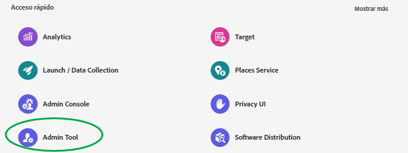
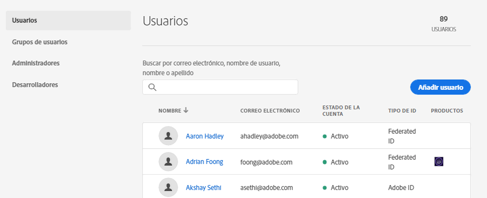
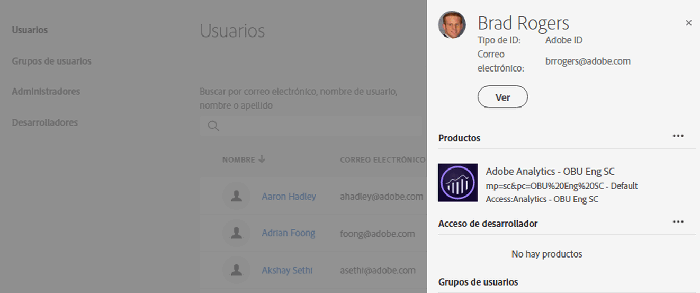
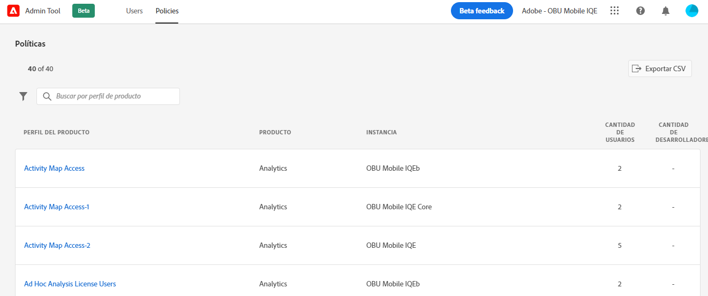
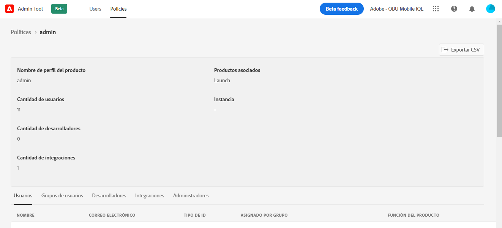

# CX empresa [!UICONTROL Admin Tool]

Los administradores pueden ver una lista de los usuarios y las directivas de CX Enterprise que pueden ordenar y filtrar y sus detalles en [!UICONTROL Admin Tool]. Los detalles del usuario incluyen el acceso al producto, las funciones y la información a la que accedió por última vez. Los detalles de la directiva incluyen la lista de usuario, grupo, desarrollador, integración y administrador de una directiva (perfil de producto), así como información detallada sobre sus permisos y recursos.

1. Iniciar sesión en `https://experience.adobe.com/.`

   

1. En [!UICONTROL Quick Access], haga clic en **[!UICONTROL Admin Tool]**.

   (Como alternativa, en la URL de página de inicio puede reemplazar _inicio_ por _admin_).

   Se muestra la página [!UICONTROL Users].

## Página Usuarios

Esta página muestra la lista completa de usuarios con acceso a CX Enterprise en su organización. Proporciona información sobre el derecho a la aplicación y el último inicio de sesión. Puede buscar, ordenar y filtrar vistas personalizadas de la lista del usuario.

| Elemento | Descripción |
| --- | ---|
| [!UICONTROL Name] | Nombre y apellido del usuario. Puede ordenar esta columna de la A a la Z y de la Z a la A. Haga clic en el nombre de un usuario para ver más detalles sobre el mismo. |
| [!UICONTROL Email] | La dirección de correo electrónico asociada al usuario. La columna puede ordenarse de la A a la Z y de la Z a la A. |
| [!UICONTROL ID Type] | Tipo de identidad de la cuenta del usuario. El filtro se puede aplicar a tipos de ID específicos de la vista. Consulte [Administrar tipos de identidad](https://helpx.adobe.com/es/enterprise/using/identity.html) para obtener más información. |
| [!UICONTROL Solutions] | Resumen de las aplicaciones empresariales de CX a las que el usuario puede acceder. Puede aplicar filtros para reducir la lista de los usuarios con acceso específico a la aplicación. |
| [!UICONTROL Last Login] | Hora y fecha del inicio de sesión más reciente del usuario en CX Enterprise. Esta columna se puede ordenar por fechas en orden ascendente o descendente.   **Importante:** A partir del 13 de enero de 2020, los datos de inicio de sesión de un usuario se conservarán durante 365 días. Esta información está pensada para mostrar la actividad de inicio de sesión actual en CX Enterprise y no para recomendar que se realicen acciones en cuentas inactivas antes del 13 de enero de 2020. |

## Personalización de la vista de lista del usuario

Puede buscar, ordenar o filtrar las columnas para personalizar la lista del usuario.

* Busque usuarios por nombre o correo electrónico. Las búsquedas coinciden con la cadena de texto que escriba.
* Ordene la columna por valores ascendentes o descendentes. Este orden se aplica a [!UICONTROL Name,] [!UICONTROL Email,] y [!UICONTROL Last Login] columnas.
* Para aplicar varios filtros a los usuarios de la lista con criterios específicos, haga clic en **[!UICONTROL Filter By]**. Cuando se aplican varias categorías de filtro, las búsquedas contienen Dominio de correo electrónico `AND` TIPO DE ID `AND` Solución.

| Elemento | Descripción |
| ---------| ----------|
| [!UICONTROL Email Domain] filtro | Busque cadenas de caracteres en la columna Correo electrónico para reducir los resultados a uno o varios dominios. Añada varios filtros pulsando Intro después de cada término de búsqueda. |
| [!UICONTROL ID Type] filtro | Elija entre los tipos de ID disponibles. Se pueden usar varios tipos de ID como filtro. |
| [!UICONTROL Solution] filtro | Elija entre las aplicaciones disponibles. Varios filtros de aplicación buscan resultados que contengan Solución 1 `OR` Solución 2. |

## Ver detalles del usuario

En la página [!UICONTROL Users], para ver los detalles de un usuario, haga clic en el correo electrónico del usuario.

Una vista detallada de cada usuario muestra detalles importantes sobre el acceso a la aplicación del usuario, las funciones de administración y del producto, y la información de acceso más reciente.

## Información sobre esta sección

Esta sección muestra un resumen de la cuenta de usuario, que incluye:

* Avatar del usuario y distintivo del administrador del sistema (si corresponde)
* Nombre
* Correo electrónico
* Nombre de usuario (es posible que las cuentas de Federated ID tengan nombres de usuario diferentes de las direcciones de correo electrónico)
* [Tipo de ID](https://helpx.adobe.com/es/enterprise/using/identity.html)
* País
* Último inicio de sesión

## Resumen de soluciones

Esta sección muestra un resumen de las aplicaciones empresariales de CX a las que el usuario puede acceder. Incluye la función administrativa del producto cuando corresponde.

## Lista de acceso a productos detallados

Esta sección muestra una lista completa de todos los miembros de perfiles de producto para el usuario.

| Elemento | Descripción |
| ---------| ----------|
| [!UICONTROL Product] | Nombre del producto asociado con el perfil del producto. |
| [!UICONTROL Instance] | Nombre de la instancia (como la compañía de inicio de sesión o el inquilino) asociados al producto y al perfil del producto. |
| [!UICONTROL Product profile] | Nombre único del perfil del producto. |
| [!UICONTROL Assigned by Group] | Nombre del grupo de usuarios que asocia al usuario a un perfil de productos. Los resultados en blanco indican que el usuario se asignó directamente al perfil del producto, no a través de un grupo. |
| [!UICONTROL Product Roles] | Asignación de funciones del usuario dentro del perfil del producto. Actualmente, esta información solo se aplica a perfiles de productos de Adobe Target. |

## Página Directivas

Esta página muestra la lista completa de las políticas de CX Enterprise de su organización. Proporciona información sobre productos, instancias, usuarios y desarrolladores. Puede buscar, ordenar y filtrar vistas personalizadas de la lista de directivas.

| Elemento | Descripción |
| ---| ---|
| [!UICONTROL Product rofile] | Nombre del perfil del producto. Las columnas se pueden ordenar de A->Z y de Z->A. Para ver más detalles acerca de la directiva, seleccione el nombre de un perfil de producto. |
| [!UICONTROL Product] | Producto asociado con el perfil del producto. La columna puede ordenarse de la A a la Z y de la Z a la A. |
| [!UICONTROL Instance] | La instancia (por ejemplo, compañía de inicio de sesión o inquilino) asociada al perfil del producto. Los productos que no tengan instancias únicas o inquilinos muestran un “ - ” para el valor. La columna puede ordenarse de la A a la Z y de la Z a la A. |
| [!UICONTROL Number of Users] | Cantidad única de usuarios asociados al perfil del producto, incluida la asignación directa y la asignación de grupos. Las columnas pueden ordenarse de menor a mayor o de mayor a menor. |
| [!UICONTROL Number of Developers] | Recuento de funciones de desarrollador asociadas al perfil del producto. Las columnas pueden ordenarse de menor a mayor o de mayor a menor. |

## Personalización de la visualización de listas de directivas

Puede buscar, ordenar o filtrar las columnas para personalizar la lista de directivas.

* Busque perfiles de producto por nombre. Las búsquedas coinciden con la cadena de texto que escriba.
* Ordene la columna por valores ascendentes o descendentes. Este orden se aplica a [!UICONTROL product profile,] [!UICONTROL Product,] [!UICONTROL Instance,] [!UICONTROL Number of users,] y [!UICONTROL Number of Developers,] columnas.
* Haga clic en el icono **[!UICONTROL Filter By]** para aplicar varios filtros a los perfiles de productos de la lista con criterios específicos. Cuando se aplican varias categorías de filtro, las búsquedas contienen Grupos asociados a la solución `AND`Instancia `AND`.

| Elemento | Descripción |
| ---------| ----------|
| [!UICONTROL Instance] filtro | Busque cadenas de caracteres en la columna de instancia para reducir los resultados a una o varias instancias. Añada varios filtros pulsando Intro después de cada término de búsqueda. |
| [!UICONTROL Solution] filtro | Elija entre las aplicaciones disponibles. Varios filtros de aplicación buscan resultados que contengan Solución 1 `OR` Solución 2. |

## Ver detalles de la política

En la página [!UICONTROL Policies], para ver los detalles de una directiva, seleccione el nombre del perfil del producto.

Una vista detallada de cada perfil de producto muestra detalles importantes sobre los temas del perfil del producto (usuarios, grupos, etc.). También muestra los permisos y recursos habilitados por el perfil del producto.

Los detalles del perfil del producto se pueden exportar a archivos CSV. La opción [!UICONTROL Export CSV] genera dos archivos CSV:

* Detalles del asunto (usuarios, grupos de usuarios, desarrolladores, integraciones, administradores)
* Elementos de permisos y recursos

## Sección de resumen

Esta sección muestra un resumen del perfil de producto, que incluye:

* Nombre del perfil del producto
* Cantidad de usuarios
* Cantidad de desarrolladores
* Cantidad de integraciones
* Productos asociados
* Instancia

## Lista detallada del asunto

Esta sección muestra una lista completa de todos los usuarios, grupos de usuarios, desarrolladores, integraciones y administradores asignados al perfil del producto.

| Tabulación | Descripción |
| ---------| ----------|
| [!UICONTROL Users] | Lista de usuarios incluidos en el perfil del producto. La asociación de grupos de usuarios aparece en la columna [!UICONTROL Assigned by group]. |
| [!UICONTROL User Groups] | Lista de grupos de usuarios asociados al perfil del producto. |
| [!UICONTROL Developers] | Lista de desarrolladores asociados al perfil del producto. |
| [!UICONTROL Integrations] | Lista de integraciones asociadas al perfil del producto. |
| [!UICONTROL Administrators] | Lista de los administradores asociados al perfil del producto. |

## Listas detalladas de permisos y recursos

Esta sección muestra una lista completa de los permisos y recursos disponibles para el perfil del producto. Los permisos y recursos que se han incluido en el perfil del producto se han marcado con &quot;✔&quot;. Las listas de permisos y recursos se han clasificado en fichas y columnas para facilitar la visualización. Las fichas y las columnas muestran la lista de las secciones que se aplican al producto actual.

## Información relacionada

* [Administrar usuarios](https://helpx.adobe.com/es/enterprise/using/users.html) en [!DNL Admin Console]
