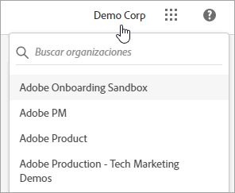
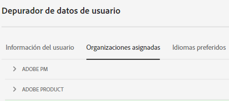
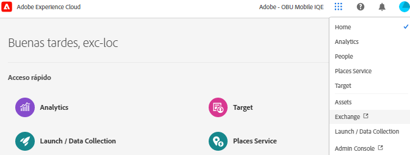
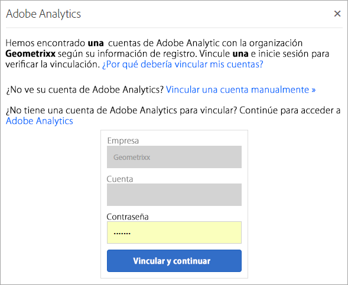

# Organizaciones en Experience Cloud

Una *organización* (identificador de organización) es la entidad que permite a un administrador configurar grupos y usuarios, así como para controlar el inicio de sesión único en Experience Cloud.

La organización funciona como una empresa de inicio de sesión que abarca todos los productos y aplicaciones de Experience Cloud. Generalmente, la organización es el nombre de la empresa. Sin embargo, una empresa puede tener muchas organizaciones.

Para comprobar que ha iniciado sesión en su organización correcta, haga clic en **[!UICONTROL Profile]** para ver el nombre de organización predeterminado. Si tiene acceso a más de una organización, también puede ver y cambiar a otra organización en la barra de encabezado.

>[!NOTE]
>
>El cambio entre organizaciones permite acceder a Admin Console para esa organización específica. Si no ve la organización deseada en la lista, es posible que tenga que solicitar acceso a un administrador de esa organización. (Si necesita combinar varias Admin Consoles, póngase en contacto con el servicio de atención al cliente de Adobe para obtener ayuda).

## Federated ID

Si su organización utiliza Federated ID, Experience Cloud le permite iniciar sesión con el inicio de sesión único de su organización sin necesidad de escribir su dirección de correo electrónico y contraseña. Agregar `#/sso:@domain` a la dirección URL de Experience Cloud (`https://experience.adobe.com`) para realizar esta tarea.

Por ejemplo, para una organización con Federated IDs y el dominio `adobecustomer.com`, establezca el vínculo URL en `https://experience.adobe.com/#/sso:@adobecustomer.com`. También puede ir directamente a una aplicación específica marcando esta URL, anexada con la ruta de la aplicación. (Por ejemplo, para Adobe Analytics, `https://experience.adobe.com/#/sso:@adobecustomer.com/analytics`).

## Ver su ID de organización

Puede localizar el ID de organización asignado con fines de asistencia. Puede comprobar que se encuentra en la organización correcta o cambiar de una organización a otra mediante el selector **[!UICONTROL Organization]** del encabezado.

El identificador de organización es el ID asociado con la compañía que ha seleccionado en Experience Cloud. Se trata de una cadena alfanumérica de 24 caracteres seguida de `@AdobeOrg` (que debe incluirse).

Puede ver su identificador de organización, junto con otra información de la cuenta, mediante el método abreviado de teclado **Ctrl+i** desde cualquier página de `https://experience.adobe.com`.

**Para ver el identificador de su organización**

1. En [Experience Cloud](https://experience.adobe.com), presione **Ctrl+i** en el teclado.

   

1. En **[!UICONTROL User Information]**, busque **[!UICONTROL Current Org ID]** y podrá encontrar el identificador de organización.

   Los administradores también pueden iniciar sesión en Admin Console (vaya a [https://adminconsole.adobe.com](https://adminconsole.adobe.com)) y ver su identificador de organización en la dirección URL.

   Por ejemplo, en la siguiente dirección URL:

   `https://adminconsole.adobe.com/C538193582390300A495CC9@AdobeOrg/overview`

   El identificador es:

   `C538193582390300A495CC9@AdobeOrg`

## Vinculación de una cuenta de aplicaciones a un Adobe ID

Normalmente, los administradores de Experience Cloud otorgan acceso a aplicaciones y servicios. En circunstancias excepcionales, puede vincular las credenciales de la aplicación a una Adobe ID.

1. Siga los pasos de la invitación del correo electrónico a Experience Cloud.

1. Inicie sesión con su Adobe ID o Enterprise ID.

1. Haga clic en **[!UICONTROL Application selector]**. ().

   

   Las aplicaciones a las que tiene acceso se muestran coloreadas.

1. Haga clic en la aplicación deseada.

   

   Este tipo de mensaje se muestra si es parte del grupo apropiado (y tiene permisos para la aplicación), pero todavía no ha vinculado sus credenciales de cuenta a su Adobe ID.

1. Haga clic en **[!UICONTROL Link Account]** y, a continuación, proporcione las credenciales.

## Especificar una organización predeterminada

Puede especificar la organización predeterminada que se utilizará al iniciar sesión.

1. En el encabezado, haga clic en **[!UICONTROL Profile]** y luego haga clic en Preferencias.

1. En [!UICONTROL General], seleccione una organización predeterminada.

## Solución de problemas de vinculación de cuentas

Ayuda relacionada con los problemas que se derivan de la vinculación de cuentas.

Normalmente, la vinculación de cuentas falla porque el Adobe ID está vinculado a un usuario anterior. Cuando falla la vinculación de cuentas, puede:

* [Ponerse en contacto con el Servicio de atención al cliente de Adobe](https://experienceleague.adobe.com/es?support-solution=General&lang=es#support).
* Acceder a la aplicación mediante el inicio de sesión estándar mientras el problema se soluciona.
