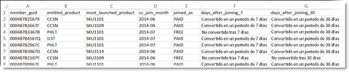

# Cómo utilizar los atributos del cliente en Adobe Experience Cloud

Los atributos del cliente en Adobe Experience Cloud le permiten cargar los datos empresariales capturados desde una base de datos de administración de la relación con los clientes (CRM). Puede cargar los datos en un origen de datos de atributos del cliente en el Experience Cloud y, a continuación, utilizar los datos en Adobe Analytics y Adobe Target.

To locate this feature, navigate to **[!DNL Experience Platform]** > **[!UICONTROL People]** > **[!UICONTROL Customer Attributes]**

## Requisitos previos para cargar Atributos del cliente {#section_BD38693AFBF34926BA28E964963B4EA0}

* **Activación de las soluciones:** [Habilite las soluciones para los servicios de Experience Platform](../core-services/core-services.md#concept_07ED1D5C64234E77976E6D572E78FB9C).

* **Pertenencia a un grupo:** Para cargar los datos de los Atributos del cliente, los usuarios deben ser miembros del [grupo de Atributos del cliente](../admin-getting-started/admin-getting-started.md#task_3295A85536BF48899A1AB40D207E77E9). También debe pertenecer a un grupo de Adobe Analytics o de Adobe Target.

   Para saber si su empresa tiene acceso a los atributos del cliente, su administrador de [!DNL Experience Cloud]debe iniciar sesión en [Experience Cloud](https://experience.adobe.com). Vaya a **[!UICONTROL Administración]** > **[!UICONTROL Admin Console]** > **[!UICONTROL Productos]**. Si *Atributos del cliente* se muestra como uno de los [!UICONTROL Perfiles de producto], está listo para empezar.

   Los usuarios que se agregan a Atributos del cliente podrán ver el elemento de menú [!UICONTROL Atributos del cliente] a la izquierda de la interfaz de Experience Cloud.

* Se requiere **Adobe Target** `at.js` (cualquier versión) o `mbox.js` versión 58 o posterior para los Atributos del cliente.

   Consulte [Implementación de at.js](https://docs.adobe.com/content/help/es-ES/target/using/implement-target/client-side/deploy-at-js/how-to-deployatjs.html) o [mbox.js](https://docs.adobe.com/content/help/es-ES/target/using/implement-target/client-side/mbox-implement/mbox-download.html).

## ¿Qué son los datos del cliente empresariales? {#section_6F34C29F11414842AA57D2B1248FA3C6}

Los datos empresariales residen en otros sistemas. Puede ser complejo y significar cosas diferentes para diferentes personas. Estos datos pueden incluir información como suscripciones, nivel de lealtad, edad, sexo, productos propios, intereses y valor a largo plazo.

La siguiente imagen es un ejemplo de un archivo de datos que muestra los datos del suscriptor de productos, incluidos los ID de miembro, los productos con derechos, los productos más utilizados, etc.

Tras crear el archivo de datos, puede cargarlo en el origen de atributos del cliente que cree en **[!UICONTROL Experience Cloud]** > **[!UICONTROL Atributos del cliente]**.

Consulte [Carga de datos del atributo del cliente](../attributes/t-crs-usecase.md#task_BCC327B2A0EF4A1BBB2934013AB92B78) para obtener información sobre este flujo de trabajo.

## Ejemplos de atributos del cliente en Analytics y Destinatario {#section_4E77650F6CEE4C4ABCD0B3221A5AE5D9}

Una vez que los datos se encuentren en Experience Cloud, podrá personalizarlos y compartirlos con soluciones para la creación de informes, segmentación, actividades y campañas.

Por ejemplo:

| Solución | Ventajas y casos de uso |
|--- |--- |
| Adobe Analytics | Los especialistas en marketing y analistas pueden comprender:<ul><li>Las campañas en línea más efectivas con sus clientes de nivel oro.</li><li>Los productos que buscan los clientes de nivel oro en comparación con los productos que buscan los clientes de nivel platino.</li><li>Si el rediseño del sitio está teniendo un impacto positivo en las tasas de conversión para los clientes más antiguos.</li><li>Qué productos tienden a buscar en el sitio los clientes con un valor bajo a largo plazo.</li></ul> |
| Adobe Target | Los datos de atributos permiten a los usuarios de Adobe Target:<ul><li>Mostrar descuentos y ofertas especiales para miembros del club de fidelidad.</li><li>Recomendar productos más caros a sus clientes de lujo.</li><li>Para los clientes que ya reciben correos electrónicos, permite mostrar una oferta de “up-sell” en el espacio reservado normalmente para los registros por correo electrónico.</li></ul> |
