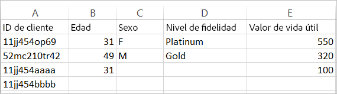
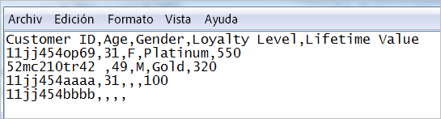

# Acerca del archivo de datos y las fuentes de datos para Atributos del cliente

Requisitos de archivos de datos y varias fuentes de datos para cargar atributos del cliente en Experience Cloud.

Necesitará acceso a CRM o datos similares de su empresa. Los datos que cargue en Experience Cloud deben estar en un archivo `.csv`. Si carga a través de un FTP o sFTP, también debe subir un archivo `.fin`.

Los Atributos del cliente están diseñados para gestionar algunos archivos cada día. Para reducir el problema de la demora en el procesamiento de un gran número de archivos pequeños, los archivos enviados en los 30 minutos siguientes a un lote anterior desde la misma organización se redirigirán a una cola de prioridad inferior.

## Tipos de archivos permitidos y requisitos de nombre {#section_6F64FA02ACCC4215B0862CB6A1821FBF}

<table id="table_C27955F6B52A45B28BEEAAF14FFC86D8"> 
 <thead> 
  <tr> 
   <th colname="col1" class="entry"> Tipo de archivo </th> 
   <th colname="col2" class="entry"> Descripción </th> 
  </tr> 
 </thead>
 <tbody> 
  <tr> 
   <td colname="col1"> <p> <span class="filepath"> .csv </span> </p> </td> 
   <td colname="col2"> <p>Archivo de valores separados por coma (como uno creado en Excel). Este es el archivo que contiene los datos de atributos del cliente. </p> <p> <b>Requisitos de nomenclatura:</b> Asegúrese de que las extensiones de nombre de archivo no contienen espacios en blanco. </p> </td> 
  </tr> 
  <tr> 
   <td colname="col1"> <p> <span class="filepath"> .fin </span> </p> </td> 
   <td colname="col2"> <p>(Obligatorio) El archivo <span class="filepath">.fin</span> indica al sistema que la carga de datos ha finalizado. El nombre del archivo <span class="filepath">.fin</span> debe concordar con el nombre del archivo <span class="filepath">.csv</span>. </p> <p>Adobe recomienda la creación de un archivo de texto vacío con una extensión <span class="filepath">.fin</span>. Un archivo vacío ahorra espacio y tiempo de carga. </p> <p> <p>Nota: No se permite cambiar el nombre de un archivo <span class="filepath">.fin</span> una vez cargado. El archivo <span class="filepath">.fin</span> debe cargarse de forma independiente y no puede ser un archivo anteriormente cargado con un nombre diferente. </p> </p> <p>After you upload the <span class="filepath"> .fin </span> file in the Customer Attributes FTP, the system retrieves data quickly (within one minute). Eso es distinto con respecto a otros sistemas basados en FTP de Adobe, que toman datos con menos frecuencia (alrededor de una vez por hora). </p> <p>El archivo <span class="filepath">.fin</span> no es necesario cuando se utiliza el método de carga de arrastrar y soltar. </p> </td> 
  </tr> 
  <tr> 
   <td colname="col1"> <p> <span class="filepath"> .gz</span> o <span class="filepath">.zip </span> </p> </td> 
   <td colname="col2"> <p> <span class="filepath"> .gz</span> (gzip) o <span class="filepath">.zip</span>: para archivos comprimidos. Un archivo <span class="filepath">.zip</span> no puede contener más de un archivo en el archivo. </p> <p> <b>Requisitos de nomenclatura:</b> el nombre del <span class="filepath">.zip</span> o del <span class="filepath">.gz</span> debe concordar con el nombre del <span class="filepath">.csv</span>. Por ejemplo, si su archivo <span class="filepath">.csv</span> es <span class="filepath">crm_small.csv</span>, el archivo <span class="filepath">.zip</span> debería ser <span class="filepath">crm_small.csv.zip</span>. </p> <p>El archivo .fin debe concordar con el .csv. </p> </td> 
  </tr> 
 </tbody> 
</table>

## Requisitos para los archivos de datos de atributos {#section_169FBF5B7BBA47CE825B7A330CF3FE98}

**CSV de ejemplo**

El archivo CSV debe cumplir el siguiente formato:



El mismo archivo visualizado en un editor de texto:



**Directrices**

<table id="table_A9849CC9AA784763921DE057F0F61515"> 
 <thead> 
  <tr> 
   <th colname="col1" class="entry"> Elemento </th> 
   <th colname="col2" class="entry"> Descripción </th> 
  </tr> 
 </thead>
 <tbody> 
  <tr> 
   <td colname="col1"> <p>Arrastrar y soltar </p> </td> 
   <td colname="col2"> <p>El archivo de arrastrar y soltar debe ser inferior a 100 megabytes. </p> <p>El archivo <span class="filepath">.fin</span> no es necesario cuando se utiliza el método de carga de arrastrar y soltar. </p> </td> 
  </tr> 
  <tr> 
   <td colname="col1"> <p>Columna ID del cliente </p> </td> 
   <td colname="col2"> <p> La primera columna debe ser un ID de cliente único. El ID utilizado debe corresponder al ID que se pasa al Servicio de Experience Cloud ID. </p> <p>Para Analytics, el ID que se está almacenando en una propiedad o eVar. </p> <p>Para Target, el valor setCustomerID. (Consulte <a href="../core-services/core-services.md#section_AD473A6A21C1446498E700363F9A8437" format="dita" scope="local">Analytics y Adobe Target: Sincronización del ID de cliente</a>) </p> <p> Este ID de cliente es el identificador único que utiliza su CRM para cada persona de la base de datos. Las columnas restantes son atributos que provienen de su CRM. Elija cuántos atributos desea cargar. </p> <p>Se recomiendan nombres sencillos y legibles para los encabezados de columna, pero no obligatorios. Cuando valide el esquema después de la carga, puede asignar nombres descriptivos a las filas y columnas cargadas. </p> <p> <b>Acerca de los ID de cliente</b> </p> <p>Normalmente, una empresa utiliza un ID de cliente de un sistema CRM. Este ID se establece utilizando la llamada de <span class="codeph">setCustomerIDs</span> cuando una persona inicia sesión. Este ID también se utiliza como clave en el archivo CRM que se carga en Experience Cloud. El<a href="../attributes/t-crs-usecase.md#task_09DAC0F2B76141E491721C1E679AABC8" format="dita" scope="local"> ID de alias</a> es un nombre descriptivo para un almacén de datos en Audience Manager, en el que se almacenan los datos de alias. El sistema envía alias a este almacén de datos (mediante setCustomerIDs). El archivo CRM se aplica a los datos de ese almacén de datos. </p> <p>Para obtener información sobre <span class="codeph">setCustomerIDs</span>, consulte <a href="https://docs.adobe.com/content/help/es-ES/id-service/using/reference/authenticated-state.html" format="https" scope="external">ID de cliente y estados de autenticación</a>. </p> </td> 
  </tr> 
  <tr> 
   <td colname="col1"> <p>Encabezados y columnas posteriores </p> </td> 
   <td colname="col2"> <p>Los encabezados posteriores deben representar el nombre de cada atributo. </p> <p> Estas columnas deben contener Atributos del cliente procedentes de CRM. </p> </td> 
  </tr> 
  <tr> 
   <td colname="col1"> <p>Límites de atributos </p> </td> 
   <td colname="col2"> <p>En Experience Cloud, puede cargar cientos de columnas <span class="filepath">.csv</span> en el servicio de atributos del cliente. Sin embargo, al configurar suscripciones y seleccionar atributos, se aplican los límites siguientes según la solución: </p> <p> 
     <ul id="ul_2BB85067918D4BB3B59394F3E3E37A6D"> 
      <li id="li_93703988B9934384B4B94A839D028380"> <b>Analytics Standard</b>: 3 en total </li> 
      <li id="li_D1E5E7BD24C54591B14D15DE97447835"> <b>Analytics Premium</b>: 200 por grupo de informes </li> 
      <li id="li_8C891FE3D1EF49FA9F81E2E32CD0B9CA"> <b>Adobe Target Standard:</b> 5 </li> 
      <li id="li_2B66D43023F34EA685CE2C38A9250CEA"> <b>Adobe Target Premium:</b> 200 </li> 
     </ul> </p> </td> 
  </tr> 
  <tr> 
   <td colname="col1"> <p>Límites de fila </p> </td> 
   <td colname="col2"> <p>No hay límite conocido en el número de filas. </p> </td> 
  </tr> 
  <tr> 
   <td colname="col1"> <p>Límites de columna </p> </td> 
   <td colname="col2"> <p>Para que sea práctico, limite el número de columnas a alrededor de 200. </p> </td> 
  </tr> 
  <tr> 
   <td colname="col1"> <p>Límites de caracteres </p> </td> 
   <td colname="col2"> <p>Al crear una suscripción de Analytics, las longitudes de campo de los archivos cargados se truncan a 255. </p> </td> 
  </tr> 
  <tr> 
   <td colname="col1"> <p>Directrices de FTP y limitaciones de tamaño </p> </td> 
   <td colname="col2"> <p> 
     <ul id="ul_E157EE6F98914EADA0C103D1D1E705D3"> 
      <li id="li_84FBD455DD164A28AC16F4A5AB19E4B3">El límite en el tamaño máximo de un archivo para FTP es de 4 GB por carga. </li> 
      <li>El límite en el tamaño mínimo de un archivo es de 10 MB por carga. </li>
      <li>Puede cargar un archivo cada media hora. </li>
      <li id="li_B69A20C51D824727AA99C1F6F78537A4"> Debe soltar su archivo <span class="filepath">.csv</span> (y el <span class="filepath">.fin</span>) en la carpeta raíz del sitio FTP. </li> 
     </ul> </p> <p> <p>Importante: El espacio total permitido para la cuenta de FTP es 40 GB. Es responsabilidad suya eliminar los archivos procesados. </p> </p> </td> 
  </tr> 
  <tr> 
   <td colname="col1"> <p>Requisitos de archivo </p> </td> 
   <td colname="col2"> <p> Cada origen de atributo debe contener el mismo número de campos separados por comas. </p> <p> Los campos que contienen un salto de línea, comillas dobles o comas deben estar entre comillas. </p> <p> Los caracteres de comillas dobles de un campo deben tener un carácter de escape mediante una barra invertida (\). </p> <p> Las columnas en blanco se almacenan como  <span class="term">null</span>. </p> </td> 
  </tr> 
  <tr> 
   <td colname="col1"> <p>Varios archivos </p> </td> 
   <td colname="col2"> <p>Al cargar datos de atributos del cliente, si tiene varios archivos que desea cargar en sucesión con rapidez, asegúrese de que el archivo anterior se haya procesado antes de cargar el siguiente archivo, especialmente si dichos archivos son grandes. Puede controlarlo comprobando cuándo se ha movido el archivo anterior a la carpeta procesada o en la que se han producido errores en la cuenta FTP de Atributos del cliente. </p> <p> Dividir un archivo grande en otros más pequeños y enviarlos en sucesión rápida puede ralentizar el procesamiento, a menos que se asegure de que cada archivo se procese completamente antes de enviar el siguiente. </p> </td> 
  </tr> 
  <tr> 
   <td colname="col1"> <p>Codificación de caracteres </p> </td> 
   <td colname="col2"> <p>Para Japón, UTF-8 es obligatoria. </p> </td> 
  </tr> 
   <tr> 
   <td colname="col1"> <p>Datos históricos </p> </td> 
   <td colname="col2"> <p> Los atributos del cliente están vinculados al perfil del visitante subyacente en Analytics. Como tal, los atributos del cliente están asociados con el visitante durante toda la vida de ese perfil de visitante en Analytics. Esto incluye el comportamiento que se produjo antes de que el cliente iniciara sesión por primera vez. </p> <p> Si utiliza el método de relleno del almacén de datos, los datos se asocian a un post_visid_high/low basado en el ID de Analytics (AID). Si utiliza el Servicio de Experience Cloud ID, los datos se asocian a un post_visid_high/low basado en Experience Cloud ID (MID). </p> </td> 
  </tr> 
  <tr> 
   <td colname="col1"> <p>Fuentes de datos </p> </td> 
   <td colname="col2"> <p>Los atributos del cliente no están disponibles en las fuentes de datos. </p> </td> 
  </tr> 
 </tbody> 
</table>

## Utilización de varias fuentes de datos {#section_76DEB6001C614F4DB8BCC3E5D05088CB}

Al crear, modificar o eliminar orígenes de atributos del cliente, se produce un retraso de cerca de una hora antes de que los identificadores empiecen a sincronizarse con la nueva fuente de datos.

El ID de alias de cada origen de atributos del cliente debe ser único. Si tiene varias fuentes de datos que aprovechan el mismo ID, deben configurarse de la siguiente manera:

**En VisitorAPI.js o en la herramienta Experience Cloud ID de Dynamic Tag Management:**

Establezca dos ID de cliente que se correspondan con las fuentes de datos apropiadas:

```
Visitor.setCustomerIDs({ 
     "ds_id1”:"123456", 
     "ds_id2":"123456" 
});
```

(Consulte [ID de cliente y estados de autenticación](https://docs.adobe.com/content/help/es-ES/id-service/using/reference/authenticated-state.html) para obtener más información).

En **[!UICONTROL Experience Cloud]** > **[!UICONTROL People]** > **[!UICONTROL Atributos del cliente]**:

Cree dos fuentes de atributos del cliente utilizando ID de alias exclusivos que correspondan a los ID de cliente anteriores. El uso de este método permite enviar el mismo ID de referencia a varios orígenes de atributos de cliente.
