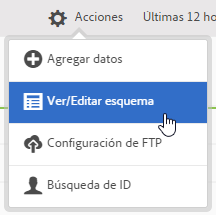
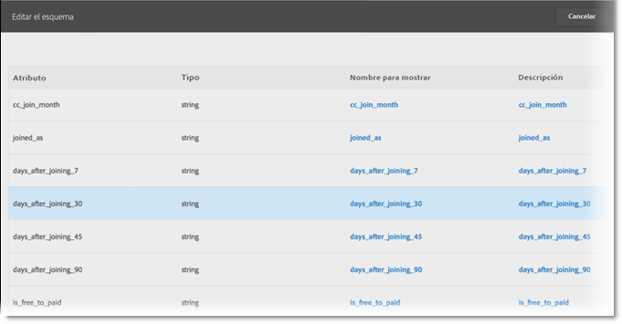

# Validar el esquema

El proceso de validación le permite asignar nombres para mostrar y descripciones en atributos cargados (cadenas, números enteros, números y demás). Se ha creado un esquema basado en estos ajustes. El esquema se utiliza para validar todos los datos futuros cargados a esta fuente de datos. Este proceso de asignación no altera los datos originales.

>[!NOTE]
>
>Actualizar el esquema tras la validación elimina los atributos del cliente. Consulte [Actualizar el esquema (también elimina los atributos)](../attributes/t-crs-usecase.md#task_6568898BB7C44A42ABFB86532B89063C).

**[!UICONTROL Origen de atributos del cliente]** &gt; **[!UICONTROL Crear un nuevo origen de atributos del cliente]** &gt; **[!UICONTROL Ver/Editar Esquema]**

En la página [!UICONTROL Validar esquema], cada fila del esquema representa una columna del archivo CSV cargado.

* **[!UICONTROL Añadir datos:]** Le permite cargar datos de atributo nuevos a esta fuente de datos.

* **[!UICONTROL Ver/Editar Esquema:]** Asigna nombres para mostrar en los datos de atributo, como se describe en el siguiente paso.

* **[!UICONTROL Configuración de FTP:]**[Cargue los datos a través de un FTP](../attributes/t-upload-attributes-ftp.md#task_591C3B6733424718A62453D2F8ADF73B).

* **[!UICONTROL Búsqueda de ID:]** Introduzca un ID de cliente (CID) de su [!DNL .csv] para buscar información sobre ese ID en Experience Cloud. Esta función es útil para resolver problemas sobre por qué no se muestran los datos de atributo de un visitante:

   * **[!UICONTROL MCID (Experience Cloud ID):]** Muestra si utiliza el servicio Experience Cloud ID más reciente. Si se encuentra en el servicio MCID pero no hay ningún ID en la lista, Experience Cloud no ha recibido un alias para dicho CID. Lo cual significa que el visitante no ha iniciado sesión o su implementación no ha pasado dicha ID.

   * **[!UICONTROL CID (ID de cliente):]** Los atributos asociados con este CID. Si utiliza una propiedad o eVar para cargar CID (AVID) y ve que se muestran atributos pero no hay AVID, esto indica que el visitante no ha iniciado sesión en su sitio.

   * **[!UICONTROL AVID (Analytics visitor ID):]** Muestra si utiliza una prop o una eVar para cargar los CID. Si estos ID se pasan a Experience Cloud, cualquier ID de visitante asociado con el CID que ha introducido se muestra aquí.

También puede cargar los datos mediante FTP una vez que haya creado un origen de atributos del cliente y una cuenta FTP en Experience Cloud. Puede crear una cuenta FTP por cada origen de atributos. Los archivos cargados se almacenan en la carpeta raíz de dicha cuenta. Los datos deben tener el formato .csv, con un segundo archivo .fin para indicar que la carga ha finalizado

Los nombres que aplique a las cadenas, números enteros y números se utilizan para crear métricas de [!DNL Analytics] Consulte [Informe de atributos del cliente](https://marketing.adobe.com/resources/help/es_ES/reference/?f=reports_customer_attributes) en las páginas de ayuda de [!DNL Analytics] para obtener más información.

* **[!UICONTROL Atributo:]** Lectura de datos de atributo desde un archivo cargado [!DNL .csv].

* **[!UICONTROL Tipo:]** El tipo de datos, como por ejemplo:

   * **Cadena:** una secuencia de caracteres.

   * **Enteros**: números enteros.

   * **Números**: puede tener hasta dos cifras decimales.

* **[!UICONTROL Mostrar nombre:]** Un nombre descriptivo para el atributo. Por ejemplo, puede cambiar un atributo de *Edad del cliente* a *Cliente desde*.

* **[!UICONTROL Descripción:]** Una descripción del atributo.

