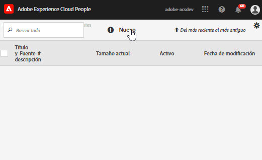

# audiencias de Experience Cloud {#topic_679810123CAA4E0CA4FA3417FB0100C7}

Las Audiencias son recopilaciones de visitantes (una lista de ID de visitantes). La biblioteca de audiencias de Adobe administra la traducción de datos sobre visitantes en la segmentación de audiencia. Como tal, crear y administrar audiencias es similar a crear y utilizar segmentos. También puede compartir el segmento de audiencia con productos y servicios de [!DNL Experience Cloud].

Las audiencias pueden crearse o derivarse desde distintos orígenes como:

* Las nuevas se crean en [!DNL Experience Cloud]
* Segmentos de [!DNL Analytics] publicados en [!DNL Experience Cloud]
* [!DNL Audience Manager]

**Audiencias en tiempo real o históricas**

Todas las audiencias, independientemente de su origen, son accesibles para los casos de uso de segmentación en tiempo real. Sin embargo, las audiencias compartidas desde Analytics en Audience Manager no se pueden utilizar para los procesos de segmentación en tiempo real. El sistema evalúa las audiencias de dos maneras:

* Las audiencias históricas de Analytics se evalúan cada cuatro horas. El tiempo total para procesar y compartir tarda hasta ocho horas. Las audiencias históricas siempre incluyen visitantes de retorno.
* Estas audiencias provienen de Audiencias de Experience Cloud y se evalúan en tiempo real.

## Cómo utilizan las soluciones las audiencias {#concept_01EB9345C5344597BC94A864EDD38EE1}

En la tabla siguiente se describe cómo se utilizan las audiencias en las soluciones de Experience Cloud:

| Solución | Descripción |
|--- |--- |
| Audiencias de Experience Cloud | Cree, administre y comparta audiencias de forma nativa con la interfaz de [Biblioteca de audiencias](audience-library.md). Puede:<ul><li>Usar audiencias en tiempo real mediante atributos de análisis sin procesar</li><li>Combinar audiencias para crear composiciones, uniendo datos históricos y en tiempo real</li><li>Ver vistas gráficas del tamaño estimado de audiencias</li></ul> Para obtener sugerencias sobre el tipo de audiencia que desea crear, consulte: [Audiencias de Experience Cloud](https://experienceleague.adobe.com/docs/experience-cloud-kcs/kbarticles/KA-16471.html?lang=en). |
| Analytics | En la segmentación puede crear un segmento, combinarlo con un grupo de informes y, a continuación, publicarlo en Experience Cloud. Al publicar el segmento, aparece en Experience Cloud en la página [!UICONTROL Biblioteca de Audiencias]. (Consulte [Publicar segmentos en Experience Cloud](https://experienceleague.adobe.com/docs/analytics/components/segmentation/segmentation-workflow/seg-publish.html?lang=en) en la ayuda de Analytics para obtener más información). La audiencia también está disponible como audiencia de destino para una experiencia de campaña suministrada por Adobe Target y en Audience Manager. Después de compartir una audiencia de Adobe Analytics y seleccionarla para usarla en una campaña activa, los perfiles de visitantes que cumplen los criterios de definición de segmento de los últimos 90 días se envían a [!UICONTROL Audience Services]. El límite de audiencias compartidas se ha aumentado a 75. Las audiencias compartidas en Experience Cloud desde Analytics no pueden superar los 20 millones de miembros únicos. Además, debido al almacenamiento en caché, los grupos de informes que se eliminan en Analytics tardan 12 horas en desaparecer de Experience Cloud. |
| Mobile Services | Analice el tráfico móvil mediante la visualización radial en el informe [!UICONTROL Tipos de dispositivos]. |
| [!DNL Target] | El [servicio de ID](https://experienceleague.adobe.com/docs/id-service/using/home.html?lang=es) unifica el ID y los datos de los visitantes en un único perfil que se puede activar para utilizarlo en todos los programas. Marcar la casilla [Publicar en Experience Cloud](audience-library.md) durante el proceso de creación de segmentos en Adobe Analytics permite que el segmento esté disponible en la biblioteca de audiencias personalizada de Adobe Target. Un segmento creado en Analytics o Audience Manager puede utilizarse para actividades en [!DNL Target]. Por ejemplo, puede crear actividades de campaña basadas en [!DNL Analytics] métricas de conversión de y segmentos de audiencias creados en [!DNL Analytics]. |
| Audience Manager | Las audiencias compartidas están disponibles en la segmentación de Audience Manager. Todas las audiencias de Experience Cloud están disponibles de forma nativa en Audience Manager, que proporciona lo siguiente:<ul><li>Automatización integrada sobre cómo se comparten y consumen los flujos de trabajo de la solución</li><li>Destinos fuera del sitio</li><li>Modelado similar</li></ul> |
| Campaign | <ul><li>Importar audiencias compartidas de diferentes soluciones de Adobe Experience Cloud en Adobe Campaign.</li><li>Exportación de listas de destinatarios como audiencias compartidas. Estas audiencias compartidas pueden utilizarse con las diferentes soluciones de Adobe Experience Cloud que use.</li></ul> |
| Advertising Cloud | Utilice la audiencia como destinatarios. |

{style=&quot;table-layout:auto&quot;}

>[!IMPORTANT]
>
>Una vez que un visitante se califica para la audiencia compartida desde Analytics, deben pasar de 4 a 8 horas antes de que pueda realizarse alguna acción sobre esa información en [!DNL Target], Ad Cloud y Campaign Standard.

## Más ayuda: preguntas, sugerencias y casos de uso {#section_C7F151644D8A45F7B6FC54F58845635D}

| Ayuda con | Recurso |
|--- |--- |
| ¿No puede encontrar Audiencias? | Compruebe que está aprovisionado. Consulte [Introducción: Habilite sus soluciones para los servicios principales](core-services.md). Vaya aquí   para solicitar acceso a Profiles and Audiences (formulario de aprovisionamiento de integraciones). |
| Casos de uso | Para obtener más información sobre la solución que se debe utilizar, vaya a [Opciones de creación de audiencias](https://experienceleague.adobe.com/docs/experience-cloud-kcs/kbarticles/KA-16471.html?lang=en) en la Base de conocimiento. |
| Foro | El [Foro de audiencias](https://experienceleaguecommunities.adobe.com/t5/Adobe-Experience-Cloud-Audiences/ct-p/experience-cloud-audiences-community) es otro recurso para obtener ayuda con las audiencias. |

{style=&quot;table-layout:auto&quot;}

## Elementos de la interfaz de la biblioteca de audiencias {#section_D04ACEF61CEF4B189AE6BA9F40D0DBF4}

[!DNL Experience Cloud] proporciona una biblioteca para la creación y administración de audiencias, con identificación de audiencia nativa y en tiempo real.

**[!UICONTROL Experience Cloud]** > **[!UICONTROL Experience Platform]** > **[!UICONTROL People]** > **[!UICONTROL Biblioteca de audiencias]**

| Elemento | Descripción |
|--- |--- |
| Nuevo | [Crear una audiencia](audience-library.md). |
| Título y descripción | Un encabezado de columna que identifica y describe la audiencia. |
| Autor | La persona que creó el segmento de audiencia. |
| Fuente | Identifica dónde se creó la audiencia.<ul><li>**Analytics:** un segmento creado en Adobe Analytics y [publicado en Experience Cloud](audience-library.md).</li><li>**Experience Cloud:** audiencia nueva [creada en Audiencias de Experience Cloud](audience-library.md).</li><li>**Audience Manager:** las audiencias creadas en Audience Manager se muestran automáticamente en Audiencias de Experience Cloud.</li></ul> |
| Tamaño actual | El tamaño de audiencia actual. |
| Activo | El estado activo del segmento. |

{style=&quot;table-layout:auto&quot;}
