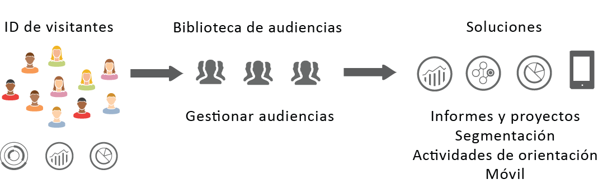
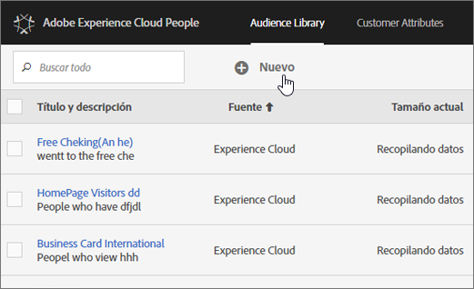

# Audiencias{#topic_679810123CAA4E0CA4FA3417FB0100C7}

Las audiencias son recopilaciones de visitantes (una lista de ID de visitantes). Los servicios de audiencias de Adobe administran la traducción de los datos sobre visitantes en segmentaciones de audiencia. De este modo, la creación y gestión de audiencias es similar a la creación y uso de segmentos, con la capacidad añadida de compartir segmentos de audiencia en [!DNL Experience Cloud].

Las audiencias pueden crearse o derivarse desde distintos orígenes como:

* Los nuevos creados en la variable [!DNL Experience Cloud]
* Desde [!DNL Analytics] segmentos publicados en la [!DNL Experience Cloud]
* De [!DNL Audience Manager]

**Audiencias en tiempo real o históricas**

Todas las audiencias, independientemente de su origen, son accesibles para los casos de uso de targeting en tiempo real. Sin embargo, las audiencias compartidas desde Analytics a Audience Manager no son accesibles para la obtención de segmentos en tiempo real. El sistema evalúa audiencias de dos formas:

* Las audiencias históricas provienen de Analytics y se evalúan cada 12 horas. Las audiencias históricas siempre incluyen visitantes de retorno.
* Las audiencias en tiempo real se generan en Audiencias de Experience Cloud y se evalúan en tiempo real.

## Cómo utilizan las soluciones las audiencias {#concept_01EB9345C5344597BC94A864EDD38EE1}

La tabla siguiente describe el modo en que las soluciones de Experience Cloud utilizan las audiencias:

| Solución | Descripción |
|--- |--- |
| Audiencias de Experience Cloud | Cree, administre y comparta audiencias de forma nativa mediante [la interfaz Biblioteca](../audience-library/audience-library.md) de audiencias. Puede:<ul><li>Usar audiencias en tiempo real con atributos de Analytics sin procesar</li><li>Combinar audiencias para crear atributos compuestos, uniendo datos históricos y en tiempo real</li><li>Consultar vistas gráficas de tamaño estimado de audiencias</li></ul> Para obtener sugerencias sobre el tipo de audiencia a crear, consulte [Audiencias de Experience Cloud](https://helpx.adobe.com/marketing-cloud-core/kb/People/Audience-Creation-Options.html). |
| Analytics | En la segmentación puede crear un segmento, combinarlo con un grupo de informes y, a continuación, [publicarlo en Experience Cloud](../audience-library/audience-library.md). Los segmentos publicados se muestran en la página [Audiencias](../audience-library/audience-library.md). La audiencia también está disponible como audiencia de destino para una experiencia de campaña suministrada por Adobe Target y en Audience Manager.   Una vez que una audiencia se comparte desde Analytics y se selecciona para usarla en una campaña activa, todos los perfiles de visitantes que cumplen los criterios de definición de segmento de los últimos 90 días se envían a la plataforma Servicios de audiencia de Experience Cloud.   Importante: Debe limitar la cantidad de audiencias compartidas de Analytics a 20 para evitar retrasos de procesamiento adicionales. Las audiencias compartidas en Experience Cloud desde Analytics no pueden superar los 20 millones de miembros únicos. Además, debido al almacenamiento en caché, los grupos de informes eliminados en Analytics tardan 12 horas en desaparecer de Experience Cloud. |
| Mobile Services | Analice el tráfico móvil con la visualización radial de los tipos [de dispositivos](https://marketing.adobe.com/resources/help/en_US/mobile/?f=reports_devices). |
| Target | El [servicio de ID](https://marketing.adobe.com/resources/help/en_US/mcvid/) unifica el ID de visitante y los datos en un único perfil sobre el que se puede actuar para su uso en distintas soluciones. La casilla [Publicar en Experience Cloud](../audience-library/audience-library.md) durante el proceso de creación de segmentos en Adobe Analytics permite que el segmento esté disponible en la biblioteca de audiencias personalizada de Adobe Target. Un segmento creado en Analytics o Audience Manager puede utilizarse para actividades en Target.  Por ejemplo, puede crear actividades de campaña basadas en métricas de conversión de Analytics y segmentos de audiencias creados en Analytics. |
| Audience Manager | Las audiencias compartidas están disponibles en la segmentación de Audience Manager. Todas las audiencias de Experience Cloud están disponibles de forma nativa en Audience Manager, que proporciona lo siguiente:<ul><li>Automatización integrada sobre cómo se comparten y consumen flujos de trabajo en la solución</li><li>Destinos fuera del sitio</li><li>Modelado similar</li></ul> |
| Campaign | <ul><li>Importar audiencias compartidas de diferentes soluciones de Adobe Experience Cloud en Adobe Campaign.</li><li>Exportar listas de destinatarios en el formulario de audiencias compartidas. Estas audiencias compartidas se pueden usar en las diferentes soluciones de Adobe Experience Cloud empleadas.</li></ul> |
| Media Optimizer | Utilice la audiencia como objetivos. |

>[!IMPORTANT]
>
>Una vez que un visitante cumple los requisitos de la audiencia compartida desde Analytics, hay un retraso de 24 a 48 horas para poder procesarla en Target, Media Optimizer y Campaign.

## Más ayuda: preguntas, sugerencias y casos de uso {#section_C7F151644D8A45F7B6FC54F58845635D}

| Ayuda con | Recurso |
|--- |--- |
| ¿No encuentra Audiencias? | Compruebe que está aprovisionado. Consulte [Introducción: habilite sus soluciones para los servicios principales](../core-services/core-services.md). Haga clic [aquí](https://www.adobe.com/go/audiences) para solicitar acceso a Profiles &amp; Audiences (formulario de aprovisionamiento de integraciones). |
| Casos de uso | Para obtener más sugerencias sobre la solución a utilizar, vaya a [Opciones de creación de audiencias](https://helpx.adobe.com/marketing-cloud-core/kb/People/Audience-Creation-Options.html) en la Base de conocimiento. |
| Foro | El [foro de Audiencias](https://forums.adobe.com/community/experience-cloud/platform/core-services/people-service/audiences) representa otro recurso sobre obtener ayuda a este respecto. |

## Elementos de la interfaz de la biblioteca de audiencias {#section_D04ACEF61CEF4B189AE6BA9F40D0DBF4}

[!DNL Experience Cloud] proporciona una biblioteca para la creación y administración de audiencias, con identificación de audiencia nativa y en tiempo real.

**[!UICONTROL Experience Cloud]** &gt; **[!UICONTROL Biblioteca de audiencias]**

| Elemento | Descripción |
|--- |--- |
| Nuevo | [Crear una audiencia](../audience-library/audience-library.md). |
| Título y descripción | Un encabezado de columna que identifica y describe la audiencia. |
| Autor | La persona que creó el segmento de audiencia. |
| Fuente | Identifica dónde se creó la audiencia.<ul><li>**Analytics:** Segmento creado en informes y análisis, análisis específico y luego [publicado en Experience Cloud](../audience-library/audience-library.md).</li><li>**Experience Cloud:** audiencia nueva [creada en Audiencias de Experience Cloud](../audience-library/audience-library.md).</li><li>**Audience Manager:** las audiencias creadas en Audience Manager se muestran automáticamente en Audiencias de Experience Cloud.</li></ul> |
| Tamaño actual | El tamaño de la audiencia actual. |
| Activo | El estado activo del segmento. |
