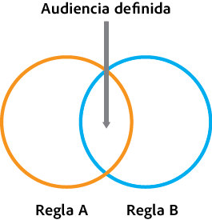
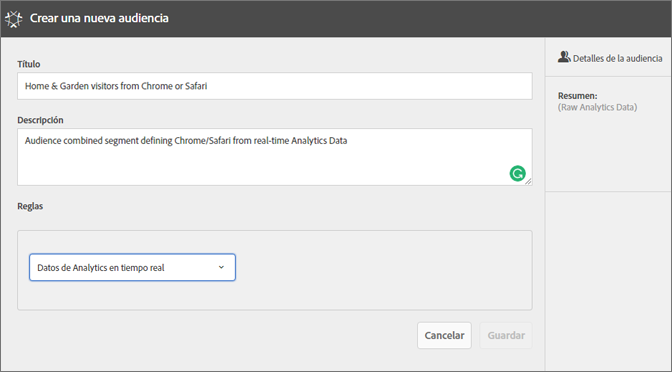
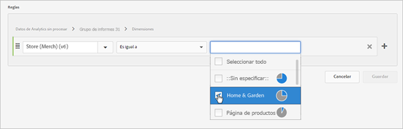
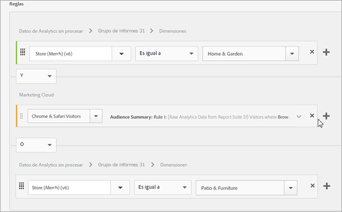
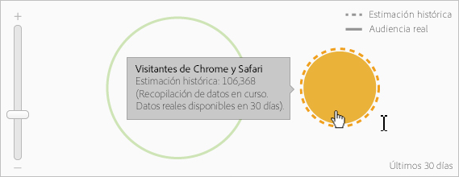

# Crear una audiencia

Obtenga más información sobre cómo utilizar las reglas de atributos para crear una audiencia y definir una compuesta en Experience Cloud.

Este artículo le ayuda a comprender cómo:

* Crear una audiencia
* Creación de reglas
* Uso de reglas para definir una audiencia compuesta

El siguiente gráfico representa dos reglas en una audiencia compuesta.

Cada círculo representa una regla que define una afiliación de audiencia. Los visitantes que cumplen con los requisitos de miembro en ambas reglas de audiencia se superponen para convertirse en una audiencia compuesta y definida.

>[!NOTE]
>
>La audiencia se define completamente después de que se complete la recopilación de datos durante el período especificado.
El siguiente ejemplo muestra cómo crear las reglas para una audiencia compuesta. Esta audiencia está compuesta por:

* La sección de Hogar y jardinería derivada de los datos de página o los datos de análisis sin procesar.
* Usuarios de Chrome y Safari derivados de [!DNL Adobe Analytics] un segmento [publicado](../audience-library/audience-library.md#task_32FEEFE0B32E4E388CD4D892D727282A) en [!DNL Experience Cloud]la.

   

1. En [!DNL Experience Cloud], haga clic **[!UICONTROL en Personas]** &gt; **[!UICONTROL Biblioteca de audiencias]**.
1. En la página [!UICONTROL Audiencias]**, haga clic en[!UICONTROL Nuevo]**. 

1. En la página [!UICONTROL Crear audiencia], especifique un título y una descripción.
1. Dentro de [!UICONTROL Reglas], seleccione una fuente de atributos:

* **[!UICONTROL Datos de Analytics en tiempo real:]** datos de atributo derivados de solicitudes de imagen en tiempo real de Analytics; incluyen datos tales como eVars y eventos. Debe seleccionar un grupo de informes al usar esta fuente de atributos, y definir la dimensión o el evento para incluir. Esta selección de grupo de informes proporciona la estructura de variables utilizada por el grupo de informes.

   >[!NOTE]
   >
   >Debido al almacenamiento en caché, los grupos de informes eliminados en Analytics tardan 12 horas en desaparecer de Experience Cloud.

* **[!UICONTROL Experience Cloud:]** Datos de atributo derivados de [!DNL Experience Cloud] las fuentes. Por ejemplo, pueden ser datos de segmentos de audiencia creados en [!DNL Analytics] o datos de [!DNL Audience Manager].

1. Definir reglas de audiencia.

>[!NOTE]
>
>Debe comprender las variables de implementación al definir reglas de audiencia.

En [!UICONTROL Reglas], defina las selecciones de *`Home & Garden`* atributos:

* **[!UICONTROL Fuente de atributos:]** Datos de Analytics sin procesar
* **[!UICONTROL Grupo de informes:]** Grupo de informes 31
* Dimensión = **[!UICONTROL Tienda (Merc) (v 6)]** &gt; **[!UICONTROL Es igual]** a &gt; **[!UICONTROL Hogar y jardín]**

   

   Los visitantes *de Chrome y Safari* son segmentos de audiencia compartidos desde Analytics:

* **[!UICONTROL Fuente de atributos:]** Experience Cloud
* **[!UICONTROL Dimensión:]** Visitantes de Chrome y Safari

   

   Para compararla, puede agregar una regla *O* para ver todos los visitantes de una sección del sitio, como Patio &amp; Furniture.

   

1. Ver los resultados.

La regla resultante es una audiencia definida compuesta por usuarios de Chrome y Safari que visitaron Home &amp; Garden. El segmento Patio y muebles proporciona información adicional con respecto a todos los visitantes que visitan esa sección del sitio.

**Estimación histórica:** (Círculo con puntos) Representa reglas creadas según datos de [!DNL Analytics].

**Audiencia real:** (círculo sólido) Cualquier regla creada que tiene 30 días de datos a partir de Audience Manager. Cuando los datos de Audience Manager llegan a los 30 días, la línea se convierte en una línea sólida y representa números reales.

Una vez que la recopilación de datos se completa para el período especificado, los círculos se combinan para mostrar una audiencia definida.

1. Después de definir las reglas, haga clic **[!UICONTROL en Guardar]**.

Una vez se ha guardado la audiencia, está disponible para otras soluciones. Por ejemplo, puede incluir una audiencia compartida en una actividad de Target.
