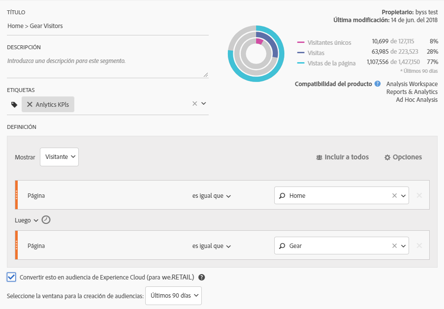

# Publicación de un segmento de audiencia de Analytics

Publique un segmento de audiencia de Analytics en Experience Cloud y Adobe Target para actividades de marketing para audiencias.

1. En Analytics, [cree un segmento](https://docs.adobe.com/content/help/en/analytics/components/segmentation/segmentation-workflow/seg-build.html).
1. En el Creador de segmentos, active la opción **[!UICONTROL Publicar este segmento en Experience Cloud]**.

   

   | Elemento | Descripción |
   |--- |---|
   | Publicar este segmento en Experience Cloud (para &lt;report suite name&gt;) | Publica este segmento en Experience Cloud. Puede utilizar la audiencia para actividades de segmentación y marketing en Adobe Target, Audience Manager, Advertising Cloud, Campaign y Audience Analytics. Los campos Título y Descripción son obligatorios para que se publique el segmento. Cuando esta opción está activada, el título y la definición del segmento de audiencia se comparten, pero no los datos en sí. Cuando dicha audiencia está asociada con una actividad en Target, Analytics comienza a enviar ID para los visitantes que son aptos para esta audiencia de Experience Cloud y Target. En este punto, el nombre de audiencia y los datos correspondientes empiezan a mostrarse en la página de Audiencias de Experience Cloud. Las audiencias compartidas en Experience Cloud desde Analytics no pueden superar los 20 millones de miembros de audiencia. Debido al almacenamiento en caché, los grupos de informes que se eliminan en Analytics tardan 12 horas en desaparecer de Experience Cloud. Para eliminar un segmento publicado en Experience Cloud, tiene que cancelar la publicación primero. Para cancelar la publicación de un segmento, simplemente **demarque** la casilla que utilizó para publicarla. **No puede** cancelar la publicación de un segmento que esté actualmente en uso por ninguna de las siguientes soluciones de Adobe: [!DNL Analytics] (en [!DNL Audience Analytics]), [!DNL Campaign], [!DNL Advertising Cloud] (para clientes de [!DNL Core Service] y [!DNL Audience Manager]) y todos los demás socios externos (para clientes de [!DNL Audience Manager]). **Puede** cancelar la publicación de un segmento en uso por [!DNL Target]. Una vez que un visitante se califica para la audiencia compartida desde Analytics, deben pasar de 24 a 48 horas antes de que pueda realizarse alguna acción sobre esa información en Target, Advertising Cloud y Campaign.Las audiencias de  **Privacidad de los datos**  no se filtran según el estado de autenticación de un visitante. Si un visitante puede navegar por su sitio en los estados de autenticado y no autenticado, las acciones que se dan cuando un visitante no está autenticado todavía pueden hacer que un visitante se incluya en una audiencia. Consulte la [Información general de privacidad de Analytics](https://docs.adobe.com/help/en/analytics/technotes/privacy-overview.html) para comprender las implicaciones de privacidad completas del uso compartido de audiencias. |
   | Selección del periodo para la creación de audiencias | Tenga en cuenta que este es un periodo de tiempo **variable**, no es fijo. |

1. Haga clic en **[!UICONTROL Guardar]**.
1. Vaya a [!DNL Adobe Target], haga clic en [!UICONTROL Audiencias].
1. En la página [!UICONTROL Audiencias], busque la audiencia procedente de Experience Cloud.

   Estas audiencias están disponibles para su uso en actividades.
