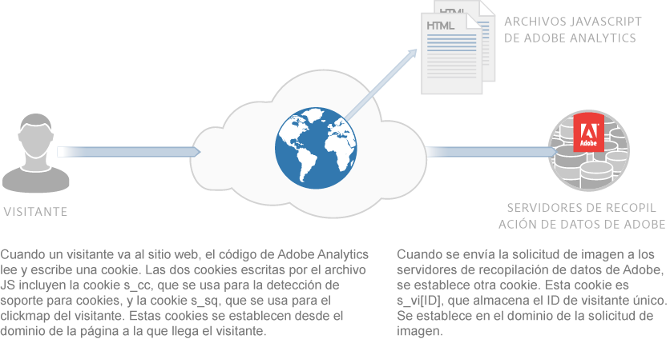
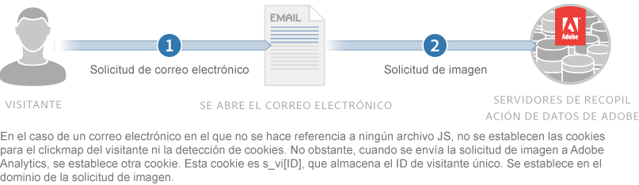

# Acerca de las cookies y la privacidad{#about-cookies-and-privacy}

El mantenimiento de la privacidad del cliente y la seguridad de los datos son prioridades esenciales en Adobe. Adobe participa en varias organizaciones de privacidad y coopera con los reguladores de privacidad y los principios de autorregulación. Esta cooperación incluye el programa AdChoices de Digital Advertising Alliance para proporcionar a los clientes información sobre cómo se utiliza su información y las opciones sobre su uso.

La mayoría de las cookies establecidas por los productos de Experience Cloud no contienen información personal. Estas cookies y los datos asociados son seguros y se utilizan solamente para los informes de su compañía y para proporcionar contenido y anuncios relevantes. Los datos no están disponibles para terceros ni para otros clientes de Adobe, a menos que se utilicen en informes del sector agregados. Por ejemplo, el informe [!DNL Digital Marketing Insight Report] analiza los datos agregados y anónimos de los comerciantes.

Adobe no combina la información a nivel de navegador entre distintas empresas. Para proteger la privacidad y seguridad de los datos de los clientes, algunos de los servicios de la oferta de Experience Cloud cuentan con la capacidad de usar un conjunto de cookies distinto para cada sitio rastreado. Algunas de las ofertas de grupo también permiten a los clientes usar su propio nombre de dominio como propietario de la cookie. Esta práctica crea una capa adicional de privacidad y seguridad, ya que hace que las cookies de Experience Cloud sean *cookies de origen*, que pertenecen de forma permanente al sitio de la compañía.

Las cookies pueden almacenar y proporcionar solamente la información que se había depositado anteriormente en ellas. No pueden ejecutar código ni acceder a otra información almacenada en el equipo. Además, los exploradores web restringen el acceso a los datos de cookies. Los navegadores aplican una directiva de seguridad de cookies que hace que todos los datos de las cookies estén disponibles únicamente para el sitio Web que originalmente configuró la información.

Por ejemplo, los datos contenidos en las cookies configuradas desde el sitio web Adobe.com no se pueden ver en ningún otro sitio web que no sea Adobe.com.

El diagrama siguiente ilustra el uso de cookies para una solicitud de imagen estándar:

El diagrama siguiente ilustra el uso de cookies para una solicitud de imagen habitual (utilizado en situaciones en las que no se carga un archivo JS):

