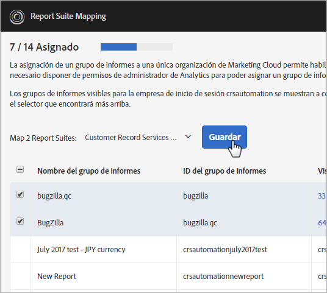
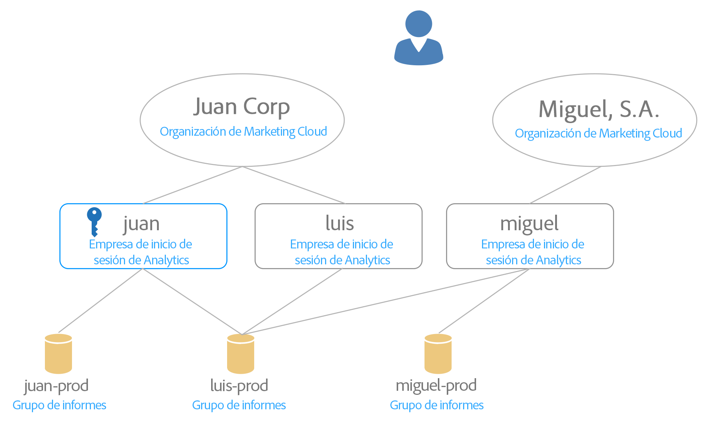

# Asignación de grupos de informes a una organización {#topic_7C4740559EAC4E0FA5F8DEF886B580DA}

>[!NOTE]
>
>La funcionalidad de asignación de grupos de informes quedará obsoleta en noviembre de 2020. Póngase en contacto con Asistencia al cliente si tiene alguna pregunta.

Los servicios de Experience Cloud (como el Servicio de Experience Cloud ID y [!UICONTROL People]) están asociados a una organización en lugar de a un grupo de informes individual. Para garantizar que estos servicios funcionen correctamente, cada grupo de informes de Analytics debe asignarse a una organización. Proceso de asignación:

* Establece una organización de Experience Cloud como la organización principal para el grupo de informes.
* No cambia quién puede acceder a un grupo de informes (el acceso sigue determinado por la cuenta de inicio de sesión de Adobe Analytics de cada usuario)

## Requisitos

Debe ser administrador de Analytics de una compañía de inicio de sesión que tenga acceso al grupo de informes que desee asignar. Además, esta cuenta debe estar [vinculada a una organización de Experience Cloud](../admin-getting-started/organizations.md#topic_C31CB834F109465A82ED57FF0563B3F1) para asignar grupos de informes a esa organización.

Las organizaciones aparecen en gris si se carece de permisos de administrador de Analytics para una empresa de inicio de sesión en ellas y con acceso al grupo de informes dado.

## Asignación de un grupo de informes a una organización {#task_23993FE78DF6455FA8D7BE60686EA16C}

1. Vaya a Grupos de informes para la administración de datos en [!DNL Analytics] > **[!UICONTROL Administración]** > **[!UICONTROL Gestión de datos]** (consulte [Ver/Administrar la configuración de la Gestión de datos del grupo de informes](https://docs.adobe.com/help/es-ES/analytics/admin/data-governance/gdpr-view-settings.html))

1. Si desea ver las empresas de inicio de sesión que tienen acceso a cada grupo de informes, haga clic en **[!UICONTROL Visible para empresas de inicio de sesión]**.

   Esta vista pretende ayudarlo a tomar una decisión fundamentada acerca de la asignación.

1. Haga clic en el menú desplegable en la columna **[!UICONTROL Organización asignada]** junto a un grupo de informes y seleccione la organización a la que desea asignar.

   Consulte la siguiente sección para obtener sugerencias sobre cómo seleccionar una organización de Experience Cloud.

## Asignar varios grupos de informes a una organización {#task_94955B0D8ABA4CB1A38746ECF8E32711}

1. Haga clic en **[!UICONTROL Experience Cloud]** > **[!UICONTROL Administración]** > **[!UICONTROL Asignación de grupos de informes]**.

1. Seleccione los grupos de informes que desea asignar.

   

1. Seleccione la organización (Outdoors Inc, en este ejemplo) y, a continuación, haga clic en **[!UICONTROL Seleccionar]**.

   Consulte la siguiente sección para obtener sugerencias sobre cómo seleccionar una organización de Experience Cloud.

1. Haga clic en **[!UICONTROL Guardar asignación]**.

## Sugerencias para seleccionar una organización de Experience Cloud {#mapping-tips}

Esta sección contiene sugerencias para ayudarle a seleccionar la organización de Experience Cloud a la que debe asignar un grupo de informes.

### ¿Qué organización debo elegir?

Si el Servicio de Experience Cloud ID está implementado en el grupo de informes, asegúrese de que la organización seleccionada en la herramienta Report Suite Mapping sea la misma especificada en el archivo [!DNL visitorAPI.js] de su sitio web. Puede utilizar las instrucciones de [Comprobación y verificación del Servicio de Experience Cloud ID](https://docs.adobe.com/content/help/es-ES/id-service/using/implementation-guides/test-verify.html) para encontrar el ID de organización que utiliza el servicio de ID de visitante.

Si el servicio de ID de visitante aún no está implementado en los sitios que recopilan datos para el grupo de informes, si implementa el servicio de ID de visitante de Experience Cloud en el futuro, deberá asegurarse de que la implementación coincida con la organización elegida en la herramienta de asignación de grupos de informes.

### ¿Por qué algunas organizaciones están atenuadas?

Esto indica que no tiene suficientes privilegios para asignar al grupo de informes atenuado. Consideremos el siguiente ejemplo:

En este diagrama, la llave azul indica privilegios de administrador. Las líneas grises indican visibilidad.

Este usuario tiene acceso a dos organizaciones de Experience Cloud. Ha realizado lo siguiente:

* Ha vinculado su cuenta de administrador en la compañía de inicio de sesión de [!UICONTROL chapek] Analytics a su cuenta de organización de Experience Cloud de [!UICONTROL Chapek].
* Ha vinculado su cuenta de no administrador en la compañía de inicio de sesión de Analytics de [!UICONTROL doohan] a su cuenta de organización de Experience Cloud de [!UICONTROL Chapek].
* Ha vinculado su cuenta de no administrador en la compañía de inicio de sesión de Analytics de nigel a su cuenta de organización de Experience Cloud de Nigel Inc.

Los siguientes puntos incluyen las acciones de asignación que este usuario puede y no puede realizar con respecto a estos grupos de informes:

* El grupo de informes [!UICONTROL Chapek-prod] se puede asignar a la organización [!UICONTROL Chapek] Corp, ya que este usuario es administrador de una compañía de inicio de sesión vinculada de Analytics ([!UICONTROL chapek]) y su cuenta está vinculada a esta organización.
* Este usuario no puede vincular el grupo de informes [!UICONTROL Nigel-prod] porque no es administrador en ninguna compañía de inicio de sesión en la que este grupo de informes sea visible.
* El grupo de informes [!UICONTROL Doohan-prod] se puede asignar a [!UICONTROL Chapek Corp], ya que este usuario es administrador de una compañía de inicio de sesión ([!UICONTROL chapek]) vinculada a la organización de Experience Cloud (tenga en cuenta que no es administrador de la compañía de inicio de sesión doohan de Analytics). Es importante tener en cuenta que el grupo de informes [!UICONTROL doohan-prod] también puede asignarse a la organización de Experience Cloud de Nigel Inc, aunque este usuario no pueda realizar esa asignación. En este caso, ambas organizaciones de Experience Cloud se muestran en la lista, pero [!UICONTROL Nigel Inc] aparece atenuado. Antes de realizar la asignación, este usuario debe consultar con un administrador de la compañía de inicio de sesión nigel para determinar qué organización es la mejor candidata para la asignación. La interfaz de usuario muestra una advertencia de posible conflicto si selecciona una organización diferente a la organización en la que se creó originalmente el grupo de informes.

## Preguntas frecuentes {#section_099E485805994C929FF9C9F75219BEE1}

### ¿Por qué no veo todos los grupos de informes?

Algunos de los grupos de informes podrían estar visibles en una compañía de inicio de sesión diferente. Puede cambiar la compañía de inicio de sesión actual mediante la lista desplegable situada en la parte superior de la pantalla.

### ¿Qué sucede si no reconozco algunas de las organizaciones enumeradas en la lista desplegable de uno de mis grupos de informes?

La lista muestra todas las organizaciones *posibles* a las que podría asignarse el grupo de informes, aunque carezca de permiso para asignar a todos estos grupos de informes. Si no está seguro de si el grupo de informes debe asignarse a uno de los grupos de informes en gris de la lista, consulte con un administrador de Experience Cloud de su organización para determinar cuál es la mejor opción.

### ¿Qué sucede si no reconozco algunas de las Compañías de inicio de sesión enumeradas para un grupo de informes en la columna “Visible para Compañías de inicio de sesión”?

En algún momento, este grupo de informes se compartió con otra compañía de inicio de sesión que puede formar parte de una organización diferente de Experience Cloud.

### ¿Qué es este error de “Posible conflicto” acerca de un grupo de informes generado a la vez en otra organización? ¿Por qué importa eso?

Se trata de una notificación que le ayuda a tomar una decisión informada sobre la asignación de grupos de informes. Queremos que sea consciente de que el grupo de informes se creó originalmente bajo una organización diferente en caso de que esa organización sea más apropiada para este grupo de informes.

### ¿Cómo sé si un grupo de informes está asignado?

Los grupos de informes asignados se mostrarán en un formato no editable. Si necesita cambiar una asignación, póngase en contacto con el Servicio de atención al cliente.

### ¿Qué sucede si solo conozco el ID de organización de mi organización de Experience Cloud? ¿Cómo busco el nombre de mi identificador de organización?

Puede encontrar el nombre de su organización en [Organizaciones y Configuración de cuenta](https://docs.adobe.com/content/help/es-ES/core-services/interface/manage-users-and-products/organizations.html).

### Veo una fecha en la columna “Fecha de asignación”. ¿Quién hizo esa asignación?

Puede consultar el Registro de cambios del grupo de informes en la interfaz de Analytics para comprobar el ID de usuario que realizó el cambio. Busque el evento “Grupo asociado a la organización IMS”.
