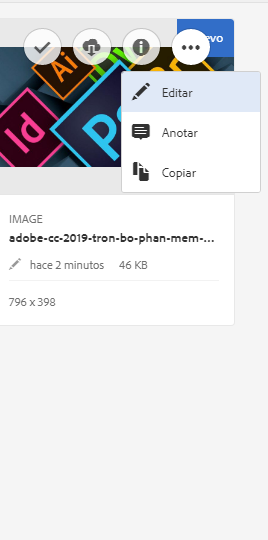
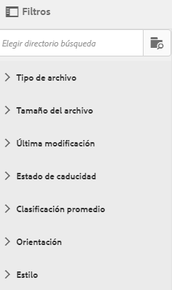
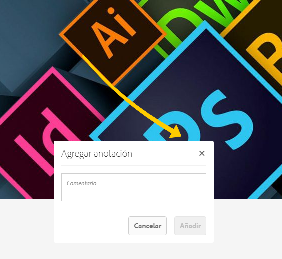
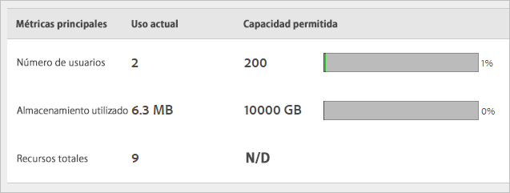

# Información general sobre Experience Cloud Assets

Recursos de Experience Cloud proporciona un único repositorio centralizado de recursos preparados para el marketing que puede compartir entre aplicaciones. Un recurso es un documento digital, una imagen, un vídeo o un audio (o parte de ello) que puede tener varias representaciones y subrecursos (por ejemplo, capas de un archivo de [!DNL Photoshop], diapositivas de un archivo de [!DNL PowerPoint], páginas de un PDF o archivos en un ZIP).

Entre los servicios de activos se incluyen:

* Almacenamiento de activos, interfaz de administración, interfaz de selección integrada (a través de aplicaciones).
* Integraciones con aplicaciones de Creative Cloud, Experience Cloud y Experience Cloud.

El uso de recursos mejora la coherencia y el cumplimiento de la marca y reduce el tiempo de comercialización. Puede optimizar los flujos de trabajo en las aplicaciones:

* **[!DNL Social]**: publique en propiedades sociales, Facebook, Twitter, LinkedIn, Google+.
* **[!DNL Target]**: cree experiencias para pruebas A/B y con pruebas multivariadas.
* **[!DNL Media Optimizer]**: desarrolle unidades de anuncios en los distintos canales y campañas.
* **[!DNL Campaign]**: coloque los recursos en campañas y boletines de correo electrónico.

En [!UICONTROL Experience Cloud Assets], puede:

* [Navegar a Experience Cloud Assets](experience-cloud-assets.md#section_3657039DD3524F2AA88753BFF4781125)
* [Acceder a la barra de herramientas](experience-cloud-assets.md#section_EC2E401D225148818F3753248556BE6B)
* [Editar recursos](experience-cloud-assets.md#section_CD3C55A9D4574455B94D0955391C8FEC)
* [Buscar recursos](experience-cloud-assets.md#section_50FE049010B446FC9640AA6A30E5A730)
* [Anotar recursos](experience-cloud-assets.md#section_67FE1DFAAB744DA5B1CD3AD3CCEABF7A)
* [Visualizar recursos en pantalla completa y hacer zoom](experience-cloud-assets.md#section_A9F50D7D6BE341A2AB8244A4E42A4EF7)
* [Visualizar las propiedades de los recursos](experience-cloud-assets.md#section_FED28711DAB14E1BBEEA7CA890EE9573)
* [Ejecutar informes de uso](experience-cloud-assets.md#section_15D782FFB8D74CF4A735116CC03AD902)
* [Compartir recursos con Experience Manager](experience-cloud-assets.md#section_45C1B72F4D274F54BC6CCB64D2580AC5)

## Navegar a Experience Cloud Assets {#section_3657039DD3524F2AA88753BFF4781125}

## Acceder a la barra de herramientas {#section_EC2E401D225148818F3753248556BE6B}

Vaya a un recurso (o a un directorio de recursos) y escoja **[!UICONTROL Seleccionar]**.

La barra de herramientas proporciona acceso rápido a las funciones, incluidas Búsqueda, Cronología, Representaciones, Editar, Anotar y Descargar.

## Editar recursos {#section_CD3C55A9D4574455B94D0955391C8FEC}

La edición de un recurso activa funciones, entre las que se incluyen:

* Recortar
* Rotar
* Girar

## Buscar recursos {#section_50FE049010B446FC9640AA6A30E5A730}

Puede buscar por palabra clave, tipo de archivo, tamaño, última modificación, estado de publicación, orientación y estilo.

## Anotar recursos {#section_67FE1DFAAB744DA5B1CD3AD3CCEABF7A}

Seleccione **[!UICONTROL Anotar]** al dibujar círculos o flechas en una imagen y anote el recurso para que sus colegas lo revisen.

## Visualizar recursos en pantalla completa y hacer zoom {#section_A9F50D7D6BE341A2AB8244A4E42A4EF7}

Seleccione **[!UICONTROL Vistas]** > **[!UICONTROL Imagen]** para ver la imagen completa del recurso y activar el zoom.

## Visualizar las propiedades de los recursos {#section_FED28711DAB14E1BBEEA7CA890EE9573}

Elija entre la visualización de la tarjeta y sus propiedades, la vista de lista y la vista de columna para encontrar sus recursos más fácilmente.

Seleccione **[!UICONTROL Vistas]** > **[!UICONTROL Propiedades]** para ver las propiedades de un recurso:

## Ejecutar informes de uso {#section_15D782FFB8D74CF4A735116CC03AD902}

Consulte el número de usuarios, el almacenamiento utilizado y el total de los recursos.

Seleccione **[!UICONTROL Herramientas]** > **[!UICONTROL Informes]** > **[!UICONTROL Informe de uso]**

