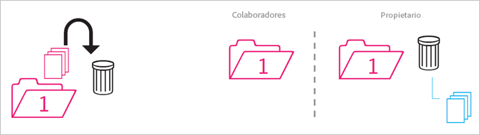
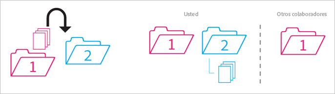
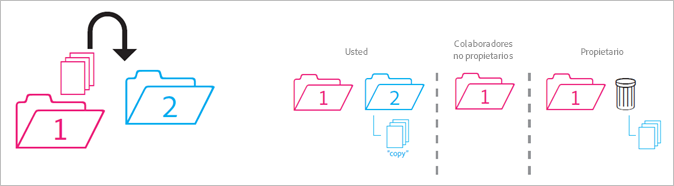
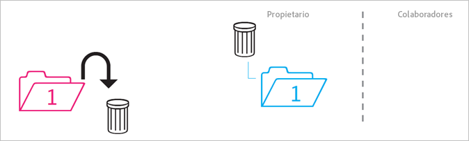
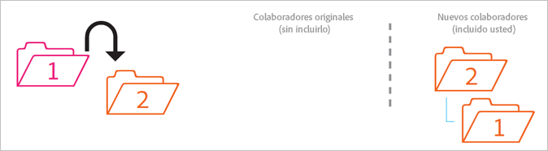
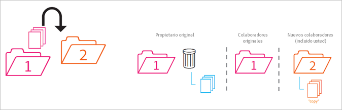
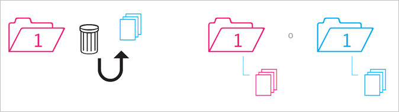

# Comportamiento de archivos compartidos

Reglas sobre cómo se comportan las carpetas compartidas cuando se mueven, eliminan o restauran.

>[!NOTE]
>
>Las carpetas y recursos compartidos de Experience Cloud se ven reflejados en el escritorio Creative Cloud en una relación de 1:1. Si un usuario de Experience Cloud cambia una carpeta (la elimina, agrega o deja de compartir), la acción se ve reflejada en la versión de Creative Cloud local y web. Por tanto, si deja de compartirse una carpeta, la carpeta y los recursos se eliminan de su equipo local. Una vez que se deja de compartir, la carpeta y sus contenidos se mueven a la papelera de su equipo local, donde puede restaurarlos en su equipo.

## Carpeta no compartida en una carpeta compartida {#section_A9BAC1A244A246A984AC62660E61E0C0}

Si mueve una carpeta no compartida a una carpeta compartida:

**Resultado**: ambas carpetas pasan a ser compartidas.

## Carpeta compartida en una carpeta no compartida{#section_8BA83001DCEC4CF084B980C4A660F59A}

Si mueve una carpeta compartida a una carpeta no compartida.

**Resultado**: la carpeta no compartida sigue sin ser compartida. La carpeta compartida sigue siendo compartida.

## Contenido de una carpeta no compartida a una carpeta compartida {#section_2941ED0DC52E4573AC1AB4C22313DD8E}

Si mueve contenido de una carpeta no compartida a una carpeta compartida.

**Resultado:** el contenido ahora es compartido y todos los colaboradores pueden verlo. El almacenamiento aumenta según el tamaño del contenido.

## Contenido compartido archivado y eliminado {#section_5210D5F4943A44D0BA675D8EB4EAE20F}

Si archiva o elimina contenido que se encuentre en una carpeta compartida.

**Resultado:** el contenido queda archivado para el propietario de la carpeta. Los colaboradores que no sean propietarios del contenido no podrán acceder más a él.

## Contenido compartido propio a una carpeta no compartida {#section_3810A364B67E4B8C9CA244BC52BF91BB}

Si mueve contenido de una carpeta compartida de su propiedad a una carpeta no compartida.

**Resultado:** el contenido ahora será no compartido. Los colaboradores de la carpeta compartida ya no tendrán acceso al contenido.

## Contenido que no es de su propiedad a una carpeta no compartida {#section_310766EBF0DC4C0BB4AB3E8A4DAEBE07}

Si mueve contenido de una carpeta compartida propiedad de otra persona a una carpeta no compartida.

**Resultado:** el contenido aparece en la carpeta no compartida y se elimina de la carpeta compartida. Los colaboradores de la carpeta compartida ya no tendrán acceso al contenido. El contenido queda archivado para el propietario de la carpeta compartida.

Los propietarios y editores pueden mover el contenido que no es de su propiedad, pero los visualizadores no pueden. Si los propietarios y editores mueven contenido, no estará disponible en una carpeta compartida para ningún usuario.

## Carpeta propia archivada o eliminada {#section_B314B13512A5409C87C49DFDB7602E14}

Si archiva (a través de la web) o elimina (de forma local) una carpeta compartida de su propiedad.

**Resultado:** la carpeta deja de compartirse y, a continuación, se archiva. Los colaboradores ya no tienen acceso a la carpeta.

## Carpeta compartida en otra carpeta compartida {#section_0A3F203D048D4D1586E9850DC92C51E9}

Si mueve una carpeta compartida de su propiedad a otra carpeta compartida que puede ser o no de su propiedad.

**Resultado:** cuando la carpeta se mueve a la segunda carpeta, pasa a ser compartida con los nuevos colaboradores.

## Contenido compartido en otra carpeta compartida {#section_69F6C312792A4CD2831BD14A340F850E}

Si mueve el contenido de una carpeta compartida a otra carpeta compartida.

**Resultado**: el contenido aparece en la segunda carpeta y ahora se comparte con los nuevos colaboradores. El contenido se elimina de la primera carpeta y el propietario lo ve como archivado, mientras que los demás colaboradores ya no tendrán acceso a él.

## Contenido restaurado del archivo {#section_DEA990B3581741F89FBB81D18C2AB449}

Si restaura el contenido de un archivo que pertenecía a una carpeta compartida. El contenido era suyo cuando se archivó.

**Resultado:** el contenido se restaura a la carpeta compartida y todos los colaboradores pueden acceder a él de nuevo. Si la carpeta compartida ya no existe, el contenido se sitúa en una copia no compartida de la carpeta principal original.
