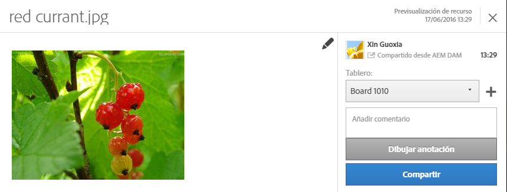

# Assets

Experience Cloud Assets proporciona un único almacén centralizado para los recursos preparados para el marketing que puede compartir entre sus soluciones. Un recurso es (o forma parte de) un documento digital, una imagen, un vídeo o audio que puede tener varias representaciones y subrecursos (por ejemplo, capas en un archivo de Photoshop, diapositivas en un archivo de PowerPoint, páginas en un PDF o archivos en un ZIP).

<!-- asset.xml -->
Los servicios de recursos incluyen:

* Almacenamiento de recursos, interfaz de administración, interfaz de selección incrustada (se accede a través de soluciones).
* Integraciones con Creative Cloud, colaboración con Experience Cloud y soluciones de Experience Cloud.

El uso de los recursos mejora la consistencia y el cumplimiento de marca y acelera la salida al mercado. Puede optimizar los flujos de trabajo en las siguientes soluciones:

* **[!DNL Social]**: publique en propiedades sociales, Facebook, Twitter, LinkedIn, Google+.
* **[!DNL Target]**: cree experiencias para pruebas A/B y con múltiples variables.
* **[!DNL Media Optimizer]**: Desarrollar unidades de publicidad en diferentes canales y campañas
* **[!DNL Campaign]**: coloque los recursos en campañas y boletines de correo electrónico.

En [!UICONTROL Experience Cloud Assets] puede realizar lo siguiente:

* [Navegar a Experience Cloud Assets](../experience-cloud-assets/experience-cloud-assets.md#section_3657039DD3524F2AA88753BFF4781125)
* [Acceder a la barra de herramientas](../experience-cloud-assets/experience-cloud-assets.md#section_EC2E401D225148818F3753248556BE6B)
* [Editar recursos](../experience-cloud-assets/experience-cloud-assets.md#section_CD3C55A9D4574455B94D0955391C8FEC)
* [Buscar recursos](../experience-cloud-assets/experience-cloud-assets.md#section_50FE049010B446FC9640AA6A30E5A730)
* [Anotar recursos](../experience-cloud-assets/experience-cloud-assets.md#section_67FE1DFAAB744DA5B1CD3AD3CCEABF7A)
* [Compartir recursos en su fuente](../experience-cloud-assets/experience-cloud-assets.md#section_2CD53A99600D4A3D9AA82C3CDA666E6B)
* [Visualizar recursos en pantalla completa y zoom](../experience-cloud-assets/experience-cloud-assets.md#section_A9F50D7D6BE341A2AB8244A4E42A4EF7)
* [Visualizar las propiedades de los recursos](../experience-cloud-assets/experience-cloud-assets.md#section_FED28711DAB14E1BBEEA7CA890EE9573)
* [Ejecutar informes de uso](../experience-cloud-assets/experience-cloud-assets.md#section_15D782FFB8D74CF4A735116CC03AD902)
* [Compartir recursos con Experience Manager](../experience-cloud-assets/experience-cloud-assets.md#section_45C1B72F4D274F54BC6CCB64D2580AC5)

## Navegar a Experience Cloud Assets {#section_3657039DD3524F2AA88753BFF4781125}

## Acceso a la barra de herramientas {#section_EC2E401D225148818F3753248556BE6B}

Vaya a un recurso (o a un directorio de recursos) y, a continuación, haga clic en **[!UICONTROL Seleccionar]**.

La barra de herramientas permite un acceso rápido a las funciones, entre las que se encuentran la búsqueda, la cronología, las representaciones, la edición, la anotación y la descarga.

## Editar recursos {#section_CD3C55A9D4574455B94D0955391C8FEC}

Editar un recurso activa funciones como las siguientes:

* Recortar
* Rotar
* Voltear

## Buscar recursos {#section_50FE049010B446FC9640AA6A30E5A730}

Puede buscar por palabra clave, tipo de archivo, tamaño, última modificación, estado de publicación, orientación y estilo.

## Anotar recursos {#section_67FE1DFAAB744DA5B1CD3AD3CCEABF7A}

Haga clic en **[!UICONTROL Anotar]dibujando círculos o flechas en una imagen y anote el recurso para su revisión por parte de sus colegas.**

## Compartir un recurso en la fuente {#section_2CD53A99600D4A3D9AA82C3CDA666E6B}

Haga clic **[!UICONTROL en Compartir]** en la barra de herramientas para compartir el recurso como [fuente](../feed.md#concept_9256B8768A294009A777282DD8719213) con otros usuarios de Experience Cloud.

Compartir hace que se muestre la imagen en su página de Feed y con quien haya compartido la tarjeta.

## Visualización de recursos de pantalla completa y zoom {#section_A9F50D7D6BE341A2AB8244A4E42A4EF7}

Haga clic **[!UICONTROL en Vistas]** &gt; **[!UICONTROL Imagen]** para ver la imagen completa del recurso y activar zoom.

## Ver propiedades de recursos {#section_FED28711DAB14E1BBEEA7CA890EE9573}

Elija entre la visualización de la tarjeta y sus propiedades, la vista de lista y la vista de columna para encontrar sus recursos más fácilmente.

Haga clic **[!UICONTROL en Vistas]** &gt; **[!UICONTROL Propiedades]** para ver las propiedades de un recurso:

## Ejecutar informes de uso {#section_15D782FFB8D74CF4A735116CC03AD902}

Consulte el número de usuarios, el almacenamiento utilizado y el total de los recursos.

Haga clic **[!UICONTROL en Herramientas]** &gt; **[!UICONTROL Informes]** &gt; **[!UICONTROL Informe de uso]**

