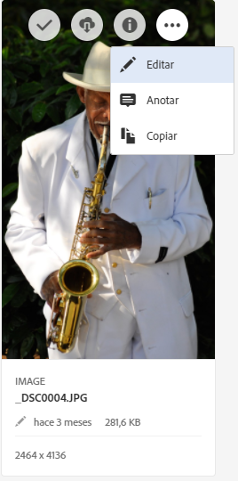
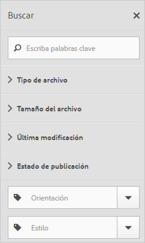
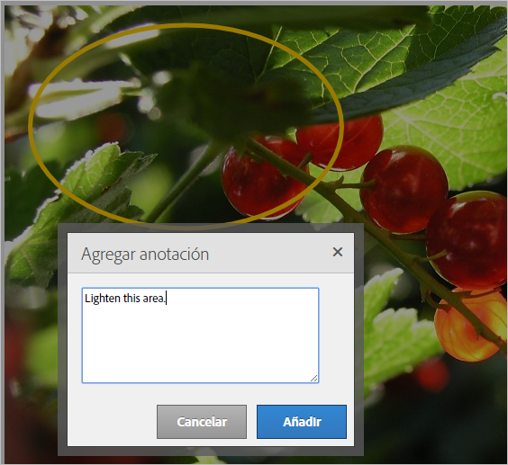
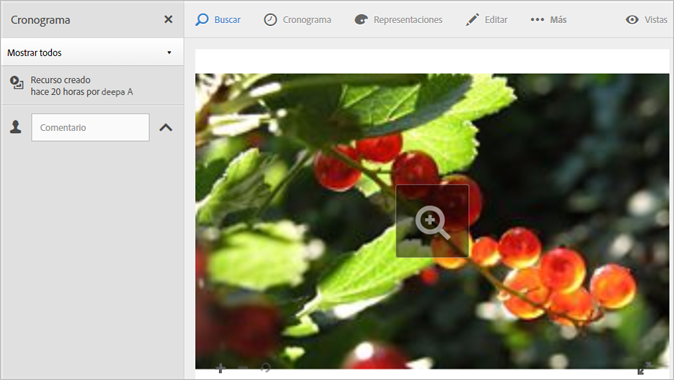
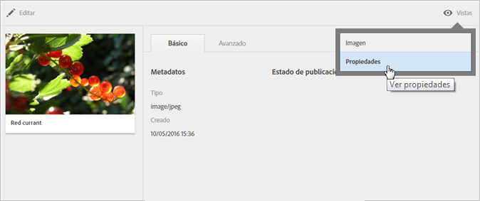

# Assets

Experience Cloud Assets ofrece un único repositorio centralizado de activos listos para su uso que se pueden compartir en varias soluciones. Un recurso es un documento digital, una imagen, un vídeo o audio (o parte del mismo) que puede tener varias representaciones y subrecursos (por ejemplo, capas de un archivo de [!DNL Photoshop], diapositivas de un [!DNL PowerPoint], páginas de un PDF o archivos en un ZIP).

Entre los servicios de activos se incluyen:

* Almacenamiento de activos, interfaz de administración, interfaz de selección de incrustación (a través de las soluciones).
* Integraciones con Creative Cloud, colaboración con Experience Cloud y soluciones de Experience Cloud.

El uso de recursos mejora la coherencia y el cumplimiento de la marca y reduce el tiempo de comercialización. Puede optimizar los flujos de trabajo en las soluciones:

* **[!DNL Social]**: publique en propiedades sociales, Facebook, Twitter, LinkedIn, Google+.
* **[!DNL Target]**: cree experiencias para pruebas A/B y con múltiples variables.
* **[!DNL Media Optimizer]**: desarrolle unidades de anuncios en los distintos canales y campañas.
* **[!DNL Campaign]**: coloque los recursos en campañas y boletines de correo electrónico.

En [!UICONTROL Experience Cloud Assets], puede:

* [Navegar a Experience Cloud Assets ](../experience-cloud-assets/experience-cloud-assets.md#section_3657039DD3524F2AA88753BFF4781125)
* [Acceder a la barra de herramientas](../experience-cloud-assets/experience-cloud-assets.md#section_EC2E401D225148818F3753248556BE6B)
* [Editar recursos ](../experience-cloud-assets/experience-cloud-assets.md#section_CD3C55A9D4574455B94D0955391C8FEC)
* [Buscar recursos](../experience-cloud-assets/experience-cloud-assets.md#section_50FE049010B446FC9640AA6A30E5A730)
* [Anotar recursos](../experience-cloud-assets/experience-cloud-assets.md#section_67FE1DFAAB744DA5B1CD3AD3CCEABF7A)
* [Visualizar recursos en pantalla completa y hacer zoom](../experience-cloud-assets/experience-cloud-assets.md#section_A9F50D7D6BE341A2AB8244A4E42A4EF7)
* [Visualizar las propiedades de los recursos](../experience-cloud-assets/experience-cloud-assets.md#section_FED28711DAB14E1BBEEA7CA890EE9573)
* [Ejecutar informes de uso](../experience-cloud-assets/experience-cloud-assets.md#section_15D782FFB8D74CF4A735116CC03AD902)
* [Copmartir recursos con Experience Manager](../experience-cloud-assets/experience-cloud-assets.md#section_45C1B72F4D274F54BC6CCB64D2580AC5)

## Navegar a Experience Cloud Assets {#section_3657039DD3524F2AA88753BFF4781125}

## Acceder a la barra de herramientas {#section_EC2E401D225148818F3753248556BE6B}

Vaya a un recurso (o a un directorio de recursos) y, a continuación, haga clic en **[!UICONTROL Seleccionar]**.

La barra de herramientas proporciona acceso rápido a las funciones, incluidas Búsqueda, Cronología, Representaciones, Editar, Anotar y Descargar.

## Editar recursos {#section_CD3C55A9D4574455B94D0955391C8FEC}

La edición de un recurso activa funciones, entre las que se incluyen:

* Recortar
* Rotar
* Girar

## Buscar recursos {#section_50FE049010B446FC9640AA6A30E5A730}

Puede buscar por palabra clave, tipo de archivo, tamaño, última modificación, estado de publicación, orientación y estilo.

## Anotar recursos {#section_67FE1DFAAB744DA5B1CD3AD3CCEABF7A}

Haga clic en **[!UICONTROL Anotar]** dibujando círculos o flechas en una imagen y anote el recurso para su revisión por parte de sus colegas.

## Visualizar recursos en pantalla completa y hacer zoom {#section_A9F50D7D6BE341A2AB8244A4E42A4EF7}

Haga clic en **[!UICONTROL Vistas]** > **[!UICONTROL Imagen]** para ver la imagen completa del recurso y activar el zoom.

## Visualizar las propiedades de los recursos {#section_FED28711DAB14E1BBEEA7CA890EE9573}

Elija entre la visualización de la tarjeta y sus propiedades, la vista de lista y la vista de columna para encontrar sus recursos más fácilmente.

Haga clic en **[!UICONTROL Vistas]** > **[!UICONTROL Propiedades]** para ver las propiedades de un recurso:

## Ejecutar informes de uso {#section_15D782FFB8D74CF4A735116CC03AD902}

Consulte el número de usuarios, el almacenamiento utilizado y el total de los recursos.

Haga clic en **[!UICONTROL Herramientas]** > **[!UICONTROL Informes]** > **[!UICONTROL Informe de uso]**

