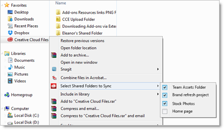

# Desactivar la sincronización de carpetas compartidas

Cómo desactivar la sincronización de carpetas de Experience Cloud compartidas desde su carpeta Creative Cloud Files.

>[!NOTE]
>
>Solo puede desactivar las carpetas que posee.

 <b>Windows</b> 

1. Abrir Windows Explorer.

1. En Favoritos, haga clic con el botón secundario en la carpeta **[!UICONTROL Creative Cloud Files]**, a continuación, haga clic en **[!UICONTROL Seleccionar carpetas compartidas a sincronizar]**.

   

1. Cancele la selección de cualquier carpeta que no desee sincronizar.

 <b>Mac OS</b> 

1. Abra una ventana de Finder.

1. Navegue hasta su carpeta de usuario.

1. Pulse control y haga clic en **[!UICONTROL Creative Cloud Files]**, a continuación, haga clic en **[!UICONTROL Seleccionar carpetas compartidas a sincronizar]**.

   

1. Cancele la selección de cualquier carpeta que no desee sincronizar.

   Las carpetas sincronizadas tienen una marca de verificación junto al nombre de la carpeta.