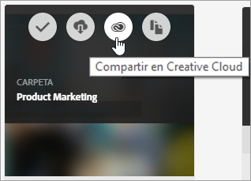
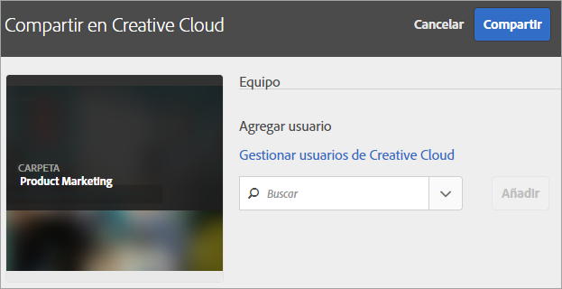
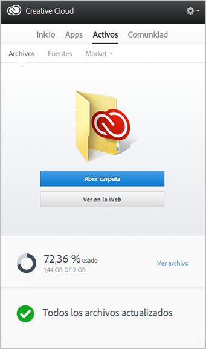
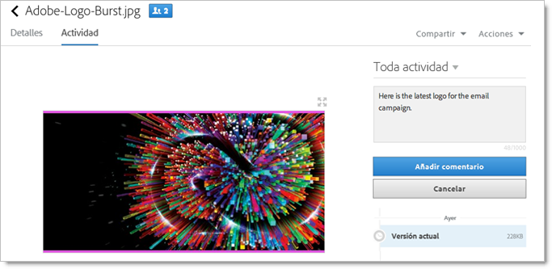
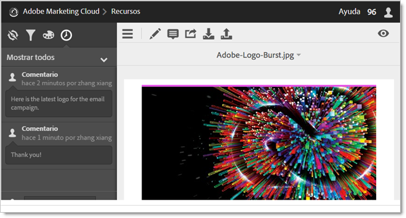
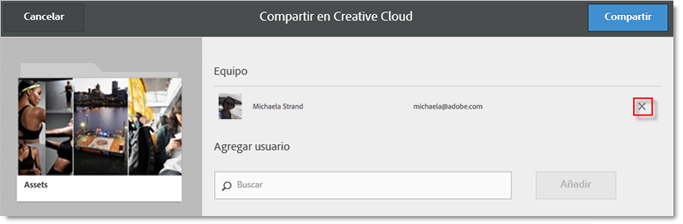
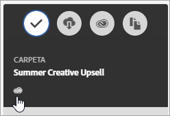

# Uso compartido de una carpeta de recursos de Experience Cloud

Comparta una carpeta de recursos de Experience Cloud con usuarios de Creative Cloud.

1. En una carpeta de recursos, haga clic en **[!UICONTROL Compartir en Creative Cloud]**.

   
1. En la página Compartir en Creative Cloud, seleccione un usuario y, a continuación, haga clic en **[!UICONTROL Agregar]**.

   

1. Haga clic en **[!UICONTROL Compartir]**.
1. Inicie la versión local de [!DNL Creative Cloud] (o vaya a la página [!UICONTROL Creative Cloud Files] desde un explorador) y busque la notificación de solicitud.

   
1. Abra la solicitud y, a continuación, haga clic en **[!UICONTROL Aceptar]**.

   
1. Para acceder a los contenidos de la carpeta, haga clic en **[!UICONTROL Abrir carpeta]** (o **[!UICONTROL Ver en la web]**).

   
1. Siga agregando comentarios en el recurso compartido:

   En Creative Cloud, puede hacer clic en una imagen y, a continuación haga clic en **[!UICONTROL Actividad]** para agregar un comentario en la imagen. Los comentarios se sincronizan con los recursos en [!DNL Creative Cloud] y en [!DNL Experience Cloud].

   

   En Experience Cloud, haga clic en una imagen y, a continuación, haga clic en el icono de línea temporal para agregar un comentario en la imagen. Los comentarios se sincronizan con los recursos en Creative Cloud y en Experience Cloud.

   

1. Para dejar de compartir una carpeta, haga clic en **[!UICONTROL Compartir en Creative Cloud]** (similar al [Paso 3](../experience-cloud-assets/t-share-creative-cloud.md#step_BA17CFA185284641A9B878BA29551996)), después elimine los usuarios haciendo clic en la X y, a continuación, haga clic en **[!UICONTROL Compartir]**.

Una vez que haya eliminado todos los usuarios de Creative Cloud, la carpeta deja de ser compartida y los usuarios de Creative Cloud ya no tendrán acceso a ella.
Formas adicionales de utilizar un recurso compartido incluyen:

* Utilizar recursos en el [!UICONTROL Selector de recursos] en [!DNL Adobe Social] para publicaciones sociales. Consulte [Página del editor](https://marketing.adobe.com/resources/help/es_ES/social/?f=c_pub_publisher).
* Cargue o intercambie recursos en la [Biblioteca de contenido](https://marketing.adobe.com/resources/help/es_ES/target/target/?f=c_manage_content) para [!DNL Adobe Target] imágenes en actividades.

Después de compartir una carpeta con Creative Cloud, verá en la misma el logotipo de Creative Cloud.

Ayuda relacionada:

* [Asistencia en Creative Cloud: Administrar y sincronizar archivos](https://helpx.adobe.com/es/creative-cloud/help/sync-files.html)
* [Asistencia en Creative Cloud: Colaborar con otros](https://helpx.adobe.com/es/creative-cloud/help/collaboration.html)
* [Asistencia en Creative Cloud: Preguntas frecuentes sobre la colaboración](https://helpx.adobe.com/es/creative-cloud/help/collaboration-faq.html)
