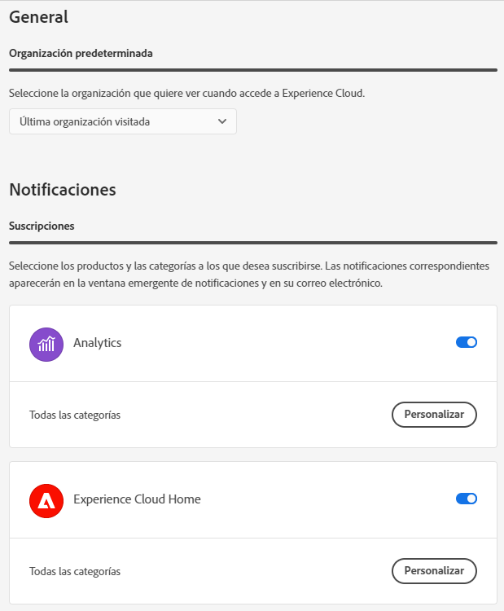

# Componentes de la interfaz central de CX

Los componentes de la interfaz central de CX Enterprise incluyen funciones que le permiten:

* Inicio de sesión y acceso a sus aplicaciones y servicios
* Búsqueda de la ayuda del producto y los objetos empresariales mediante búsqueda global
* Administración de las preferencias de la cuenta (alertas, notificaciones y suscripciones)

## Compatibilidad con exploradores en CX Enterprise

Para obtener el mejor rendimiento, CX Enterprise está optimizado para los exploradores más populares, incluida la versión más reciente, además de las dos versiones anteriores.

* Chrome
* Edge
* Firefox
* Opera
* Safari

Si el explorador no aparece en la lista, puede que sea compatible, pero se recomienda que utilice uno de los exploradores enumerados.

>[!NOTE]
>
>No todas las aplicaciones que se ejecutan en el dominio CX Enterprise admiten todos los exploradores. Si no está seguro, consulte la documentación de la aplicación específica.

## Compatibilidad de idiomas en CX Enterprise

CX Enterprise admite los idiomas preferidos para cada usuario, tal como se establecen en las preferencias de cuenta de usuario de Adobe. Actualmente se admiten los siguientes idiomas:

* Chino
* Inglés
* Francés
* Alemán
* Italiano
* Japonés
* Coreano
* Portugués
* Español
* Taiwanés

Aunque todos los equipos de aplicaciones están comprometidos con el soporte de idiomas global, no todas las aplicaciones se ofrecen en todos los idiomas mencionados anteriormente. Si el idioma principal no es compatible con una aplicación de CX Enterprise, también puede establecer un idioma secundario de forma predeterminada cuando corresponda. Esto se puede hacer en [preferencias de usuario de CX Enterprise](https://experience.adobe.com/preferences).

## Iniciar sesión en CX Enterprise

Inicie sesión y compruebe que se encuentra en la organización correcta.

1. Vaya a [Adobe CX Enterprise](https://experience.adobe.com).
1. Haga clic en **[!UICONTROL Iniciar sesión con un Adobe ID]**.
1. Compruebe que se encuentra en la organización correcta.

   

   Para comprobar que ha iniciado sesión en su organización correcta, haga clic en **[!UICONTROL Perfil]** para ver el nombre de la organización. Si tiene acceso a más de una organización, también puede ver y cambiar a otra mediante el selector **[!UICONTROL Organización]**.

   Si su organización utiliza Federated ID, CX Enterprise le permite iniciar sesión con el inicio de sesión único de su organización sin necesidad de escribir su dirección de correo electrónico y contraseña. Agregue `#/sso:@domain` a la dirección URL de CX Enterprise (`https://experience.adobe.com`) para realizar esta tarea.

   Por ejemplo, para una organización con Federated IDs y el dominio `example.com`, establezca el vínculo URL en `https://experience.adobe.com/#/sso:@example.com`. También puede ir directamente a una aplicación específica marcando esta URL, anexada con la ruta de la aplicación. (Por ejemplo, para Adobe Analytics, `https://experience.adobe.com/#/sso:@example.com/analytics`).

## Acceso a aplicaciones empresariales de CX

Después de iniciar sesión en CX Enterprise, puede acceder rápidamente a todas sus aplicaciones, servicios y organizaciones desde el encabezado unificado.

Haga clic en el selector de aplicaciones  para acceder a los servicios de CX Enterprise que posee.

## Búsqueda y asistencia en CX Enterprise

La búsqueda de CX Enterprise le permite buscar ayuda (documentación, tutoriales y cursos) en [Experience League](https://experienceleague.adobe.com/es?lang=es#home).

El menú [!UICONTROL Ayuda] también te da acceso a:

* **[!UICONTROL Soporte técnico]:** Cree un vale de soporte técnico o póngase en contacto con el [!UICONTROL Soporte técnico] a través de Twitter.
* **[!UICONTROL Comentarios]:** Póngase en contacto con Adobe para hacernos saber sus comentarios.
* **[!UICONTROL Estado]:** Vaya a `https://status.adobe.com/es-es/experience_cloud` y compruebe el estado operativo del producto y [!UICONTROL Administrar suscripciones].
* **[!UICONTROL Developer Connection]:** Navegación a `adobe.io` y búsqueda de documentación para desarrolladores.

## Preferencias de cuenta

En el menú de preferencias de cuenta, puede hacer lo siguiente:

* Especifique un tema oscuro (no todas las aplicaciones admiten este tema)
* Buscar organizaciones
* Cerrar sesión
* Configurar las [preferencias, notificaciones y suscripciones de la cuenta](#preferences)

### Administrar [!UICONTROL Preferencias] de CX Enterprise

Las preferencias de CX Enterprise incluyen notificaciones, suscripciones y alertas.

* Haga clic en **[!UICONTROL Preferencias]** en el menú de la cuenta  para administrar las preferencias.

En [!UICONTROL preferencias de CX Enterprise], puede configurar las siguientes características:

| Función | Descripción |
| --- | --- |
| Organización predeterminada | Seleccione la organización que desea ver al iniciar CX Enterprise. |
| [!UICONTROL Suscripciones] | Seleccione los productos y las categorías a los que desea suscribirse. Notificaciones en la ventana emergente [!UICONTROL Notificaciones] y en su correo electrónico. |
| [!UICONTROL Prioridad] | Seleccione las categorías que desea que se consideren de alta prioridad. Estas categorías están marcadas con la etiqueta High y pueden configurarse para entregarlas como alertas. |
| [!UICONTROL Alertas] | Seleccione las notificaciones de las que desea ver las alertas mostradas en el explorador. Las alertas aparecen en la esquina superior derecha de la ventana durante unos segundos. |
| Correos electrónicos | Especifique la frecuencia con la que desea recibir los correos electrónicos de notificación. (No enviado, instantáneo, diario o semanal). |

{style="table-layout:auto"}

## Notificaciones y anuncios

Haz clic en **[!UICONTROL Notificaciones]** para ver las notificaciones que son importantes para ti y los anuncios de Adobe.

Puede configurar las notificaciones en [preferencias de CX Enterprise](#preferences).
