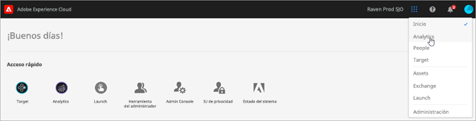

# Administración y servicios de Experience Cloud

Experience Cloud es la familia integrada de soluciones y servicios de marketing digital de Adobe. También es una intuitiva interfaz que le permite acceder rápidamente a sus soluciones y servicios principales en la nube.

Esta guía proporciona acceso a la ayuda sobre la administración de usuarios y productos de Experience Cloud en Admin Console, lo que permite crear soluciones para los servicios de plataforma. También puede acceder a la ayuda de la Biblioteca de audiencias, atributos del cliente, activos de Experience Cloud y mucho más:

* [[!UICONTROL Biblioteca de audiencias]](audience-library/audience-library.md)
* [[!UICONTROL Atributos del cliente]](attributes/attributes.md)
* [[!UICONTROL Triggers]](activation/triggers.md)
* [[!UICONTROL Activos de Experience Cloud]](experience-cloud-assets/experience-cloud-assets.md)
* [Cookies de Experience Cloud](cookies/cookies-privacy.md)
* [Administración de usuarios y productos](admin-getting-started/admin-getting-started.md) (Admin Console)
* [Activación de las soluciones en los servicios principales](core-services/core-services.md)
* [Preguntas frecuentes](admin-getting-started/admin-getting-started.md)
* [Organizaciones y vinculación de cuentas](admin-getting-started/organizations.md)
* [Integraciones](marketing-cloud-integrations.md)
* [Integración de Adobe Target con Experience Cloud](https://docs.adobe.com/content/help/es-ES/target/using/integrate/a4t/a4t.html)
* [Información general sobre seguridad y confidencialidad en Experience Cloud](assets/Adobe-Marketing-Cloud-Privacy-and-Security-Overview.pdf)
* [Precarga de DNS](admin-getting-started/admin-getting-started.md#concept_6BC8C6856E3644F8956D7AD0A96383B7)

## Guías

Las guías de Experience Cloud relacionadas incluyen:

* [Adobe Mobile](https://docs.adobe.com/content/help/es-ES/mobile-services/using/home.html)
* [Gráfico de cooperación Experience Platform](https://docs.adobe.com/content/help/es-ES/device-co-op/using/home.html)
* [Exchange](https://experiencecloud.adobeexchange.com/)
* [Servicio de Experience Cloud ID](https://docs.adobe.com/content/help/es-ES/id-service/using/home.html)
* [Experience Platform Launch](https://docs.adobe.com/content/help/es-ES/launch/using/overview.html)
* [Experience Cloud Debugger](https://docs.adobe.com/content/help/es-ES/debugger/using/experience-cloud-debugger.html)
* [API del Reglamento General de Protección de Datos (RGPD)](https://www.adobe.io/apis/experiencecloud/gdpr.html)
* [[!UICONTROL Dynamic Tag Management]](https://docs.adobe.com/content/help/es-ES/dtm/using/dtm-home.html)

## Tutoriales

Aproveche los tutoriales de autoayuda y los consejos rápidos de Experience League:

* [Todos los tutoriales de Experience League](https://experienceleague.corp.adobe.com/?lang=en#quick-how-tos)
* [Tutoriales de Experience Platform](https://experienceleague.corp.adobe.com/docs/core-services-learn/tutorials/overview.html?lang=en)
* [Plataforma de datos de clientes en tiempo real](https://experienceleague.corp.adobe.com/docs/platform-learn/tutorials/rtcdp/understanding-the-real-time-customer-data-platform.html?lang=en)

## Notas de la versión y ayuda relacionada con Experience Cloud

* [Documentación del producto para todas las soluciones de Experience Cloud](https://docs.adobe.com/content/help/es-ES/experience-cloud/user-guides/home.html): Busque ayuda en Experience Cloud Learn &amp; Support
* [Notas de la versión y actualizaciones de productos](https://docs.adobe.com/content/help/es-ES/release-notes/experience-cloud/current.html): Descubra las novedades de Experience Cloud y suscríbase para obtener actualizaciones
* [Tutoriales para implementar servicios principales](https://docs.adobe.com/content/help/es-ES/core-services-learn/tutorials/overview.html): Explore vídeos y tutoriales sobre servicios principales
* [Ayuda de expertos en Experience League](https://landing.adobe.com/experience-league/): Descubra todo lo que tiene que saber sobre nuestras soluciones gracias a nuestros expertos y a nuestra comunidad
* [Educación y formación](https://helpx.adobe.com/es/learning.html?promoid=KAUDK): Póngase en contacto con Adobe para asegurarse de sacar el máximo partido de nuestros productos
* [Blog de la experiencia del cliente](https://theblog.adobe.com/customer-experience/): Lea el blog de Experience Cloud
* [Servicio de atención al cliente](https://helpx.adobe.com/es/contact/enterprise-support.ec.html): Póngase en contacto con el Servicio de atención al cliente de Adobe
