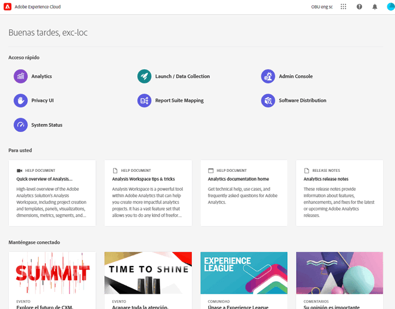
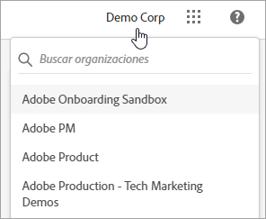
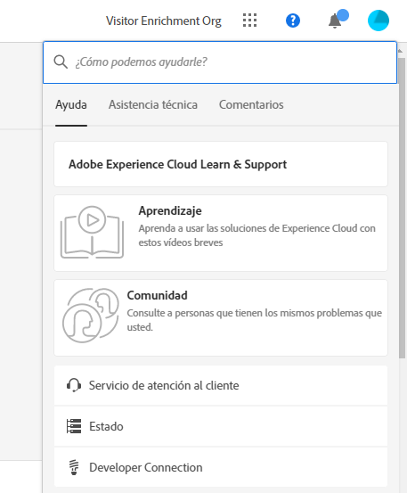
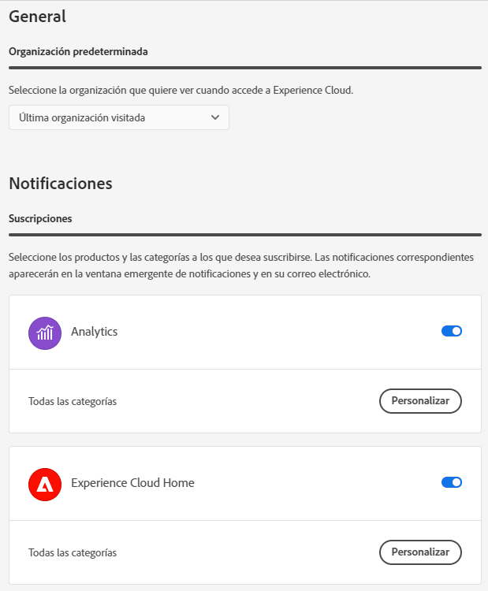
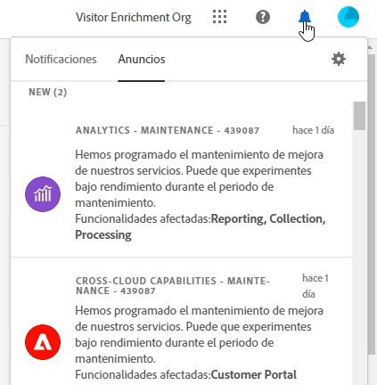

# Guía de componentes de la interfaz central del Experience Cloud

[La familia integrada de aplicaciones, productos y servicios de marketing digital de Experience ](https://experience.adobe.com) Cloud Adobe. Desde su intuitiva interfaz, puede acceder rápidamente a sus aplicaciones, funciones de productos y servicios en la nube.

Desde el encabezado del Experience Cloud, puede:

* Acceso a sus aplicaciones y servicios
* Busque documentación del producto, tutoriales y publicaciones de la comunidad
* Buscar globalmente objetos empresariales usando una búsqueda global (solo usuarios Experience Platform)
* Administración de las preferencias de la cuenta (alertas, notificaciones y suscripciones)

## Inicie sesión en Experience Cloud

Inicie sesión y verifique que se encuentra en la [organización](organizations.md) correcta.

1. Vaya a [Adobe Experience Cloud](https://experience.adobe.com).
1. Seleccione **[!UICONTROL Iniciar sesión con un Adobe ID]**.
1. En Adobe Experience Cloud, seleccione su organización.

   

   Su administrador puede ayudarle a verificar que se encuentra en la organización [correcta](organizations.md).

## Acceso a aplicaciones de Experience Cloud {#navigation}

Después de iniciar sesión en Experience Cloud, puede acceder rápidamente a todas sus aplicaciones, servicios y organizaciones desde el encabezado unificado.

Para acceder a los servicios de Experience Cloud que posee, vaya al selector de aplicaciones .

## Obtener ayuda y asistencia {#search}

La Ayuda unificada proporciona una ubicación dentro del producto para buscar y acceder al contenido de ayuda (documentación, tutoriales y cursos) en [Experience League](https://experienceleague.adobe.com/?lang=es#home). También puede enviar comentarios abiertos y crear tickets de asistencia priorizados.

El menú [!UICONTROL Ayuda] también le permite acceder a:

* **[!UICONTROL Asistencia técnica]:** Cree un ticket de asistencia o póngase en contacto con el [!UICONTROL Soporte técnico] mediante Twitter.
* **[!UICONTROL Comentarios]:** comparta comentarios sobre su experiencia de Experience Cloud. Los comentarios se utilizan para mejorar los productos y servicios de Adobe.
* **[!UICONTROL Estado]:** Vaya a `https://status.adobe.com/experience_cloud` y compruebe el estado operativo del producto y [!UICONTROL Administrar suscripciones].
* **[!UICONTROL Developer Connection]:** Navegación hasta `adobe.io` y búsqueda de documentación para desarrolladores.

## Buscar globalmente objetos y entidades

La búsqueda global le permite encontrar objetos o entidades empresariales en los que realizar búsquedas en una experiencia uniforme, sin problemas y con un solo clic. Esta búsqueda muestra los objetos a los que ha accedido recientemente.

>!![NOTE]
La búsqueda global solo está disponible para usuarios Experience Platform.

## Administrar preferencias de cuenta {#preferences}

Las preferencias de Experience Cloud incluyen notificaciones, suscripciones y alertas. En el menú de preferencias de cuenta, puede hacer lo siguiente:

* Especifique un tema oscuro (no todas las aplicaciones admiten este tema)
* Buscar [Organizaciones](organizations.md)
* Cerrar sesión
* Configurar las preferencias, notificaciones y suscripciones de la cuenta

Para administrar las preferencias, seleccione **[!UICONTROL Preferencias]** en el menú de la cuenta .

En [!UICONTROL preferencias de Experience Cloud], puede configurar las siguientes funciones:

| Función | Descripción |
|--- |--- |
| Organización [predeterminada](organizations.md) | Seleccione la organización que desea ver al iniciar Experience Cloud. |
| [!UICONTROL Suscripciones] | Seleccione los productos y las categorías a los que desea suscribirse. Notificaciones en la ventana emergente [!UICONTROL Notificaciones] y en el correo electrónico. |
| [!UICONTROL Prioridad] | Seleccione las categorías que desea que se consideren de alta prioridad. Estas categorías están marcadas con la etiqueta High y pueden configurarse para entregarlas como alertas. |
| [!UICONTROL Alertas] | Seleccione las notificaciones de las que desea ver las alertas mostradas en el explorador. Las alertas aparecen en la esquina superior derecha de la ventana durante unos segundos. |
| Correos electrónicos | Especifique la frecuencia con la que desea recibir los correos electrónicos de notificación. (No enviado, instantáneo, diario o semanal). |

{style=&quot;table-layout:auto&quot;}

## Notificaciones y anuncios {#notifications}

Seleccione **[!UICONTROL Notifications]** para recibir alertas sobre actualizaciones relevantes y procesables, incluidas versiones de productos, avisos de mantenimiento, elementos compartidos y solicitudes de aprobación.

## Obtener ayuda sobre administración y servicios entre aplicaciones

Esta guía proporciona acceso a la ayuda sobre la administración de usuarios y productos de Experience Cloud en Admin Console, lo que permite crear soluciones para los servicios de plataforma. También puede acceder a la ayuda de la Biblioteca de audiencias, atributos del cliente, activos de Experience Cloud y mucho más:

* [[!UICONTROL Biblioteca de audiencias]](audience-library.md)
* [[!UICONTROL Atributos del cliente]](attributes.md)
* [[!UICONTROL Triggers]](triggers.md)
* [[!UICONTROL Activos de Experience Cloud]](experience-cloud-assets.md)
* [Cookies de Experience Cloud](cookies-privacy.md)
* [Administración de usuarios y productos](admin-getting-started.md) (Admin Console)
* [Activación de las soluciones en los servicios principales](core-services.md)
* [Preguntas frecuentes](admin-getting-started.md)
* [Organizaciones y vinculación de cuentas](organizations.md)
* [Integraciones](marketing-cloud-integrations.md)
* [Integración de Adobe Target con Experience Cloud](https://experienceleague.adobe.com/docs/target/using/integrate/a4t/a4t.html?lang=es)
* [Información general sobre seguridad y confidencialidad en Experience Cloud](assets/Adobe-Marketing-Cloud-Privacy-and-Security-Overview.pdf)
* [Precarga de DNS](admin-getting-started.md#concept_6BC8C6856E3644F8956D7AD0A96383B7)

## Guías

Las guías de Experience Cloud relacionadas incluyen:

* [Adobe Mobile](https://experienceleague.adobe.com/docs/mobile-services/using/home.html?lang=es)
* [Gráfico de cooperación Experience Platform](https://experienceleague.adobe.com/docs/device-co-op/using/home.html?lang=en)
* [Exchange](https://exchange.adobe.com/experiencecloud)
* [Servicio de Experience Cloud ID](https://experienceleague.adobe.com/docs/id-service/using/home.html?lang=es)
* [Recopilación/Launch de datos del Experience Platform](https://experienceleague.adobe.com/docs/launch.html?lang=en)
* [Experience Cloud Debugger](https://experienceleague.adobe.com/docs/debugger/using/experience-cloud-debugger.html?lang=en)
* [API del Reglamento General de Protección de Datos (RGPD)](https://www.adobe.io/apis/experiencecloud/gdpr.html)
* [[!UICONTROL Dynamic Tag Management]](https://experienceleague.adobe.com/docs/dtm/using/dtm-home.html?lang=es)

## Tutoriales

Aproveche los tutoriales de autoayuda y los consejos rápidos de Experience League:

* [Todos los tutoriales de Experience League](https://experienceleague.adobe.com/?lang=es#quick-how-tos)
* [Tutoriales de Experience Platform](https://experienceleague.adobe.com/docs/launch-learn/tutorials/overview.html?lang=en)
* [Plataforma de datos de clientes en tiempo real](https://experienceleague.adobe.com/docs/platform-learn/tutorials/application-services/rtcdp/understanding-the-real-time-customer-data-platform.html?lang=en)

## Notas de la versión y ayuda relacionada con Experience Cloud

* [Documentación del producto para todas las soluciones de Experience Cloud](https://experienceleague.adobe.com/docs/home.html?lang=es): Busque ayuda en Experience Cloud Learn &amp; Support
* [Notas de la versión y actualizaciones de productos](https://experienceleague.adobe.com/docs/release-notes/experience-cloud/current.html?lang=es): Descubra las novedades de Experience Cloud y suscríbase para obtener actualizaciones
* [Tutoriales para implementar servicios principales](https://experienceleague.adobe.com/docs/launch-learn/tutorials/overview.html?lang=en): Explore vídeos y tutoriales sobre servicios principales
* [Ayuda de expertos en Experience League](https://experienceleague.adobe.com/?lang=es): Descubra todo lo que tiene que saber sobre nuestras soluciones gracias a nuestros expertos y a nuestra comunidad
* [Educación y formación](https://helpx.adobe.com/es/learning.html?promoid=KAUDK) : Póngase en contacto con el Adobe para asegurarse de sacar el máximo partido de los productos de Adobe
* [Blog de la experiencia del cliente](https://blog.adobe.com/en/topics/digital-transformation.html): Lea el blog de Experience Cloud
* [Servicio de atención al cliente](https://experienceleague.adobe.com/?support-solution=General&amp;lang=es#support): Póngase en contacto con el Servicio de atención al cliente de Adobe
