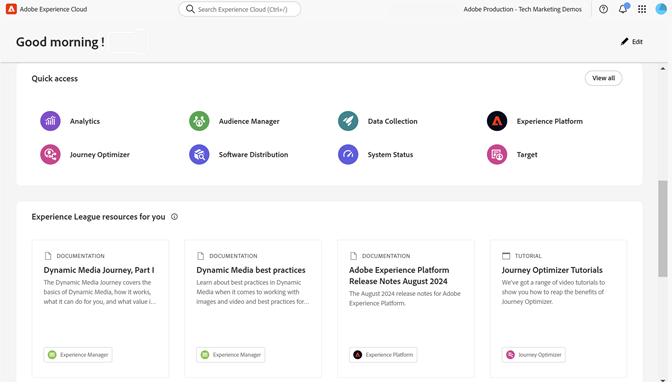

# Interfaz y administración de Experience Cloud

[Experience Cloud](https://experience.adobe.com) es la familia integrada de aplicaciones, productos y servicios de marketing digital de Adobe. Desde la intuitiva interfaz, puede acceder rápidamente a sus aplicaciones, funciones de productos y servicios en la nube.

En el encabezado de Experience Cloud encuentra las siguientes funciones:

* Acceda a todas las aplicaciones y servicios de Experience Cloud
* En el menú Ayuda, busque documentación del producto, tutoriales y publicaciones de la comunidad. Ver resultados en Experience League.
* Haga una búsqueda general de objetos empresariales mediante una búsqueda global (solo usuarios de Experience Platform) en el campo Búsqueda.
* Administración de las [preferencias](features/account-preferences.md) de la cuenta (alertas, notificaciones y suscripciones)

## Inicie sesión en Experience Cloud {#signin}

Inicie sesión y verifique que se encuentra en la [organización](administration/organizations.md) correcta.

1. Vaya a [Adobe Experience Cloud](https://experience.adobe.com).
1. Escriba su dirección de correo electrónico de Adobe y haga clic en **[!UICONTROL Continuar]**.
1. Haga clic en una cuenta.
1. Escriba la contraseña.
1. Compruebe que se encuentra en la organización correcta.

   

   **Verifique su organización**

   La [organización](administration/organizations.md) se muestra en el encabezado de la interfaz.

   Si su organización utiliza Federated ID, Experience Cloud le permite iniciar sesión con el inicio de sesión único de su organización sin necesidad de escribir su dirección de correo electrónico y contraseña. Agregar `#/sso:@domain` a la dirección URL de Experience Cloud (`https://experience.adobe.com`) para realizar esta tarea.

   Por ejemplo, para una organización con Federated IDs y el dominio `adobecustomer.com`, establezca el vínculo URL en `https://experience.adobe.com/#/sso:@adobecustomer.com`. También puede ir directamente a una aplicación específica marcando esta URL, anexada con la ruta de la aplicación. (Por ejemplo, para Adobe Analytics, `https://experience.adobe.com/#/sso:@adobecustomer.com/analytics`).

## Acceso a aplicaciones de Experience Cloud {#navigation}

Después de iniciar sesión en Experience Cloud, puede acceder rápidamente a todas sus aplicaciones, servicios y organizaciones desde el encabezado unificado.

Para acceder a las aplicaciones y servicios de Experience Cloud proporcionados por usted dentro de su organización, vaya al  del selector de aplicaciones.

## Obtener ayuda y asistencia {#support}

Acceda a aprendizaje y ayuda mediante el **[!UICONTROL Centro de Ayuda]** () del encabezado, que incluye contenido de ayuda (documentación, tutoriales y cursos) en [Experience League](https://experienceleague.adobe.com/?lang=es#home), así como recursos adicionales para aplicaciones individuales. También puede enviar comentarios abiertos y crear tickets de asistencia con prioridad.

El menú [!UICONTROL Ayuda] también le permite acceder a:

* **[!UICONTROL Asistencia técnica]:** Cree un ticket de asistencia o póngase en contacto con el [!UICONTROL Soporte técnico] mediante Twitter.
* **[!UICONTROL Comentarios]:** Comparta comentarios sobre su experiencia de Experience Cloud. Los comentarios se utilizan para mejorar los productos y servicios de Adobe.
* **[!UICONTROL Estado]:** Vaya a `https://status.adobe.com/experience_cloud` y compruebe el estado operativo del producto y [!UICONTROL Administrar suscripciones].
* **[!UICONTROL Developer Connection]:** Navegación hasta `adobe.io` y búsqueda de documentación para desarrolladores.

## Administrar el perfil de usuario

En el menú [!UICONTROL Perfil] puede hacer lo siguiente:

* Especifique un tema oscuro (no todas las aplicaciones admiten este tema)
* Administrar [Preferencias](features/account-preferences.md) de Experience Cloud
* Seleccione o busque una [organización](administration/organizations.md)
* Ver [!UICONTROL avisos legales]
* Cerrar sesión
* Configurar las preferencias, notificaciones y suscripciones de la cuenta

## Ver notificaciones y anuncios dentro del producto {#notifications}

Haga clic en el icono de la campana para ver las notificaciones y los anuncios. Los anuncios pueden ser actualizaciones relevantes y procesables, entre ellas versiones de productos, avisos de mantenimiento, elementos compartidos y solicitudes de aprobación.

Para administrar notificaciones y alertas, consulte [Preferencias y notificaciones de la cuenta](features/account-preferences.md)
