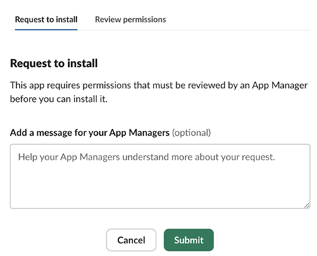

# Preferencias y notificaciones de cuenta {#preferences}

Las [preferencias](https://experience.adobe.com/preferences) del Experience Cloud incluyen notificaciones (en la aplicación, correo electrónico y [!DNL Slack]), suscripciones y alertas.

En las preferencias, puede:

* Buscar [Organizaciones](../administration/organizations.md)
* Especifique un tema oscuro (no todas las aplicaciones admiten este tema).
* Configure las preferencias de usuario, las notificaciones y las suscripciones.
* Cerrar sesión de Experience Cloud.

## Administrar preferencias

Para administrar las preferencias, seleccione **[!UICONTROL Preferencias]** en el menú  de su cuenta.

En [!UICONTROL preferencias de Experience Cloud], puede configurar las siguientes funciones:

| Función | Descripción |
|--- |--- |
| Organización [predeterminada](../administration/organizations.md) | Seleccione la organización que desea ver al iniciar Experience Cloud. |
| [!UICONTROL Recopilación de datos del producto] | Seleccione qué tecnologías puede utilizar Adobe para recopilar datos sobre cómo aprovechar sus productos. |
| [Notificaciones](#notifications-and-announcements) | Habilitar las notificaciones [!UICONTROL en la aplicación], [!UICONTROL correo electrónico] o [Slack](#slack-notifications). |
| [!UICONTROL Recomendaciones y promociones de formación personalizadas] | Seleccione dónde desea recibir [ayuda personalizada](personalized-learning.md) para sus productos de Adobe. Esta ayuda está disponible por correo electrónico, en el producto y en las comunidades de Experience League. |
| [!UICONTROL Suscripciones] | Seleccione los productos y las categorías a los que desea suscribirse. Notificaciones en la ventana emergente [!UICONTROL Notificaciones] y en su correo electrónico. |
| [!UICONTROL Prioridad] | Seleccione las categorías que desea que se consideren de alta prioridad. Estas categorías están marcadas con la etiqueta [!UICONTROL High] y pueden configurarse para su envío como alertas. |
| [!UICONTROL Alertas] | Seleccione las notificaciones de las que desea ver las alertas mostradas en el explorador. Las alertas aparecen en la esquina superior derecha de la ventana durante unos segundos. |
| Correos electrónicos | Especifique la frecuencia con la que desea recibir los correos electrónicos de notificación. (No enviado, instantáneo, diario o semanal). |

## Suscripción a notificaciones en Experience Cloud {#notifications}

Puede seleccionar los productos y las categorías a los que desea suscribirse. Las notificaciones aparecen en la ventana emergente [!UICONTROL Notificaciones] (en la aplicación), en tu correo electrónico o en [Slack](#slack-notifications) (según tus suscripciones).

Las notificaciones por correo electrónico y al Slack son útiles en situaciones en las que no ha iniciado sesión en Experience Cloud.

### Suscripción a notificaciones en la aplicación y por correo electrónico

1. Vaya al Experience Cloud [preferencias](https://experience.adobe.com/preferences).

1. En **[!UICONTROL Notificaciones]**, habilite **[!UICONTROL En la aplicación]** o **[!UICONTROL Correo electrónico]**.

   Los cambios en las notificaciones se guardan automáticamente.

### Suscribirse a [!DNL Slack] notificaciones {#slack}

>[!NOTE]
>
>Las notificaciones del Slack se lanzarán el **11 de septiembre de 2024**

Puede configurar las preferencias de su cuenta para enviar notificaciones al Experience Cloud a un canal [!DNL Slack].

**Requisitos previos**

* Debe tener una cuenta de Experience Cloud.
* Debe tener una cuenta de [!DNL Slack]. El administrador del Slack habilita la integración del Experience Cloud con Slack.
* Debe formar parte de al menos un espacio de trabajo de [!DNL Slack].

**Para suscribirse a las notificaciones del Slack**

1. Vaya al Experience Cloud [preferencias](https://experience.adobe.com/preferences).

1. Busque [!DNL Slack] y haga clic en **[!UICONTROL Agregar al Slack]**.

   

   Si [!DNL Slack] está instalado, la aplicación se abrirá y aparecerá un mensaje de solicitud de permiso. Si Slack no está instalado, debe [solicitar permiso](#slack-troubleshoot).

1. Haga clic en **[!UICONTROL Permitir]**.

1. En **[!UICONTROL Notificaciones]**, habilite [!DNL Slack] notificaciones para los productos y categorías que desee.

   

   Las actualizaciones de las notificaciones se guardan automáticamente.

### Solicitar permiso en el Slack {#slack-troubleshoot}

Si [!DNL Slack] no está instalado, aparece el mensaje _[!UICONTROL Solicitud de instalación]_ cuando el Slack se abre después de hacer clic en **[!UICONTROL Agregar al Slack]**.

**Para solicitar permisos en el Slack**

1. En Slack, elija el espacio de trabajo en la esquina superior derecha de la aplicación.

1. Para solicitar la aprobación de la aplicación para el administrador del espacio de trabajo del Slack, haga clic en **[!UICONTROL Enviar]**.

1. Recibirá una notificación en [!DNL Slack] después de que se apruebe la solicitud de la aplicación.

1. Una vez que reciba la aprobación de [!DNL Slack], regrese al Experience Cloud **[!UICONTROL Notificaciones]** y [suscríbase al Slack](#slack-notifications) (descrito anteriormente).

### Lo que verá en [!DNL Slack]

Después de integrar correctamente Slack, las notificaciones del Slack muestran la siguiente información:

* Se recibirá un mensaje personal del nombre de la aplicación _Adobe Experience Cloud_.
* El mensaje incluye el logotipo del producto para la aplicación en particular, como Adobe Experience Platform, Adobe Experience Manager, etc.
* Un vínculo para ver todas las notificaciones en el Experience Cloud.
* Un vínculo para administrar las preferencias de notificación del Experience Cloud.

## Ver [!UICONTROL notificaciones] y anuncios en el Experience Cloud {#view-notifications}

En el encabezado del Experience Cloud, puede ver las notificaciones a las que se ha [suscrito](#notifications), así como los anuncios.

1. Haga clic en el icono de campana del encabezado. 

1. Haga clic en **[!UICONTROL Notificaciones]** o en **[!UICONTROL Anuncios]**.

   En esta ubicación recibirá información importante sobre los productos, su colaboración con otros usuarios y otras actualizaciones relevantes. Las actualizaciones incluyen versiones de productos, avisos de mantenimiento, elementos compartidos y solicitudes de aprobación.