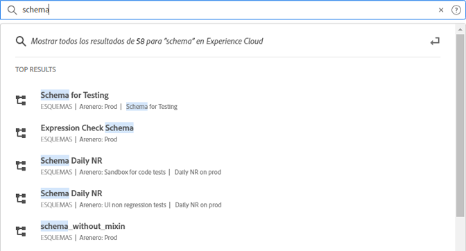
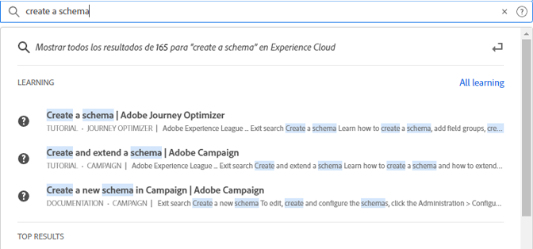

# [!UICONTROL Búsqueda unificada] de objetos y entidades {#globally-search}

La [!UICONTROL Búsqueda unificada] le permite encontrar objetos o entidades empresariales en los que realizar búsquedas de manera uniforme, sin problemas y con un solo clic. Esta búsqueda también muestra los objetos a los que ha accedido recientemente.

## Acceso a búsqueda unificada

La búsqueda unificada está disponible en todas las páginas del encabezado del Experience Cloud, en la parte superior de la página. También puede utilizar el método abreviado de teclado `command /` o `ctrl /` para acceder a la búsqueda.

Esta función solo está disponible para productos compatibles, que actualmente son:

* Experience Platform (AEP)
* Journey Optimizer (AJO)

A medida que se indexa más contenido, esta función se añade a las aplicaciones relevantes.

## Objetos y campos que se pueden buscar

A medida que escribe, se muestran los resultados principales coincidentes de los objetos a los que tiene acceso.

Nuestros algoritmos muestran primero los registros más relevantes. El orden de los resultados depende de varios factores, como:

Su capacidad y permisos de objetos Porcentaje de coincidencia Si hay una coincidencia exacta

Los objetos empresariales que se pueden buscar incluyen:

* Segmentos (nombre, descripción, ID)
* Esquema (nombre, descripción, ID)
* Conjuntos de datos (nombre, descripción, ID)
* Fuentes (nombre, descripción, ID)
* Destinos (nombre, descripción, ID)
* Consultas (nombre, descripción, ID)
* Mensajes (nombre, descripción, ID)
* Ofertas (nombre, descripción, ID)
* Componentes (nombre, descripción e ID)
* Recorridos (nombre, descripción, ID)

Si una palabra clave coincide con una página de navegación, puede obtener un vínculo de acceso rápido a los conjuntos de datos de ejemplo de la página de navegación. La sección de resultados principales muestra los 30 resultados principales.

También puede encontrar los artículos de ayuda de Experience League y Communities. Se admiten consultas de lenguas naturales

Por ejemplo, _Cómo crear un esquema_ produce resultados de Experience League en _[!UICONTROL Aprendizaje]_:

Los algoritmos de búsqueda muestran primero los registros más relevantes. El orden de los resultados depende de varios factores, como:

* Permisos de usuario para acceder a objetos
* Porcentaje de coincidencia
* Coincidencias exactas
* La sección _[!UICONTROL Resultados principales]_ muestra los treinta resultados principales.

Para restringir la búsqueda, haga clic en una de las siguientes opciones:

* **[!UICONTROL Todo el aprendizaje]**: Abre la búsqueda en Experience League.
* **[!UICONTROL Mostrar todo...]**: Permite restringir y filtrar aún más los resultados.

## Funciones de búsqueda unificada

Las siguientes funciones están disponibles en la búsqueda unificada.

| Función | Descripción |
| ------- | ------- |
| Compatibilidad con idiomas globales | La búsqueda global comprende las consultas y produce resultados para alemán, español, francés, italiano, japonés, coreano, portugués y chino. |
| Tipotolerancia | La búsqueda unificada proporciona una sólida tolerancia a errores tipográficos mediante algoritmos avanzados. Estos algoritmos calculan las ediciones y proporcionan los resultados adecuados. |
| Resaltado | La respuesta de búsqueda resalta la palabra clave coincidente de la consulta de búsqueda para que pueda encontrar fácilmente la sección y las palabras que coinciden con la consulta. El resaltado también funciona para palabras mal escritas. |
| Fragmentos | En la respuesta de búsqueda, puede ver un fragmento del resultado. Los fragmentos devuelven las palabras coincidentes y parte del contenido alrededor de las palabras clave coincidentes. |
| Detener palabras | Algunas palabras comúnmente utilizadas en inglés se definen como _detener palabras_. Si se incluyen palabras de detención en la consulta de búsqueda, se les da menos peso.  Las palabras de detención incluyen: _a, y, son, como, en, ser, pero, por, porque, si, en, en, es, no, no, de, en, o, tal, que, el, su, entonces, allí, estos, ellos, esto, a, era, voluntad, con_.  Las palabras de detención no son compatibles con otros idiomas globales. |
| Consultas del lenguaje natural | Cuando busque un artículo de ayuda o una discusión en las Comunidades de Experience League, puede escribir la pregunta utilizando lenguaje natural y obtener la respuesta. Búsqueda de ejemplo: &quot;¿Cómo se crea un esquema?&quot; |
| Búsqueda exacta entre comillas | Puede realizar una búsqueda exacta utilizando comillas en la consulta. No se realiza ninguna corrección de error tipográfico en las consultas de coincidencia exacta. Por ejemplo: &quot;Recorrido de Luma 2022&quot;. |
| Filtros | Puede aplicar filtros como _Tipo de objeto_ y otros filtros específicos de objetos en la ventana emergente de resultados de búsqueda completa. Cuando pulse Intro después de vincular la consulta de búsqueda, se abrirá una ventana emergente de página completa que incluye los filtros. |

{style="table-layout:auto"}

## ¿No lo encuentra?

Pruebe estas sugerencias:

* Introduzca un término de búsqueda más específico
* Revisar la ortografía
* Intente escribir el término de búsqueda completo
* Asegúrese de que dispone de los permisos para los objetos que busca
