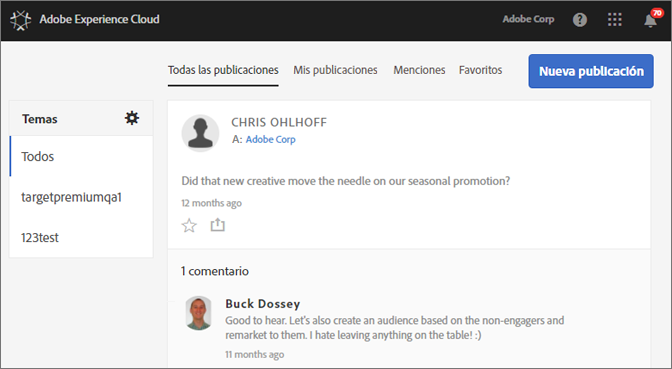
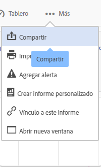

# Fuente

**Experience Cloud Feed ya no será compatible a partir del 1 de noviembre de 2019 y dejará de serlo antes de diciembre de 2019.**

Descubra cómo se comparten o publican recursos e informes de Analytics directamente con otros a través de Experience Cloud Feed.

Es posible que Feed esté vacío la primera vez que se inicia sesión en Experience Cloud. Conforme cree publicaciones y comparta contenido, y otros usuarios lo compartan con usted, Feed se rellenará automáticamente para ayudarlo tanto a usted como a los miembros de su equipo a mantenerse actualizados.

Entre los ajustes de Feed se incluyen:

* **Temas: Todos \&lt;nombre de la organización \&gt;:** Muestra todas las publicaciones compartidas con usted y todas a las que tiene acceso.
* **Administrar temas:** le permite seguir, dejar de seguir o sugerir temas. Además, los administradores pueden aprobar, rechazar, desactivar y crear temas.
* **Nueva publicación:** cree publicaciones que puedan ver los miembros de los grupos.
* **Todas las publicaciones:** vea todas las publicaciones de la fuente.
* **Mis publicaciones:** vea solo sus publicaciones.
* **Menciones:** vea las publicaciones en las que usted o su grupo son mencionados.
* **Favoritos:** vea las publicaciones que ha marcado como favoritas.

## Uso compartido de un proyecto de Analytics con Feed {#section_F2BDF9FEF4394686BAC5051CBE913EE5}

**Experience Cloud Feed ya no será compatible a partir del 1 de noviembre de 2019 y dejará de serlo antes de diciembre de 2019.**

Puede compartir informes de [!UICONTROL Reports &amp; Analytics] con Experience Cloud Feed.

1. [Inicie sesión](admin-getting-started/getting-started-experience-cloud.md#topic_AC564B6795334DE39359ADD87F52F2E0) en Experience Cloud con su Adobe ID.

1. Vaya a Reports &amp; Analytics y, a continuación, [cree un proyecto](https://docs.adobe.com/content/help/en/analytics/analyze/analysis-workspace/build-workspace-project/freeform-overview.html).

1. Haga clic en **[!UICONTROL Más]** &gt; **[!UICONTROL Compartir]**.

   

1. En la ventana Compartir, agregue destinatarios y, a continuación, haga clic en **[!UICONTROL Compartir]**.
