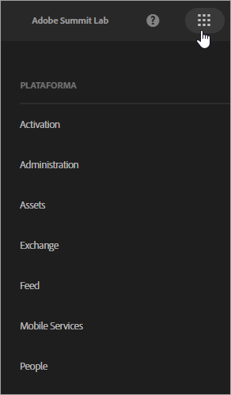
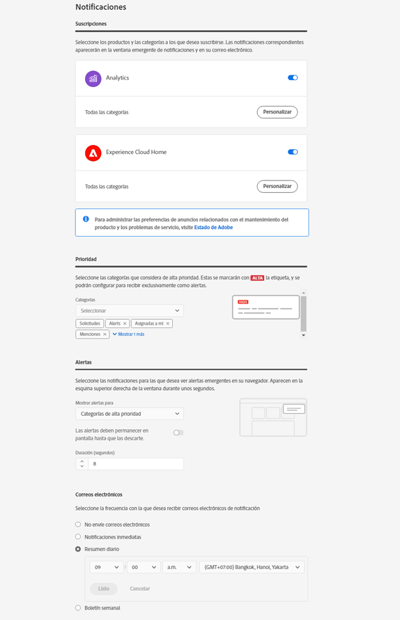

# Inicio de sesión y administración de la configuración de perfil de Experience Cloud

Iniciar sesión en Experience Cloud (y no en una única aplicación) habilita el inicio de sesión único en todas las aplicaciones y servicios que posea. Esta página de ayuda describe cómo iniciar sesión en Experience Cloud, administrar las contraseñas y las notificaciones, y especificar una página de aterrizaje predeterminada.

>[!IMPORTANT]
>
>Los administradores deben consultar [Administración](admin-getting-started.md#topic_3FCB4099640647E3B2411ADBFCE81909) para obtener información sobre actualizaciones en la gestión de usuarios y productos.

## Inicio de sesión en Experience Cloud (administradores) {#task_034FC955031347F3B02B686A09801A08}

Inicie sesión y verifique que se encuentra en la [organización](organizations.md#topic_C31CB834F109465A82ED57FF0563B3F1) correcta.

1. Seleccione el menú Experience Cloud ( ) y luego seleccione **[!UICONTROL Administración]**.

   Si no se muestra el vínculo **[!UICONTROL Administration]**, no es administrador de Experience Cloud para la [organización](organizations.md#topic_C31CB834F109465A82ED57FF0563B3F1) que se muestra. Si necesita ayuda asistencia para hacerse administrador, póngase en contacto con el servicio de atención al cliente o con un administrador de Experience Cloud de su empresa.
1. Seleccione **[!UICONTROL Administración]**.

1. A continuación, seleccione uno de estos vínculos:

| Elemento | Descripción |
|--- |--- |
| [Conceptos básicos de Admin Console](experience-cloud.md) | Obtenga información acerca de los pasos iniciales que debe seguir para empezar a utilizar las aplicaciones de Experience Cloud. |
| [Configurar identidad](https://helpx.adobe.com/es/enterprise/using/set-up-identity.html) | Defina y configure un sistema de identidad con el que se autenticarán los usuarios finales. |
| [Administración de usuarios](https://helpx.adobe.com/es/enterprise/using/users.html) | Obtenga más información sobre el inicio de sesión en Admin Console y la administración de permisos de usuarios y perfiles de producto en Experience Cloud. |
| [Iniciar Admin Console](admin-getting-started.md) | Admin Console es la ubicación central para administrar los usuarios de Adobe y las autorizaciones de productos en toda la organización. También puede iniciar sesión en Admin Console utilizando un [enlace directo](https://adminconsole.adobe.com). |
| [Gestionar usuarios de Creative Cloud](t-admin-add-cc-user.md) | Experience Cloud Assets permite a los especialistas en marketing compartir, sincronizar y colaborar en carpetas con diseñadores y otros recursos creativos mediante Creative Cloud. Aquí puede administrar los usuarios de Creative Cloud aprobados para colaborar con su organización. |
| [Asignar grupos de informes](core-services.md) | (Solo Analytics) Los servicios principales de Experience Cloud están asociados a una organización en lugar de a un grupo de informes individual. Para garantizar que estos servicios funcionen correctamente, cada grupo de informes de Analytics debe asignarse a una organización. (Esta tarea es parte de un flujo de trabajo más amplio que [activa Analytics para servicios principales](core-services.md#concept_07ED1D5C64234E77976E6D572E78FB9C)). |
| [ID de organización](organizations.md) | El *ID de organización* se encuentra en la dirección URL en Admin Console. También puede verlo en el elemento emergente [!UICONTROL Depurador de datos de usuario] (`ctrl+i` o `cmd+i`) desde cualquier página de `https://experience.adobe.com`. Este ID es el ID asociado a la compañía de Experience Cloud aprovisionada. Se trata de una cadena alfanumérica de 24 caracteres seguida de @AdobeOrg (que debe incluirse). |

{style=&quot;table-layout:auto&quot;}

## Inicio de sesión en Experience Cloud (usuarios) {#task_1BFE87E20DCB44078CAC82F3CD44B985}

Ayuda para usuarios no administradores que inician sesión en Experience Cloud.

1. Compruebe con su administrador que su [organización](organizations.md) está aprovisionada en Experience Cloud.

1. Vaya a [Adobe Experience Cloud](https://experience.adobe.com) ([!DNL experience.adobe.com]).
1. Seleccione **[!UICONTROL Iniciar sesión con Adobe ID]**.

   Su administrador de Experience Cloud puede ayudarlo a determinar el tipo de cuenta (Adobe ID o Enterprise ID).

1. En la página de aterrizaje, seleccione el icono del selector de  para acceder al menú desplegable.

   

   Las aplicaciones y servicios que se muestran en este menú dependen de los privilegios de su aplicación, definidos por el [administrador](admin-getting-started.md#topic_3FCB4099640647E3B2411ADBFCE81909).

## Configuración de los ajustes predeterminados de la cuenta personal {#task_73CBCAE6C91749D19C95421E5AC311BA}

Puede editar los detalles personales y especificar una [organización](admin-getting-started.md#concept_705C626560A54CA2A4215F1C870C42B2) y una página de aterrizaje predeterminadas que se mostrarán tras iniciar sesión en Experience Cloud.

1. Inicie sesión en Experience Cloud y, a continuación, seleccione su icono de perfil.

   
1. Seleccione **[!UICONTROL Editar perfil]**.

   
1. Siga configurando y modificando la información personal y, cuando acabe, seleccione **[!UICONTROL Guardar cambios]**.

## Habilitar notificaciones {#concept_0105453AD71847B8BFCAF4A40915F157}

Reciba notificaciones (por correo electrónico o en el producto) sobre actualizaciones del sistema, avisos de mantenimiento, publicaciones, menciones y recursos compartidos. También puede especificar los productos y las aplicaciones para los que desea recibir notificaciones, incluido el estado de carga de los Atributos del cliente.

Para ir a Notificaciones, seleccione el icono **[!UICONTROL Notificaciones]**  y, a continuación, seleccione el icono **[!UICONTROL Configuración]** .

Puede ordenar la aparición de notificaciones según los tipos de mensajes que considere importantes y buscar notificaciones. También puede:

* Ordenar por los tipos de mensajes que sean importantes para usted.
* Buscar notificaciones.

<!-- 
 <b>Analytics</b> 
 
<ul id="ul_91BF597858124FA5BF338C36F6C5533F"> 
 <li id="li_FAD3E93CDE6242F58F14D55C8A6E23D7">Contribution analysis completed </li> 
 <li id="li_03D33D3228884CECA371B58656B2F3E7">Guided analysis shared </li> 
 <li id="li_DCF710F89317487B8DAA86CC05C694CA">Scheduled report failure </li> 
</ul> 

 <b>Adobe Target</b> 
 

Test started or stopped 
 

 <b>Advertising Cloud</b> 
 

Performance alerts 
 

 <b>Dynamic Tag Manager</b> 
 
<ul id="ul_9ACDA418933E40918744D9C32A57DD4B"> 
 <li id="li_4DD0FFD3D9F84A428703611EF767D4D0">New web property created </li> 
 <li id="li_C6B923012E9D40BA91F4CBF7D2D72986">New user added </li> 
 <li id="li_EB0B9D1CFDE24E6987935CCCBFC7892A">Approvals - publishing and approval status for new rules, data elements, and tools </li> 
 <li id="li_17B0B176FF85435FB7EDD4317BC18201">Property has been published </li> 
</ul> -->

## Administración de perfiles y contraseñas {#task_7B89F4F38E5A4C4EB0FF842953856382}

Entre otras cosas, puede editar su perfil de Experience Cloud y especificar una organización y una página de aterrizaje predeterminadas.

1. Inicie sesión en Experience Cloud.

1. En Experience Cloud, seleccione su imagen de perfil.

   
1. Seleccione **[!UICONTROL Editar perfil]**.

   En la página Perfil y contraseñas, complete los campos y las opciones en Detalles personales.

## Recuperación de la contraseña {#task_46541A2806164CB1A4AE8239604E4EB1}

1. Navegue a la página de inicio de sesión de su solución.
1. Seleccione **[!UICONTROL Olvidé la contraseña]**.

   Restablecer la contraseña de una solución debería resolver los problemas de vinculación de contraseña de Experience Cloud.

   Para los usuarios de Adobe Analytics, vaya a [https://sc2.omniture.com/password_recovery.html](https://sc2.omniture.com/password_recovery.html).

## Configuración del inicio de sesión en una aplicación mediante un vínculo directo {#concept_8BE493A08786469B88B210E13F78FF2F}

Opcionalmente, puede iniciar sesión en una página específica de una solución mediante la autenticación proporcionada por la interfaz de Experience Cloud.

### Plantilla de URL

`https://experience.adobe.com/#/@<tenantId>/<solutionname>?destURL=<fullURL>`

URL de ejemplo:

`https://experience.adobe.com/#/@aem62tenant/analytics?destURL=https%3A%2F%2Fsc.omniture.com%2Freports%2F11562.html`

>[!NOTE]
>
>Debe codificar cualquier dirección URL antes de pasarla al parámetro `destURL`. (Hay páginas del codificador disponibles, como [la URL del decodificador/codificador](https://meyerweb.com/eric/tools/dencoder/)).

| Parámetro | Descripción | Ejemplo | Obligatorio/Opcional |
|--- |--- |--- |--- |
| `tenantId` | Nombre del inquilino en el que el usuario debe iniciar sesión. | aem62tenant | Opcional |
| `destURL` | Dirección URL completa del lugar al que se debe llevar al usuario. | http://sc.omniture.com/login/?r=%2Fx%2F1_7xxzf&amp;tenantId=obuengsc&amp;company=OBU+Eng+SC | Opcional |
| `solutionname` | Nombre de la solución MAC que es el propietario del parámetro `destURL`. Se utiliza para verificar que el usuario tiene acceso a la aplicación que posee la dirección URL.  Es responsabilidad de las aplicaciones asegurarse de que `applicationname` está en sincronía con el parámetro `destURL`.  Por ejemplo: Si la dirección URL contiene `solutionname` como social y la `destURL` proporcionada es una dirección URL de análisis, se redirigirá al usuario a la dirección URL aunque no tenga acceso a Analytics. MAC no verifica si el propietario de `destURL` está sincronizado con el nombre de la aplicación. | Analytics | Obligatorio si se utiliza el parámetro `destURL`. |

{style=&quot;table-layout:auto&quot;}
