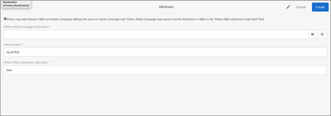

# Campaign{#campaign}

Obtenga información sobre cómo utilizar ofertas y compartir campos en Adobe Campaign Standard.

Después de crear al menos una oferta de reserva y una oferta general, puede crear una actividad de oferta mediante un mensaje de correo electrónico en Campaign Standard. Una actividad de oferta solo se puede crear en una campaña de correo electrónico normal. No se puede agregar a una campaña de correo electrónico transaccional (por ejemplo, un correo electrónico recurrente desencadenado por un evento, como un correo electrónico de abandono del carro de compras).

Una actividad de oferta le pedirá que seleccione un grupo de ofertas y una oferta de reserva que se pueda mostrar en una ubicación de una plantilla de correo electrónico. La mejor oferta para ofrecer se selecciona de entre esas ofertas en el momento de la preparación del correo electrónico, según la ubicación, la fecha, el estado de la oferta y los datos de perfil del cliente.

## Uso compartido de atributos de Campaign en Administración de [!UICONTROL ofertas]{#task_4DFA9A20D7B04E1F9AFF4774D67B6EBC}

Al crear una oferta en Administración de [!UICONTROL ofertas], puede definir reglas de elegibilidad que restrinjan qué perfiles pueden recibir determinadas ofertas. Estas reglas de elegibilidad se pueden establecer en función de atributos (o campos) que existan en el perfil de campaña. Estos campos deben compartirse desde Campaign antes de mostrarse en el generador de reglas de elegibilidad de Administración de [!UICONTROL ofertas] .

>[!NOTE]
>
>Para compartir atributos, debe tener derechos de administrador en Campaign.

1. Haga clic en **[!UICONTROL Adobe Campaign]**para acceder a la navegación.
1. Vaya a **[!UICONTROL Administración]**> Configuración**[!UICONTROL  de]** instancia > Administración **[!UICONTROL de]**ofertas y haga clic en**[!UICONTROL  Atributos]**.

   Esta página muestra los atributos que ya se han compartido. Puede editar o eliminar estos atributos.

   

   >[!NOTE]
   >
   >Si la administración de [!UICONTROL ofertas está utilizando un atributo] en una regla de elegibilidad, no se puede eliminar.

1. Haga clic en **[!UICONTROL Crear]**.

1. Haga clic en el icono de carpeta para definir el origen de datos de campaña y seleccione el elemento que desee compartir.

   

1. Seleccione una etiqueta de datos de destino.

   Es el nombre del atributo que se mostrará en el generador de reglas de elegibilidad en Administración de [!UICONTROL ofertas].

1. Haga clic en **[!UICONTROL Crear]**.

   El atributo se muestra en el creador de reglas de elegibilidad de Administración de [!UICONTROL ofertas] al crear y editar ofertas.

   

## Create an offer activity {#task_F63ADDA52BD949779DB491E4D56E664E}

Inserte una actividad de oferta en cualquier imagen o bloque de texto dentro de una plantilla de correo electrónico en Campaign Standard.

1. Para insertar una actividad de oferta en una ubicación de imagen, haga clic una vez en la imagen para que aparezca el icono Insertar oferta.

   

1. (Alternativa): Para insertar una actividad de oferta en un bloque de texto, haga clic dos veces en el bloque de texto para que aparezca el icono Insertar oferta.

1. Complete los detalles de la ficha Detalles [!UICONTROL de] actividad de la pantalla [!UICONTROL Crear actividad] de oferta:

   | Campo | Descripción |
   |---|---|
   | Nombre de la actividad | Póngale un nombre a la actividad. No puede introducir un nombre de actividad que ya se haya utilizado en otra actividad de oferta. |
   | Ubicación | Seleccione la colocación que se utilizará para esta ubicación. Esto sirve para garantizar que solo las ofertas con una representación de contenido que coincida con esa ubicación se proporcionen a un usuario. En las listas de ofertas solo se muestran las ofertas con esta colocación durante el resto de la creación de la actividad. |

1. En la ficha [!UICONTROL Seleccionar ofertas] , seleccione las ofertas que desee incluir en la actividad.

   Puede seleccionar grupos de ofertas mediante etiquetas o ofertas individuales una por una.

   * **Selección de grupos de ofertas mediante etiquetas:**

      Para seleccionar grupos de ofertas mediante etiquetas, haga clic en la ficha Generador **[!UICONTROL de]**reglas y, a continuación, haga clic en**[!UICONTROL  Agregar regla]**de etiqueta. Para crear reglas que determinen qué ofertas incluir en la actividad de oferta, seleccione la etiqueta. Aparecerá un operador _AND_ entre las etiquetas. Para cambiar el operador de _Y_ a _O_, haga clic en el operador.

      

   * **Selección de ofertas individuales:**

      Para seleccionar ofertas individuales, haga clic en la ficha Inventario **[!UICONTROL de]**ofertas. Un usuario puede buscar dentro de la lista de ofertas por nombre, ID de oferta o etiquetas que se hayan agregado a la oferta.

      Haga clic en el signo más para agregar las ofertas a la sección Ofertas seleccionadas de la lista.

      

      Para que una oferta esté disponible tanto en el generador de reglas como en el inventario de ofertas, debe:

   * Coincide con la fecha de hoy.
   * Tener un estado de aprobado.
   * Tener una representación de contenido con una colocación que coincida con la seleccionada en el paso 1.

      >[!NOTE]
      >
      >Las ofertas que aparecen en la ficha Inventario de ofertas se filtran únicamente por ubicación y estado de aprobación. No se han filtrado para que coincidan con los criterios de objetivo establecidos para el correo electrónico en Adobe Campaign.

1. En la ficha Oferta [!UICONTROL de] reserva, seleccione una oferta de reserva. La oferta de reserva se envía solamente a un cliente si no cumple los requisitos para otras ofertas. Solo puede seleccionar una oferta de reserva de la lista.
1. Vea el resumen de la actividad de la oferta y haga clic en **[!UICONTROL Listo]**.

   La mejor oferta para servir a cada usuario se determinará en el momento de la preparación del correo electrónico mediante la evaluación de lo siguiente:

* **** Comprobación de ubicación: Todas las ofertas deben tener una representación de contenido que coincida con la colocación seleccionada como parte de la actividad de oferta. Si se elimina una colocación de una oferta entre el tiempo de creación de la actividad y el tiempo de preparación (si el tiempo es superior a tres minutos), dicha oferta no se considerará.
* **** Comprobación de fecha: Todas las ofertas deben ser válidas para la fecha actual ( _no es_ la fecha de envío de la oferta). La fecha en la que se prepara la campaña de correo electrónico es la fecha que determina qué oferta se va a ofrecer. Por ejemplo, si prepara una campaña de correo electrónico el 15/15/17 y una de las ofertas seleccionadas no es válida hasta el 16/17, la oferta no se sirve.

* **** Comprobación de la regla de elegibilidad: Todas las ofertas deben cumplir las reglas [de](offers.md)elegibilidad.

* **** Comprobación de prioridad: Si un usuario puede optar a varias ofertas, la Administración [!UICONTROL de] ofertas utiliza la prioridad establecida por el usuario para determinar qué oferta mostrar a cada usuario.

   Su correo electrónico ya está listo para ser enviado. Seleccione la ficha [!UICONTROL Informes] en la [!DNL Adobe Campaign] página principal para comprobar el rendimiento de las ofertas.

   Para obtener información adicional sobre el uso de Adobe Campaign, consulte las siguientes guías:

* [Creación de un correo electrónico](https://docs.campaign.adobe.com/doc/standard/en/CHA_Email_messages_Creating_an_email.html)
* [Envío de un correo electrónico](https://docs.adobe.com/content/help/en/campaign-standard/using/testing-and-sending/about-sending-messages-with-campaign.html)
* [Acerca de los informes dinámicos](https://docs.campaign.adobe.com/doc/standard/en/RPT_About_reporting_About_dynamic_reports.html)

## Informes de ofertas

Adobe Campaign le ofrece tres dimensiones de oferta (oferta, actividad de oferta, ubicación de ofertas) y una métrica (clics en ofertas) que le permite supervisar las ofertas y medir sus efectos. Para ver los informes, visite la ficha Informes de Adobe Campaign Standard. Puede crear el informe y arrastrar y soltar distintas dimensiones de oferta en el panel del informe para empezar a filtrar los datos.

Para obtener más información sobre cómo crear informes dinámicos en Campaign, consulte [Acerca de los informes](https://docs.campaign.adobe.com/doc/standard/en/RPT_About_reporting_About_dynamic_reports.html)dinámicos.