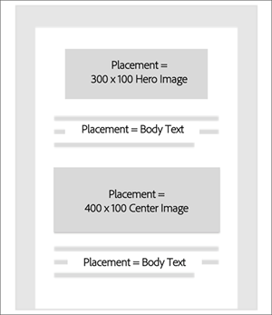

# Flujo de trabajo de administración de ofertas{#offer-management-workflow}

Obtenga información sobre el flujo de trabajo de alto nivel de la administración [!UICONTROL de]ofertas, incluida la creación de ofertas y ubicaciones, la inserción de actividades de ofertas y la visualización de informes.

## Paso 1: Determine en qué parte de las plantillas de correo electrónico necesita ofertas personalizadas {#section_F184E589428B403EA8EB921BF230CF87}

Identifique en qué campañas de correo electrónico desea insertar ofertas personalizadas. A partir de ahí, determine las ubicaciones dentro de la plantilla de correo electrónico para insertar estas ofertas. Por ejemplo, puede que desee modificar la oferta de productos en función del sector o persona del cliente, cambiar el mensaje según los mismos criterios y cambiar la imagen en función de la ubicación geográfica del cliente.

## Paso 2: Determinar qué atributos de Campaign desea dirigir y compartirlos con la administración de ofertas {#section_1461F1FAC0B943E5BBDED6B3B00E9D5C}

Al crear una oferta en Administración de [!UICONTROL ofertas], puede definir reglas de elegibilidad que restrinjan qué perfiles pueden recibir determinadas ofertas. Estas reglas de elegibilidad se pueden establecer en función de atributos (o campos) que existan en Adobe Campaign. Estos campos deben ser compartidos desde Campaign por un usuario de nivel de administrador antes de mostrarse en el generador de reglas de elegibilidad de Administración de [!UICONTROL ofertas] .

Para obtener información sobre cómo compartir estos atributos, consulte [Compartir atributos de Campaign a Offer Management](campaign.md#task_4DFA9A20D7B04E1F9AFF4774D67B6EBC).

## Paso 3: Introduzca las colocaciones necesarias en Administración de [!UICONTROL ofertas]{#section_71619756A86F4DB58B8200D8A1CE1B87}

Una colocación ayuda a garantizar que el contenido de la oferta correcta se muestre en la ubicación correcta dentro de la plantilla de correo electrónico. Al agregar contenido a una oferta, se le pedirá que seleccione una ubicación en la que se pueda mostrar dicho contenido.

Puede tener varias ubicaciones con la misma colocación. En el siguiente ejemplo, hay dos ubicaciones para dos imágenes de tamaño diferente y una única colocación para el texto que se muestra en la parte superior e inferior de la plantilla.

Después de determinar las colocaciones que necesita, puede agregarlas a la ficha [!UICONTROL Colocación] .

## Paso 4: Creación de ofertas {#section_C4F9732B0596425EB0BD5AE76E4BA6EF}

Cree las ofertas que utilizará en la campaña de correo electrónico. Hay datos y contenido que se pueden agregar a la oferta para determinar cuál es la mejor oferta que mostrar y qué contenido mostrar. Cuando cree una representación de contenido, asóciela a una de las ubicaciones definidas en [Colocaciones](placements.md). Una vez que cree y envíe una oferta, estará disponible para su uso en una actividad de oferta.

## Paso 5: Cree una campaña de correo electrónico e inserte una actividad de oferta {#section_6FD36404759B4C6E9FD3A65ACABB26C8}

Ahora que ha creado sus ofertas, puede utilizarlas en una campaña de correo electrónico. En el editor de contenido, puede seleccionar un bloque e insertar una actividad de oferta. Una actividad de oferta permite seleccionar un grupo de ofertas del inventario de ofertas, desde donde el motor de decisión determinará la mejor oferta para cada usuario.

## Paso 6: Preparación y envío de la campaña de correo electrónico {#section_EDD8EA4696664130A678D7C4483DA806}

Ahora, al preparar la campaña de correo electrónico, la Administración [!UICONTROL de] ofertas determinará la mejor oferta para servir a cada visitante en función de la fecha actual, los atributos de perfil y la prioridad. También determina si hay una representación de contenido disponible para la colocación de esa ubicación.

En el siguiente ejemplo, supongamos que ha configurado una campaña de correo electrónico con una actividad de oferta que contiene 3 ofertas (A, B, C). Puede determinar qué oferta se va a servir en una de las ubicaciones de nuestro correo electrónico. En el momento de la preparación, la Administración de [!UICONTROL ofertas] :

1. Analizar la fecha actual, los datos de perfil de cada usuario y la prioridad.
1. Compare esa información con los datos de las ofertas.
1. Determinar la mejor oferta para servir.

## Paso 7: Visualización de informes {#section_2104BAACAE154DE29B6EEB967C46F226}

Puede ver un informe sobre las ofertas que se ofrecieron y cómo se desempeñaron en una actividad de oferta. Para ver este informe, seleccione la ficha Informes en la página de inicio de Adobe Campaign Standard.
