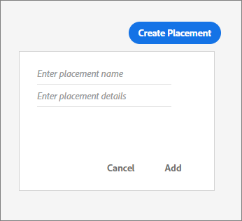

# Ubicaciones{#placements}

Cree y gestione colocaciones para sus actividades de oferta.

## Ubicaciones {#topic_A412442D4168497D981DE1C3AA1C9B61}

Cree y gestione colocaciones para sus actividades de oferta.

Antes de crear ofertas, debe crear colocaciones. Cuando agregue contenido a una oferta, especifique en qué ubicación se puede mostrar esa representación de contenido. Las colocaciones le permiten controlar que los fragmentos de contenido correctos se muestren en las ubicaciones correctas en las campañas de correo electrónico (por ejemplo, para asegurarse de que una imagen cuadrada no se muestre en una ubicación rectangular).

En el ejemplo siguiente, hay dos ubicaciones para dos imágenes de tamaño diferente y una única colocación para el texto que se muestra en la parte superior e inferior de la plantilla.

## Create a placement {#task_89CD5692D86243A2B2E9BD5F7BAF52FB}

1. En la ficha [!UICONTROL Colocaciones] , haga clic en **[!UICONTROL Crear colocación]**.

   

1. Introduzca un nombre de colocación y detalles de colocación.

   Las colocaciones se pueden definir de varias formas (por ejemplo, por tamaño de contenido o en función de una posición de un mensaje de correo electrónico).

1. Haga clic en **[!UICONTROL Agregar]**.
