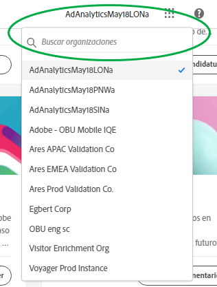
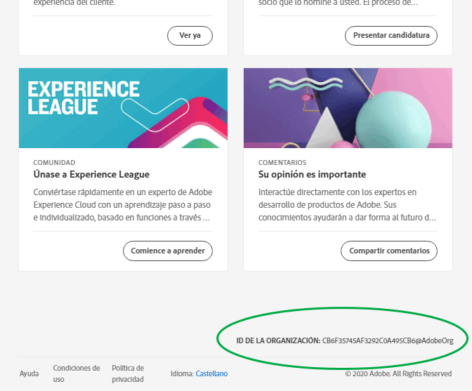
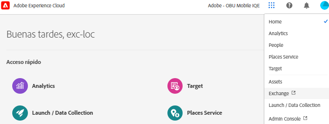
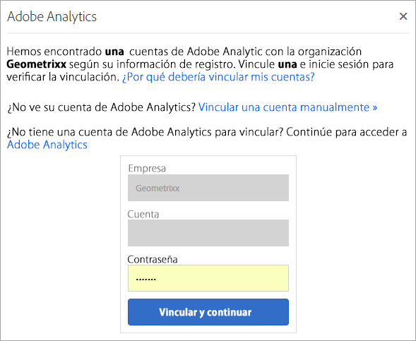

# Organizaciones en Experience Cloud

Obtenga información sobre la administración y el cambio de organizaciones en Experience Cloud.

## Identificación de la organización {#concept_384D169B0B724B799D573B8ECB5C39BF}

Una *organización* es la entidad que permite a un administrador configurar grupos y usuarios, así como controlar el inicio de sesión único en Experience Cloud. La organización funciona como una empresa de inicio de sesión que abarca todos los productos y soluciones de Experience Cloud. La mayoría de las veces, la organización es el nombre de empresa. Sin embargo, una empresa puede tener muchas organizaciones.

Para comprobar que ha iniciado sesión en su organización correcta, haga clic en el avatar de perfil para ver el nombre de la organización. Si tiene acceso a más de una organización, también puede ver y cambiar a otra organización directamente en la barra de encabezado.

Si su organización utiliza Federated ID, Experience Cloud le permite iniciar sesión con el inicio de sesión único de su organización sin necesidad de introducir su dirección de correo electrónico y contraseña. Para ello, añada `#/sso:@domain` a la dirección URL del Experience Cloud (`https://experience.adobe.com`).

Por ejemplo, para una organización con Federated IDs y el dominio `adobecustomer.com`, establezca el vínculo URL en `https://experience.adobe.com/#/sso:@adobecustomer.com`. También puede ir directamente a una aplicación específica marcando esta URL, anexada con la ruta de la aplicación. (Por ejemplo, para Adobe Analytics, `https://experience.adobe.com/#/sso:@adobecustomer.com/analytics`).

## Búsqueda del identificador de organización {#concept_EA8AEE5B02CF46ACBDAD6A8508646255}

Es posible que deba localizar su ID de organización con fines de asistencia. Mediante el menú **[!UICONTROL Organización]** puede verificar que esté en la organización correcta o cambiar de una organización a otra.

El **identificador de organización** es el ID asociado con la empresa que ha seleccionado en Experience Cloud. Se trata de una cadena alfanumérica de 24 caracteres seguida de @AdobeOrg (que debe incluirse).

Para ver su ID de organización, vaya a la página de aterrizaje del Experience Cloud o seleccione ( ) y, a continuación, seleccione **[!UICONTROL Administración]**. Puede encontrar el ID de organización en la parte inferior de la página [!UICONTROL Introducción a Experience Cloud] o la página [!UICONTROL Administración].

## Vinculación de una cuenta de solución a un Adobe ID {#task_FD389E78640848919E247AC5E95B8369}

Normalmente, los administradores de Experience Cloud otorgan acceso a soluciones y servicios. En circunstancias excepcionales, es posible que deba vincular las credenciales de la solución a un Adobe ID.

1. Siga los pasos de la invitación del correo electrónico para utilizar Experience Cloud.
1. Inicie sesión con su Adobe ID o Enterprise ID.
1. Seleccione el selector de soluciones. ( ).

   

   Las soluciones a las que tiene acceso se muestran coloreadas.
1. Seleccione la solución que desee.

   

   Este tipo de mensaje se muestra si es parte del grupo apropiado (y tiene permisos para la solución) pero todavía no ha vinculado sus credenciales de cuenta a su Adobe ID.
1. Seleccione **[!UICONTROL Vincular cuenta]** y proporcione sus credenciales.

## Especificación de una organización y una página de aterrizaje predeterminadas {#concept_6A191B42A9874A9780882903BA18F071}

Puede especificar la organización y la página de aterrizaje predeterminadas que se pueden utilizar cuando inicia sesión.

En el perfil, seleccione **[!UICONTROL Editar perfil]**.

En Organización y la página de aterrizaje predeterminadas, puede personalizar la forma de iniciar sesión.

## Solución de problemas de vinculación de cuentas {#concept_DFCB29A3B4834FC59AA29E0BBA301584}

Ayuda relacionada con los problemas que se derivan de la vinculación de cuentas.

Normalmente, la vinculación de cuentas falla porque el Adobe ID está vinculado a un usuario anterior. Cuando falla la vinculación de cuentas, puede:

* [Ponerse en contacto con el Servicio de atención al cliente de Adobe](https://experienceleague.adobe.com/?support-solution=General&amp;lang=es#support).
* Acceder a la solución mediante el inicio de sesión estándar mientras el problema se soluciona.
