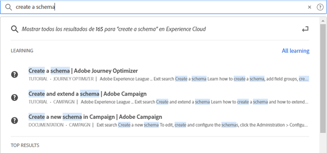

# [!UICONTROL Búsqueda unificada] para objetos y entidades {#globally-search}

La variable [!UICONTROL Búsqueda unificada] search permite encontrar objetos o entidades empresariales que se pueden buscar en una experiencia de un solo clic, uniforme y sin fisuras. Esta búsqueda muestra los objetos a los que ha accedido recientemente.

## Acceso a la búsqueda unificada

La búsqueda unificada está disponible en todas las páginas del encabezado del Experience Cloud en la parte superior de la página. También puede utilizar la combinación de teclas `command /` o `ctrl /` para acceder a la búsqueda.

Esta función solo está disponible para los productos compatibles, que actualmente son:

* Experience Platform (AEP)
* Journey Optimizer (AJO)

A medida que se indexa más contenido, esta función se añade a las aplicaciones relevantes.

## Objetos y campos que se pueden buscar

A medida que escribe, los resultados principales coincidentes de los Objetos a los que tiene acceso para mostrar.

Nuestros algoritmos muestran primero los registros más relevantes. El orden de los resultados depende de varios factores, como:

Su capacidad y permisos de objeto Coincidencia porcentaje Si hay una coincidencia exacta

Los objetos empresariales que se pueden buscar incluyen:

* Segmentos (Nombre, Descripción)
* Esquema (nombre, descripción)
* Conjuntos de datos (nombre, descripción)
* Fuentes (nombre, descripción)
* Destinos (Nombre, Descripción)
* Consultas (Nombre, Descripción)
* Mensajes (nombre, descripción)
* Ofertas (Nombre, Descripción)
* Componentes (nombre, descripción)
* Recorridos (Nombre, Descripción)

Si una palabra clave coincide con una página de navegación, puede obtener un vínculo de acceso rápido a los conjuntos de datos de ejemplo de la página de navegación. La sección de resultados principales muestra los 30 resultados principales.

También puede encontrar los artículos de ayuda de Experience League y Comunidades. Se admiten consultas de lenguajes naturales.

Por ejemplo, _Cómo crear un esquema_ produce resultados del Experience League en _[!UICONTROL Aprendizaje]_:

Los algoritmos de búsqueda muestran primero los registros más relevantes. El orden de los resultados depende de varios factores, como:

* Permisos de usuario para acceder a objetos
* Porcentaje de coincidencia
* Coincidencias exactas
* La variable _[!UICONTROL Resultados principales]_ muestra los 30 resultados principales.

Para restringir la búsqueda, haga clic en una de las siguientes opciones:

* **[!UICONTROL Todo el aprendizaje]**: Abre la búsqueda en Experience League.
* **[!UICONTROL Mostrar todo...]**: Permite refinar y filtrar aún más los resultados.

## Funciones de búsqueda unificada

Las siguientes funciones están disponibles en Búsqueda unificada.

| Función | Descripción |
| ------- | ------- |
| Compatibilidad con el idioma global | Global search comprende las consultas y produce resultados para alemán, español, francés, italiano, japonés, coreano, portugués y chino. |
| Tolerancia tipográfica | La búsqueda unificada proporciona una sólida tolerancia tipográfica mediante algoritmos avanzados. Estos algoritmos calculan las ediciones y proporcionan los resultados adecuados. |
| Resaltado | La respuesta de búsqueda resalta la palabra clave coincidente de la consulta de búsqueda para que pueda encontrar fácilmente la sección y las palabras que coinciden con la consulta. Resaltar también funciona para palabras mal escritas. |
| Fragmentos | En la respuesta de búsqueda, puede ver un fragmento del resultado. Los fragmentos devuelven las palabras coincidentes y algún contenido alrededor de las palabras clave coincidentes. |
| Detener palabras | Algunas palabras que se usan con más frecuencia en inglés se definen como _parar palabras_. Si las palabras &quot;stop&quot; se incluyen en la consulta de búsqueda, se les da menos peso.  Las palabras vacías incluyen: _a, un y, son, como, a, ser, pero, por, si, en, en, es, es, no, de, en, o tal, que, el, su, entonces, allí, estos, esto, para, fue, con_.  Las palabras vacías no son compatibles con otros idiomas globales. |
| Consultas de idiomas naturales | Cuando busque un artículo de ayuda o una conversación de Comunidades de Experience League, puede escribir su pregunta utilizando el lenguaje natural y obtener la respuesta. Búsqueda de ejemplo: &quot;¿Cómo creo un esquema?&quot; |
| Búsqueda exacta entre comillas | Puede realizar una búsqueda exacta utilizando comillas en la consulta. No se realiza ninguna corrección tipográfica en las consultas de mach exactas. Por ejemplo: &quot;Recorrido de Luma 2022&quot;. |
| Filtros | Puede aplicar filtros como _Tipo de objeto_ y otros filtros específicos de objetos en la ventana emergente de resultados de búsqueda completa. Al pulsar Intro después de vincular la consulta de búsqueda, se abre una ventana emergente de página completa que incluye los filtros. |

{style=&quot;table-layout:auto&quot;}

## ¿No lo encuentra?

Pruebe estas sugerencias:

* Escriba un término de búsqueda más específico
* Revisar la ortografía
* Intente escribir el término de búsqueda completo
* Asegúrese de que tiene los permisos para los objetos que busca

