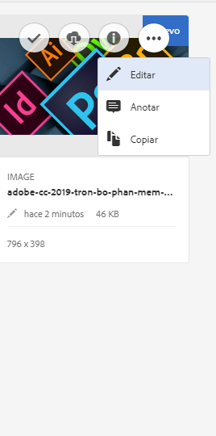
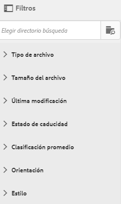
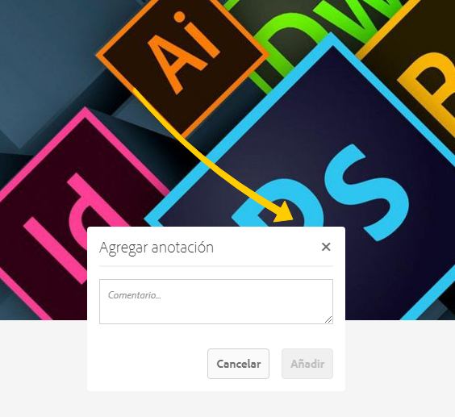
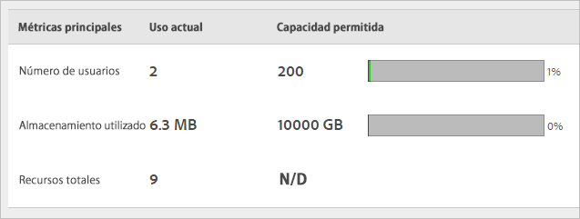

# Información general sobre Experience Cloud Assets

Experience Cloud Assets ofrece un único repositorio centralizado de recursos listos para su uso en marketing que se pueden compartir en varias aplicaciones. Un recurso es un documento digital, una imagen, un vídeo o audio (o parte del mismo) que puede tener varias representaciones y subrecursos (por ejemplo, capas de un archivo de [!DNL Photoshop], diapositivas de un [!DNL PowerPoint], páginas de un PDF o archivos en un ZIP).

Entre los servicios de recursos se incluyen:

* Almacenamiento de recursos, interfaz de administración, interfaz de selección de incrustación (a través de las aplicaciones).
* Integraciones con Creative Cloud, colaboración con Experience Cloud y aplicaciones de Experience Cloud.

El uso de recursos mejora la coherencia y el cumplimiento de la marca, y reduce el tiempo de comercialización. Puede optimizar los flujos de trabajo en las aplicaciones:

* **[!DNL Adobe Target]**: cree experiencias para pruebas A/B y con pruebas multivariadas.
* **[!DNL Ad Cloud]**: desarrolle unidades de anuncios en los distintos canales y campañas.
* **[!DNL Adobe Campaign]**: coloque los recursos en campañas y boletines de correo electrónico.

## Vaya a Experience Cloud Assets

## Acceso a la barra de herramientas

Vaya a un recurso (o a un directorio de recursos) y haga clic en **[!UICONTROL Select]**.

La barra de herramientas proporciona acceso rápido a las funciones, incluidas Búsqueda, Cronología, Representaciones, Editar, Anotar y Descargar.

>[!NOTE]
>
>Los recursos deben eliminarse de las actividades de Adobe Target para poder eliminarlos correctamente de [!DNL Target].

## Edición de recursos

La edición de un recurso habilita funciones, entre las que se incluyen:

* Recortar
* Rotar
* Girar

## Buscar recursos

Puede buscar por palabra clave, tipo de archivo, tamaño, última modificación, estado de publicación, orientación y estilo.

## Anotación de recursos

Haga clic en **[!UICONTROL Annotate]** dibujando círculos o flechas en una imagen y anote el recurso para que sus colegas lo revisen.

## Visualizar recursos en pantalla completa y hacer zoom

Haga clic en **[!UICONTROL Views]** > **[!UICONTROL Image]** para ver la imagen completa del recurso y habilitar el zoom.

## Visualizar las propiedades de los recursos

Elija entre la visualización de la tarjeta y sus propiedades, la vista de lista y la vista de columna para encontrar sus recursos más fácilmente.

Haga clic en **[!UICONTROL Views]** > **[!UICONTROL Properties]** para ver las propiedades de un recurso:

## Ejecutar informes de uso

Consulte el número de usuarios, el almacenamiento utilizado y el total de los recursos.

Haga clic en **[!UICONTROL Tools]** > **[!UICONTROL Reports]** > **[!UICONTROL Usage Report]**

