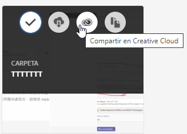
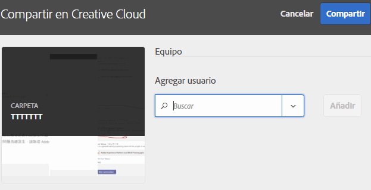
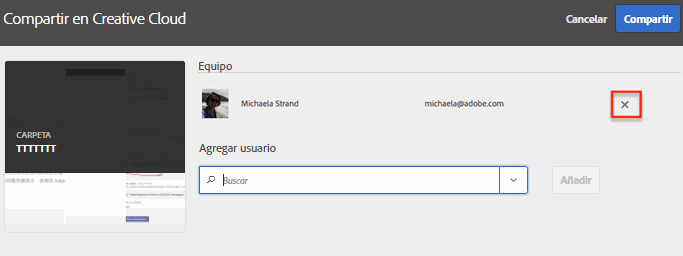
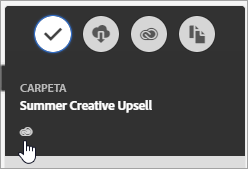

# Uso compartido de una carpeta de recursos de Experience Cloud

Comparta carpetas y recursos entre Experience Cloud y Creative Cloud. Colabore, realice anotaciones en recursos compartidos y utilícelos en aplicaciones de Experience Cloud como Adobe Target. La carpeta compartida debe proceder de Experience Cloud.

**Ventajas de compartir**

* Optimice los flujos de trabajo de producción creativos en la fase de revisión, aprobación y publicación
* Dedique menos tiempo a la administración de archivos y versiones en proceso en varias ubicaciones
* Rastree y administre recursos creativos de forma más eficaz
* Disfrute de una mayor seguridad empresarial
* Compartir, guardar y enviar archivos fácilmente entre creativos y especialistas en marketing

Antes de que los usuarios de Creative Cloud tengan acceso a los recursos, deben estar en la lista de permitidos de Experience Cloud. Consulte [Gestionar usuarios de Creative Cloud](manage-cc-users.md).

**Para compartir una carpeta de recursos de Experience Cloud**

1. En una carpeta de recursos, haga clic en **[!UICONTROL Share to Creative Cloud]**.

   
1. En la página Compartir en Creative Cloud, busque el usuario y haga clic en **[!UICONTROL Add]**.

   

1. Haga clic en **[!UICONTROL Share]**.
1. Inicie el escritorio [!DNL Creative Cloud] (o vaya a la página [!UICONTROL Creative Cloud Files] en un explorador) y busque la notificación de solicitud.

   
1. Abra la solicitud y haga clic en **[!UICONTROL Accept]**.

   
1. Para obtener acceso al contenido de la carpeta, haga clic en **[!UICONTROL Open Folder]** (o **[!UICONTROL View on Web]**).

   
1. Siga añadiendo comentarios en el recurso compartido:

   En Creative Cloud, puede seleccionar en una imagen y luego hacer clic en **[!UICONTROL Activity]** para agregar un comentario en la imagen. Los comentarios se sincronizan con los recursos en [!DNL Creative Cloud] y en [!DNL Experience Cloud].

   

   En Experience Cloud, seleccione en una imagen y, a continuación, seleccione el icono de cronología para añadir un comentario a la imagen. Los comentarios se sincronizan con los recursos de Creative Cloud y Experience Cloud.

   

1. Para dejar de compartir una carpeta, haga clic en **[!UICONTROL Share Using Creative Cloud]** (similar al [Paso 3](share.md)), quite usuarios con la X, luego haga clic en **[!UICONTROL Share]**.

   

   Una vez que haya eliminado todos los usuarios de Creative Cloud, la carpeta deja de compartirse y los usuarios de Creative Cloud ya no tendrán acceso a ella.

Otras formas de usar un recurso compartido incluyen cargar o intercambiar recursos de la [Biblioteca de ofertas](https://experienceleague.adobe.com/docs/target/using/experiences/offers/manage-content.html?lang=es) en Adobe Target por imágenes en las actividades.

Después de compartir una carpeta con Creative Cloud, verá en ella el logotipo de Creative Cloud.

Ayuda relacionada:

* [Ayuda de Creative Cloud: Gestionar y sincronizar archivos](https://helpx.adobe.com/es/creative-cloud/help/sync-creative-cloud-files.html)
* [Ayuda de Creative Cloud: Colaborar con otros usuarios](https://helpx.adobe.com/es/creative-cloud/help/collaboration.html)
* [Ayuda de Creative Cloud: Preguntas frecuentes sobre colaboración](https://helpx.adobe.com/es/creative-cloud/help/collaboration-faq.html)

## Acerca del uso compartido de recursos con Adobe Target

Al crear actividades en [!DNL Adobe Target], puede utilizar un recurso de imagen compartida al intercambiar imágenes en [!UICONTROL Offers Library].

Consulte [Biblioteca de ofertas](https://experienceleague.adobe.com/docs/target/using/experiences/offers/manage-content.html?lang=es) en la ayuda de [!DNL Target].