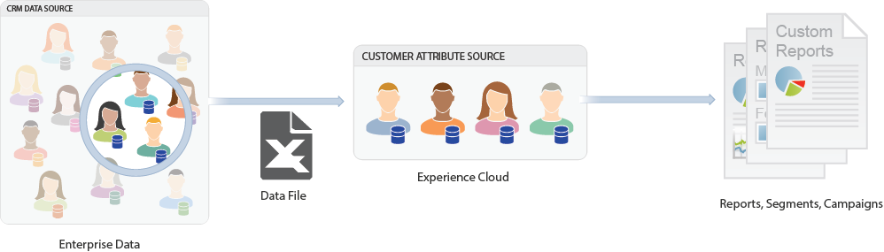

# [!DNL Customer Attributes] en Experience Cloud

**[!UICONTROL Aplicaciones]**  > **[!DNL Customer Attributes]**

Los [!DNL Customer Attributes] de Experience Cloud le permiten cargar los datos empresariales recogidos desde una base de datos de administración de la relación con los clientes (CRM). Puede [cargar los datos](t-crs-usecase.md) en un origen de datos de [!DNL Customer Attributes] en Experience Cloud y, a continuación, usar los datos en [!DNL Adobe Analytics] y [!DNL Adobe Target].

## ¿Qué son los datos del cliente empresariales? {#enterprise_data}

Los datos empresariales residen en otros sistemas. Puede ser complejo y significar cosas diferentes para diferentes personas. Estos datos pueden incluir información como abonos, nivel de lealtad, edad, género, productos propios, intereses y valor a largo plazo.

La siguiente imagen es un ejemplo de un archivo de datos que muestra los datos del suscriptor de productos, incluidos los ID de miembro, los productos con derechos, los productos más utilizados, etc.

Después de crear el archivo de datos, puede cargarlo en el origen de atributos del cliente que cree en **[!UICONTROL Experience Cloud]** > **[!UICONTROL Atributos del cliente]**.

Consulte [Cargar datos de atributos del cliente](t-crs-usecase.md) para conocer este flujo de trabajo.

## Ejemplos de atributos del cliente en Analytics y Target {#examples}

Una vez que los datos se encuentren en Experience Cloud, podrá personalizarlos y compartirlos con soluciones para la creación de informes, segmentación, actividades y campañas.

Por ejemplo:

| Solución | Ventajas y casos de uso |
|--- |--- |
| Adobe Analytics | Los especialistas en marketing y analistas pueden comprender:<ul><li>Las campañas en línea más efectivas con sus clientes de nivel oro.</li><li>Los productos que buscan los clientes de nivel oro en comparación con los productos que buscan los clientes de nivel platino.</li><li>Si el rediseño del sitio está teniendo un impacto positivo en las tasas de conversión para los clientes más antiguos.</li><li>Los productos que tienden a buscar en el sitio los clientes con un valor bajo a largo plazo.</li></ul> |
| Adobe Target | Los datos de atributos permiten a los usuarios de Adobe Target:<ul><li>Mostrar descuentos y ofertas especiales para miembros del club de lealtad.</li><li>Recomendar productos más caros a sus clientes de lujo.</li><li>Para los clientes que ya reciben correos electrónicos, permite mostrar una oferta de “up-sell” en el espacio reservado normalmente para los registros por correo electrónico.</li></ul> |

{style="table-layout:auto"}
