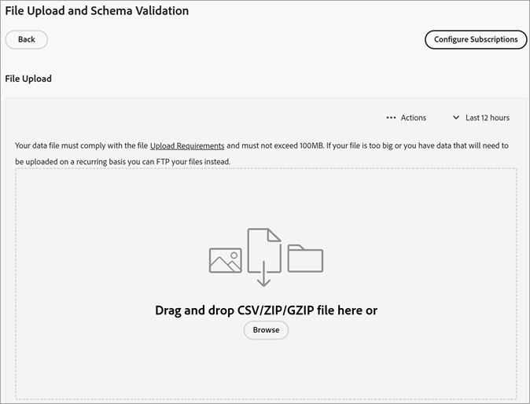

# Crear una fuente de datos y cargar el archivo

Cree el origen de atributos del cliente (`.csv` y `.fin` archivos) y cargue los datos. Puede activar el origen de los datos cuando esté preparado. Una vez que el origen de datos esté activo, comparta los datos del atributo con [!DNL Analytics] y [!DNL Target].

**[!DNL Customer Attributes]flujo de trabajo**


## Buscar [!DNL Customer Attributes]

En [!DNL Experience Cloud], haga clic en **[!UICONTROL Aplicaciones]**  > **[!DNL Customer Attributes]**.

## Requisitos previos para usar [!DNL Customer Attributes] {#prerequisites}

* **Pertenencia a un grupo:** Para cargar los datos, los usuarios deben ser miembros del grupo [!DNL Customer Attributes]. También debe pertenecer a un grupo de Adobe Analytics o de Adobe Target.

  Para saber si su empresa tiene acceso a los atributos del cliente, su administrador de [!DNL Experience Cloud] debe iniciar sesión en [Experience Cloud](https://experience.adobe.com). Vaya a **[!UICONTROL Admin Console]** > **[!UICONTROL Productos]**. Si *[!DNL Customer Attributes]* se muestra como uno de los [!UICONTROL perfiles de producto], está listo para empezar.

  Los usuarios que se agregan a [!DNL Customer Attributes] ven el elemento de menú [!DNL Customer Attributes] a la izquierda de la interfaz de Experience Cloud.

* Se requiere el de **Adobe Target** `at.js` (cualquier versión) o `mbox.js` versión 58 o posterior para los atributos del cliente.

  Consulte [Cómo implementar at.js](https://experienceleague.adobe.com/docs/target-dev/developer/client-side/overview.html?lang=es)

## Crear un archivo de datos {#create-data}

Estos datos son datos de clientes empresariales de su CRM. Los datos pueden incluir datos de suscriptores sobre productos, incluidos los ID de miembro, productos destacados, productos más utilizados, etc.

1. Crear un archivo de `.csv`.

   >[!NOTE]
   >
   >Cuando avance en este proceso, arrastre y suelte el archivo `.csv` para cargar el archivo. Sin embargo, si [lo sube a través de un FTP](t-upload-attributes-ftp.md#task_591C3B6733424718A62453D2F8ADF73B), también necesitará un archivo `.fin` con el mismo nombre que el `.csv`.

   Archivo de datos de cliente empresarial de muestra:

   

1. Antes de continuar, revise la información relevante en los [Requisitos del archivo de datos](crs-data-file.md) antes de cargar el archivo.
1. [Cree un origen de atributo de cliente y cargue los datos](t-crs-usecase.md#create-source), como se describe a continuación.

## Crear un origen de atributos y cargar el archivo de datos {#create-source}

Siga estos pasos en la página [!UICONTROL Crear Source de atributos del cliente] de Experience Cloud.

>[!IMPORTANT]
>
>Al crear, modificar o eliminar orígenes de atributos del cliente, se produce un retraso de hasta una hora antes de que los identificadores empiecen a sincronizarse con la nueva fuente de datos. Debe tener derechos administrativos en Audience Manager para crear o modificar orígenes de atributos del cliente. Póngase en contacto con el Servicio de atención al cliente de Audience Manager o con su asesor para obtener derechos administrativos.

1. En [!DNL Experience Cloud], haga clic en **[!UICONTROL Aplicaciones]**  > **[!DNL Customer Attributes]**.

   

1. Haga clic en **[!UICONTROL Nuevo]**.

   

1. En la página [!UICONTROL Crear Source de atributos del cliente], configure los siguientes campos:

   * **[!UICONTROL Nombre:]** Un nombre descriptivo para el origen de atributos de datos. Para [!DNL Adobe Target], los nombres de atributos no pueden incluir espacios. Si pasa un atributo con un espacio, [!DNL Target] lo ignorará. Otros caracteres que no se admiten son: `< , >, ', "`.

   * **[!UICONTROL Descripción:]** (Opcional) Descripción del origen del atributo de datos.

   * **[!UICONTROL ID de alias:]** Representa una fuente de datos de atributos del cliente, como un sistema CRM específico, por ejemplo. [!UICONTROL ID de alias] es un ID único que se usa en su código de [!UICONTROL Source] de atributo del cliente. El ID debe ser único, en minúsculas y sin espacios. El valor introducido en el campo [!UICONTROL ID de alias] para un origen de atributos del cliente en Experience Cloud debe coincidir con los valores que se pasan desde la implementación (ya sea mediante la recopilación de datos de Platform o JavaScript de Mobile SDK).

     >[!IMPORTANT]
     >
     >Al eliminar una fuente de datos asociada con un ID de alias, este no se encuentra disponible, ya que el ID de alias se guarda en varios servicios y se utiliza para asignar perfiles entre ellos.

     El ID de alias corresponde a ciertas áreas en las que se configuran valores de ID de cliente adicionales. Por ejemplo:

      * **Etiquetas:** El ID de alias corresponde al valor de *Código de integración* en [!UICONTROL Configuración del cliente], en la herramienta [Servicio de Experience Cloud ID](https://experienceleague.adobe.com/docs/experience-platform/tags/home.html?lang=es).

      * **API de visitante:** El ID de alias corresponde a los [ID de cliente](https://experienceleague.adobe.com/docs/id-service/using/reference/authenticated-state.html?lang=es) adicionales que puede asociar con cada visitante.

        Por ejemplo, *&quot;crm_id&quot;* en:

        ```
        "crm_id":"67312378756723456"
        ```

      * **iOS:** El ID de alias corresponde a *&quot;idType&quot;* en [visitorSyncIdentifiers:identifiers](https://experienceleague.adobe.com/docs/mobile-services/ios/overview.html?lang=es).

        Por ejemplo:

        `[ADBMobile visitorSyncIdentifiers:@{@<`**`"idType"`**`:@"idValue"}];`

      * **Android™:** El ID de alias corresponde a *“idType”* en [syncIdentifiers](https://experienceleague.adobe.com/docs/mobile-services/android/overview.html?lang=es).

        Por ejemplo:

        `identifiers.put(`**`"idType"`**`, "idValue");`

        Consulte [Aprovechamiento de varias fuentes de datos](crs-data-file.md#section_76DEB6001C614F4DB8BCC3E5D05088CB) para obtener información adicional sobre el procesamiento de datos con respecto al campo ID de alias e ID de clientes.

   * **[!UICONTROL Código de área de nombres:]** Use este valor para identificar el origen de atributos del cliente al usar [IdentityMap](https://experienceleague.adobe.com/es/docs/experience-platform/web-sdk/identity/overview) como parte de una implementación de WebSDK de AEP.

1. Haga clic en **[!UICONTROL Guardar]**.

## Cargar archivo {#upload}

Se crea el registro de atributos del cliente y puede cargar el archivo editando el atributo del cliente.

1. En la página [!DNL Customer Attributes], haga clic en el origen del atributo.

1. En la página [!UICONTROL Editar datos del cliente: Source], haga clic en **[!UICONTROL Cargar archivos]**.

   

1. Arrastre y suelte el archivo de datos `.csv`, `.zip` o `.gzip` en la ventana de arrastrar y soltar.

>[!IMPORTANT]
>
>Existen requisitos específicos para los archivos de datos. Consulte los [Requisitos de archivos de datos](crs-data-file.md) para obtener más información.

Después de cargar el archivo, los datos de la tabla se muestran en el encabezado [!UICONTROL Carga de archivos] de esta página. Puede validar el esquema, configurar suscripciones o configurar el FTP.


* **[!UICONTROL ID único de cliente:]** Muestra cuántos ID únicos ha subido a este origen de atributos.

* **[!UICONTROL ID proporcionados por el cliente asociados a ID de visitante de Experience Cloud:]** Muestra cuántos ID se han asociado a los ID de visitante de Experience Cloud.

* **[!UICONTROL ID proporcionados por el cliente con muchos alias:]** Muestra el recuento de ID proporcionados por el cliente con 500 o más ID de visitante de Experience Cloud asociados. Es muy probable que estos ID proporcionados por el cliente no representen a individuos sino algún tipo de inicio de sesión compartido. El sistema distribuye los atributos asociados con estos ID a los 500 ID de visitante de Experience Cloud con alias creados más recientemente, hasta que el recuento alcanza los 10 000. En este momento, el sistema invalida el ID proporcionado por el cliente y ya no puede distribuir los atributos asociados. —>

## Validar el esquema {#validate-schema}

El proceso de validación le permite asignar nombres para mostrar y descripciones en atributos cargados (cadenas, números enteros, números y demás). También puede eliminar atributos actualizando el esquema.

Consulte [Validar el esquema](validate-schema.md).

Para eliminar atributos, consulte [(Opcional) Actualizar el esquema (elimina los atributos)](t-crs-usecase.md).

## (Opcional) Actualizar el esquema (elimina los atributos) {#task_6568898BB7C44A42ABFB86532B89063C}

Eliminar y reemplazar atributos en el esquema.

1. En la página [!UICONTROL Editar origen de atributos del cliente], elimine la suscripción de **[!UICONTROL Target]** o **[!UICONTROL Analytics]** (en **[!UICONTROL Configurar suscripciones]**).

1. [Cargue un nuevo archivo de datos con campos actualizados](t-crs-usecase.md).

## Configurar suscripciones y activar el origen de atributos {#task_1ACA21198F0E46A897A320C244DFF6EA}

La configuración de una suscripción configura el flujo de datos entre Experience Cloud y las aplicaciones. La activación del origen de atributos permite que los datos fluyan a las aplicaciones suscritas. Los registros de cliente que ha cargado coinciden con las señales de ID entrantes de su sitio web o aplicación.

Consulte [Configurar suscripciones y activar el origen de datos](subscription.md).

## Usar datos de [!DNL Customer Attributes] en Adobe Analytics {#task_7EB0680540CE4B65911B2C779210915D}

Ahora que los datos están disponibles en aplicaciones como Adobe Analytics, puede informar sobre los datos, analizarlos y tomar las medidas adecuadas en sus campañas de marketing.

El ejemplo siguiente muestra un segmento de [!DNL Analytics] basado en los atributos cargados. El segmento muestra los suscriptores de [!DNL Photoshop Lightroom] cuyo producto más utilizado sea Photoshop.


Cuando publica un segmento en Experience Cloud, pasa a estar disponible en Audiencias de Experience Cloud y Audience Manager.

## Usar datos de [!DNL Customer Attributes] en Adobe Target {#task_FC5F9D9059114027B62DB9B1C7D9E257}

En [!DNL Target], puede seleccionar un atributo del cliente en la sección [!UICONTROL Perfil del visitante] cuando cree un público. Todos los atributos del cliente tienen el prefijo `crs.` en la lista. Combine estos atributos según sea necesario con otros atributos de datos para crear públicos.


Ver [Crear una audiencia](https://experienceleague.adobe.com/docs/target/using/audiences/create-audiences/audiences.html?lang=es) en la ayuda de [!DNL Target].
