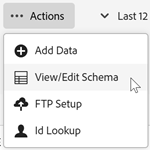
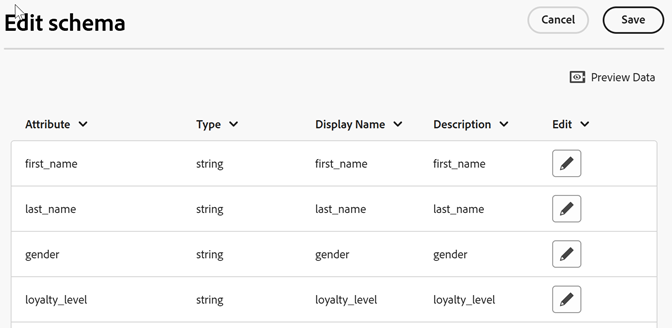

# Validar el esquema

El proceso de validación le permite asignar nombres para mostrar y descripciones en atributos cargados (cadenas, números enteros, números y demás).

Se crea un esquema basado en esta configuración. El esquema se utiliza para validar todos los datos futuros cargados a esta fuente de datos. El proceso de asignación no altera los datos originales.

>[!NOTE]
>
>Actualizar el esquema tras la validación elimina los atributos del cliente. Consulte [Actualizar el esquema (también elimina los atributos)](t-crs-usecase.md).

**Para validar el esquema**

1. En [!DNL Customer Attributes], haga clic en el origen del atributo que desea editar.

1. En **[!UICONTROL Editar atributo del cliente Source]**, haga clic en **[!UICONTROL Cargar archivo]**.

1. En la página [!UICONTROL Carga de archivos y validación de esquemas], haga clic en **[!UICONTROL Acciones]** > **[!UICONTROL Ver o editar esquema]**

   

   En la página [!UICONTROL Editar esquema], cada fila del esquema representa una columna del archivo CSV cargado.

   

**Acciones**

* **[!UICONTROL Agregar datos:]** Cargar nuevos datos de atributo en este origen de datos.

* **[!UICONTROL Ver/Editar esquema:]** Asigne nombres para mostrar a los datos de atributo, tal como se describe en el paso siguiente.

* **[!UICONTROL Configuración de FTP:]** Cree su cuenta de FTP para [cargar los datos a través de FTP](t-upload-attributes-ftp.md) (opcional).

* **[!UICONTROL Búsqueda de ID:]** Escriba un ID de cliente (CID) de su `.csv` para buscar información de CX Enterprise sobre el ID. Esta función es útil para resolver problemas sobre por qué no se muestran los datos de atributo de un visitante:

   * **[!UICONTROL ECID:]** se muestra si está usando el servicio de ID de visitante. Si está en el servicio de ID de visitante pero no hay ningún ID en la lista, CX Enterprise no ha recibido un alias para ese CID. Lo cual significa que el visitante no ha iniciado sesión o su implementación no ha pasado dicha ID.

   * **[!UICONTROL CID (ID de cliente):]** Los atributos asociados con este CID. Si utiliza una propiedad o eVar para cargar CID (AVID) y ve que se muestran atributos pero no hay AVID, esto indica que el visitante no ha iniciado sesión en su sitio.

   * **[!UICONTROL AVID (ID de visitante de Analytics):]** Muestra si usa una prop o eVar para cargar los CID. Si esos ID se pasan a CX Enterprise, aquí se mostrarán todos los ID de visitante asociados al CID que ha introducido.
