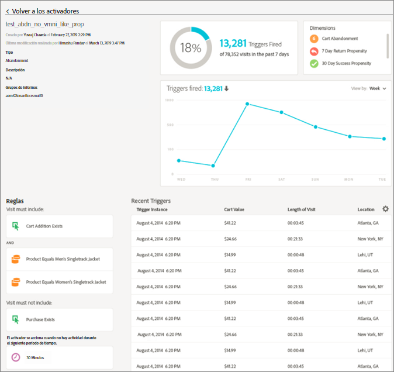
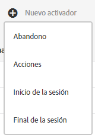
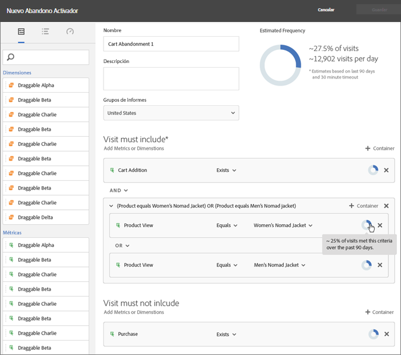
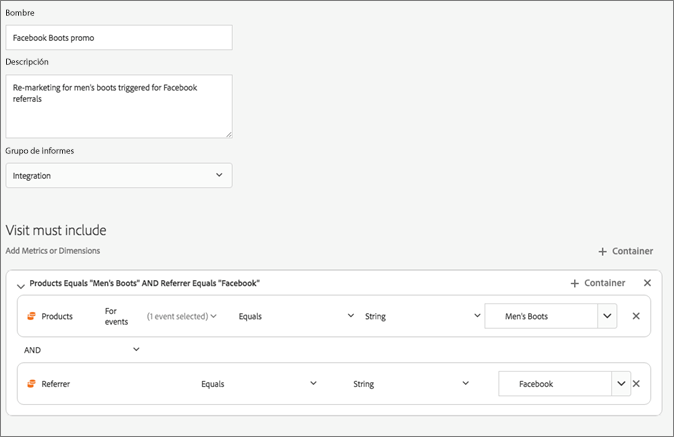

# Experience Cloud Triggers

Los [!UICONTROL Déclencheur] de Experience Cloud le permiten identificar, definir y supervisar los comportamientos clave de los clientes y generar comunicación entre las varias aplicaciones para volver a atraer visitantes. Puede usar Triggers en las decisiones en tiempo real y la personalización.

Por ejemplo:

* Configure el remarketing rápido para abandonos del carro de compras o abandonos del carro de compras con productos eliminados
* Formularios y aplicaciones incompletos
* Cualquier acción o secuencia de acciones en el sitio

>[!NOTE]
>
>Encontrará más información sobre el uso de [!UICONTROL Triggers] en [Campaign Standard](https://experienceleague.adobe.com/docs/campaign-standard/using/integrating-with-adobe-cloud/working-with-campaign-and-triggers/using-triggers-in-campaign.html).

## Tipos de déclencheur

Generalmente, un Trigger (activador) puede tardar entre 15 y 90 minutos en iniciar una campaña de marketing. Este periodo varía según la implementación de la recopilación de datos, la carga en el canal, la configuración personalizada del activador definido y el flujo de trabajo en Adobe Campaign.

* Abandono: puede crear un activador que se desencadene cuando un visitante vea un producto, pero no agregue nada al carro de compra.**&#x200B;**
* **Acción:** puede crear activadores, por ejemplo, para que se desencadenen después de que los usuarios se suscriban a un boletín, de una suscripción por correo electrónico o cuando se soliciten tarjetas de crédito (confirmaciones). Si tiene un comercio minorista, puede crear un activador para visitantes que se suscriben a un programa de lealtad. Si se dedica al sector de los medios de comunicación y el entretenimiento, cree activadores para visitantes que vean un determinado programa y que podrían estar interesados en responder a una encuesta.
* **Inicio y fin de sesión:** cree un activador para los eventos de inicio y fin de sesión.

## Crear un Trigger de Experience Cloud {#task_821F37183AC045E5AC8EED20317598FE}

Cree un activador y configure sus condiciones. Por ejemplo, puede especificar los criterios de las reglas de un activador durante una visita, por ejemplo, métricas como Abandonos del carro de compras, o dimensiones como el nombre del producto. Cuando se cumplen las reglas, se ejecuta el activador.

>[!NOTE]
>
>Actualmente, existe un límite técnico de 100 activadores.

1. En Experience Cloud, haga clic en  y, a continuación, haga clic en **[!UICONTROL Recopilación de datos/Launch]**.
2. En la tarjeta [!UICONTROL Triggers] haga clic en **[!UICONTROL Administrar activadores]**.
3. Haga clic en **[!UICONTROL Nuevo activador]** y después especifique el tipo de activador:

   

4. Configure el activador rellenando los siguientes campos y arrastrando métricas y dimensiones a los contenedores de la regla:

   | Elemento | Descripción |
   |--- |--- |
   | [!UICONTROL Nombre] | Nombre alternativo de este activador. |
   | [!UICONTROL Descripción] | Descripción de este activador, el uso que le dará, etc. |
   | [!UICONTROL Grupo de informes] | El [grupo de informes](https://experienceleague.adobe.com/docs/analytics/admin/manage-report-suites/report-suites-admin.html?lang=es) de Analytics utilizado para este activador (Trigger). Esta configuración identifica los datos de sistema de informes que se van a utilizar. |
   | La visita debe incluir La visita no debe incluir un activador sin una acción posterior Incluir metadatos | Puede definir criterios o comportamientos de los visitantes que quiera que se produzcan, así como comportamientos que no quiere que tengan lugar. Por ejemplo, las reglas de un activador sencillo de abandono del carro de compras podrían ser:<ul><li>La visita debe incluir: [!UICONTROL Adición al carro] (métrica) y [!UICONTROL Existe]. (Puede acotar aún más la regla con una vista de producto específica o con dimensiones como Tipos de explorador).</li><li>La visita no debe incluir: [!UICONTROL Cierre de compra].</li><li>Activar tras no realizar una acción durante: 10 minutos.</li><li>[!UICONTROL Include Meta Data]: permite agregar una dimensión de [!DNL Campaign] determinada o variables que resultan relevantes para el comportamiento de un visitante. Este campo puede resultar útil para que Adobe Campaign cree el mensaje de correo electrónico adecuado para remarketing.</li></ul> Puede especificar una lógica [!UICONTROL Cualquiera (Any)], [!UICONTROL Y (And)] u [!UICONTROL O (Or)] entre contenedores, según los criterios que determine para la regla. |
   | [!UICONTROL Contenedor] | [!UICONTROL Los contenedores] se encuentran en el lugar donde se establecen y almacenan las reglas, condiciones o filtros que definen un activador. Si quiere que haya eventos que tengan lugar al mismo tiempo, póngalos en el mismo contenedor. De este modo, cada contenedor procesa de forma independiente a nivel de visita. Por ejemplo, si tiene dos contenedores unidos por el operador AND, puede esperar que se activen las reglas cuando dos visitas cumplan los requisitos. |
   | Inicie una nueva sesión después | Cree un activador para los eventos de inicio y fin de sesión. |

   {style="table-layout:auto"}

5. Haga clic en **[!UICONTROL Guardar]**.
6. Utilice Triggers para [realizar remarketing en tiempo real](https://experienceleague.adobe.com/docs/campaign-standard/using/integrating-with-adobe-cloud/working-with-campaign-and-triggers/about-adobe-experience-cloud-triggers.html?lang=es) en [!DNL Adobe Campaign].

## Ejemplos de activadores

Ejemplos de Triggers de Experience Cloud:

### Déclencheur de abandono del carro

Por ejemplo, en la siguiente página se muestran reglas que podría usar para un activador de [!UICONTROL abandono del carro de compras] en función de los productos que se han visto durante una visita.

### Déclencheur de referente

El siguiente activador se desencadena cuando se produce una visita con el producto Botas para hombres y el referente de Facebook. Para que los dos criterios (*productos* y *referente*) se evalúen en la misma visita, se deben agregar al mismo contenedor.

