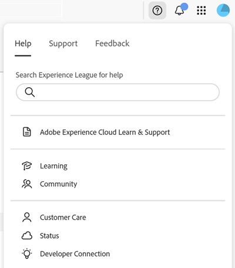

# Inicie sesión en Experience Cloud {#signin}

Inicie sesión y verifique que se encuentra en la [organización](organizations.md) correcta.

1. Vaya a [Adobe Experience Cloud](https://experience.adobe.com).
1. Escriba su dirección de correo electrónico de Adobe y seleccione **[!UICONTROL Continuar]**.

   Los administradores pueden consultar [Autenticación de usuario de Experience Cloud](admin-getting-started.md#migration) para ver las actualizaciones importantes de los tipos de identidad (ID empresarial).

1. Seleccione una cuenta.
1. Escriba la contraseña.
1. Verifique que se encuentra en la posición correcta [organización](organizations.md).

## Acceso a aplicaciones de Experience Cloud {#navigation}

Después de iniciar sesión en Experience Cloud, puede acceder rápidamente a todas sus aplicaciones, servicios y organizaciones desde el encabezado unificado.

Para acceder a las aplicaciones y servicios de Experience Cloud proporcionados por usted dentro de su organización, vaya al  del selector de aplicaciones.

## Compatibilidad con exploradores {#browser}

Para obtener el mejor rendimiento, Experience Cloud está optimizado para los exploradores más populares, incluida la versión más reciente, además de las dos versiones anteriores.

* Chrome
* Edge
* Firefox
* Opera
* Safari

Si el explorador no aparece en la lista, puede que sea compatible, pero se recomienda que utilice uno de los exploradores enumerados.

>[!NOTE]
>
>No todas las aplicaciones que se ejecutan en el dominio de Experience Cloud admiten todos los exploradores. Si no está seguro, consulte la documentación de la aplicación específica.

## Compatibilidad de idiomas {#languages}

Experience Cloud admite los idiomas preferidos para cada usuario, tal como se establecen en las preferencias de cuenta de usuario de Adobe. Actualmente se admiten los siguientes idiomas:

* Chino
* Inglés
* Francés
* Alemán
* Italiano
* Japonés
* Coreano
* Portugués
* Español
* Taiwanés

Aunque todos los equipos de aplicaciones están comprometidos con el soporte de idiomas global, no todas las aplicaciones se ofrecen en todos los idiomas mencionados anteriormente. Si el idioma principal no es compatible con una aplicación de Experience Cloud, también puede establecer un idioma secundario de forma predeterminada cuando corresponda. Esto se puede hacer en [preferencias de usuario de Experience Cloud](https://experience.adobe.com/preferences).

## Ayuda y asistencia {#support}

Acceda a aprendizaje y ayuda mediante el icono de Ayuda () del encabezado, que incluye contenido de ayuda (documentación, tutoriales y cursos) en [Experience League](https://experienceleague.adobe.com/?lang=es#home), así como recursos adicionales para aplicaciones individuales. También puede enviar comentarios abiertos y crear tickets de asistencia con prioridad.

El menú [!UICONTROL Ayuda] también le permite acceder a:

* **[!UICONTROL Asistencia técnica]:** Cree un ticket de asistencia o póngase en contacto con el [!UICONTROL Soporte técnico] mediante Twitter.
* **[!UICONTROL Comentarios]:** Comparta comentarios sobre su experiencia de Experience Cloud. Los comentarios se utilizan para mejorar los productos y servicios de Adobe.
* **[!UICONTROL Estado]:** Vaya a `https://status.adobe.com/experience_cloud` y compruebe el estado operativo del producto y [!UICONTROL Administrar suscripciones].
* **[!UICONTROL Developer Connection]:** Navegación hasta `adobe.io` y búsqueda de documentación para desarrolladores.