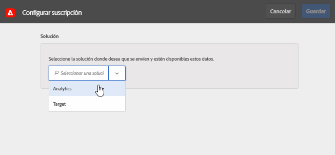

# Configuración de suscripciones en Experience Cloud

Obtenga más información sobre las fuentes de datos de soluciones y de la configuración de suscripciones. Las suscripciones habilitan el flujo de datos de atributos del cliente entre el Experience Cloud y las soluciones ([!DNL Analytics] y [!DNL Target]).

Por ejemplo, la suscripción de Adobe Analytics permite los datos de atributos en los informes. Si usa Adobe Target, puede cargar atributos del cliente para el direccionamiento y la segmentación.

**[!UICONTROL Origen de atributos del cliente]** > **[!UICONTROL Crear un nuevo origen de atributos del cliente]** > **[!UICONTROL Nuevo]**

| Elemento | Descripción |
|--- |--- |
| Solución | **Adobe Analytics**  Seleccione Analytics, especifique los grupos de informes sobre los que quiere recibir datos de atributos y los atributos que desea incluir. **Adobe Target**  Puede cargar atributos del cliente para el direccionamiento y la segmentación. Esta función es útil si desea direccionar una prueba basándose en los datos de atributos o hacer que los datos estén disponibles para la segmentación en Analytics. Los datos de atributos del cliente cargados para un visitante están disponibles al iniciarse la sesión, en **[!DNL Target]** > **Audiencias**. Es posible utilizar múltiples orígenes de datos. Cuando [configure ID de clientes](core-services.md) en su sitio web, compruebe que al menos uno de los alias esté suscrito a [!DNL Target]. |
| Grupo de informes (Analytics) | Los grupos de informes de Analytics. Como máximo puede agregar un total de 10 grupos de informes en suscripciones de Analytics desde un único origen de atributos. Al elegir qué grupos de informes incluir, tenga en cuenta las siguientes sugerencias:<ul><li>Elija grupos de informes que tengan un conjunto común de clientes autenticados. Si los clientes autenticados en un grupo de informes no se superponen con los clientes autenticados en otro grupo de informes, separe estos grupos de informes en diferentes fuentes de atributos.</li><li>Si es posible, los grupos de informes incluidos en un origen de atributos deben tener un volumen de tráfico similar.</li></ul> Si tiene más de 10 grupos de informes que tienen un conjunto de clientes autenticados en común, puede configurar orígenes de atributos del cliente adicionales, cada uno con hasta 10 grupos de informes. |
| Atributos para incluir (Analytics y [!DNL Target]) | Atributos que desea enviar a la solución.  Al configurar suscripciones y seleccionar atributos grupo de informes, aplican los límites siguientes _por grupos de informes_, según la solución:<ul><li>Foundation: 0</li><li>Select: 3</li><li>Prime: 15</li><li>Ultimate: 200</li><li>Standard: 3 en total</li><li>Premium: 200 por grupo de informes</li><li>[!DNL Target] Standard: 5</li><li>[!DNL Target] Premium: 200</li></ul> **Nota:** Cuando actualice a Analytics Premium, no podrá disponer de los atributos adicionales hasta haber transcurrido 24 horas. Durante este periodo, puede aparecer el error Máximas suscripciones a atributos. |
