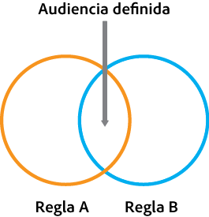
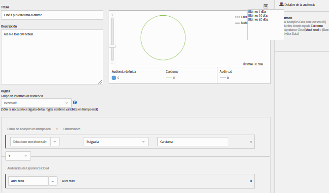
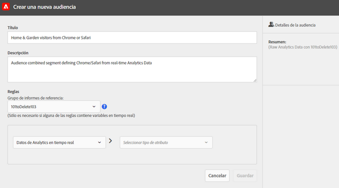
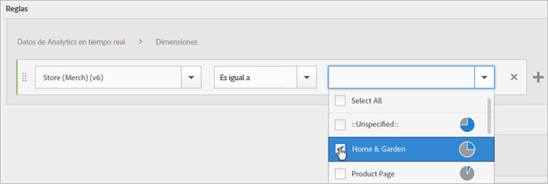
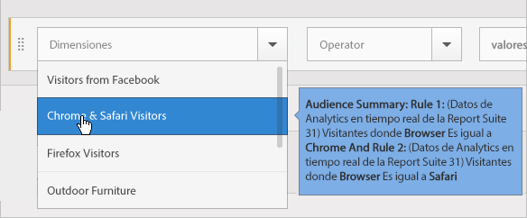
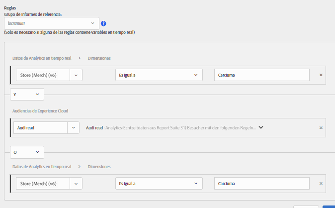
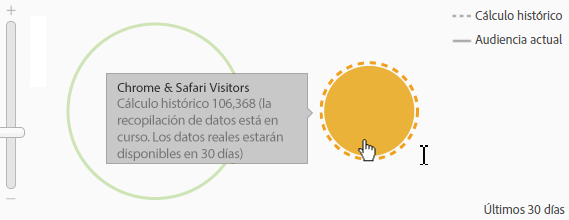

# Crear una audiencia

Obtenga información sobre cómo utilizar las reglas de atributos para crear una audiencia y definir una audiencia compuesta en Experience Cloud.

Este artículo le ayuda a lo siguiente:

* Crear una audiencia
* Crear una regla
* Usar reglas para definir una audiencia compuesta

El siguiente gráfico representa dos reglas en una audiencia compuesta.

Cada círculo representa una regla que define la pertenencia a la audiencia. Los Visitantes que se califican como miembros en ambas reglas de audiencia se superponen para convertirse en la audiencia compuesta y definida.

>[!NOTE]
>
>La audiencia está completamente definida tras la recopilación de datos una vez completado el periodo especificado.

El siguiente ejemplo muestra cómo crear las reglas para una audiencia compuesta. Esta audiencia está compuesta por:

* Sección Hogar y jardín derivada de datos de página o datos de análisis sin procesar.
* Usuarios de Chrome y Safari derivados de un segmento de [!DNL Adobe Analytics] [publicado](audience-library.md#task_32FEEFE0B32E4E388CD4D892D727282A) en [!DNL Experience Cloud].

   

**Para crear una audiencia**

1. En [!DNL Experience Cloud], en [!DNL Experience Platform], seleccione **[!UICONTROL Personas]** > **[!UICONTROL Biblioteca de audiencias].**
1. En la página [!UICONTROL Audiencias], seleccione **[!UICONTROL Nuevo]**. 

   

1. En la página [!UICONTROL Crear audiencia], especifique un título y una descripción.
1. Dentro de [!UICONTROL Reglas], seleccione una fuente de atributos:

   * **[!UICONTROL Datos de Real-Time Analytics:]** datos de atributo derivados de solicitudes de imagen de Real-Time Analytics; incluyen datos tales como eVars y eventos. Debe seleccionar un grupo de informes al utilizar este origen de atributos y definir la dimensión o el evento que se va a incluir. Esta selección de grupo de informes proporciona la estructura de variables utilizada por el grupo de informes.
   >[!NOTE]
   >
   >Debido al almacenamiento en caché, los grupos de informes que se eliminan en Analytics tardan 12 horas en desaparecer de Experience Cloud.

   * **[!UICONTROL Experience Cloud:]** datos de atributos derivados a partir de los orígenes de [!DNL Experience Cloud]. Por ejemplo, pueden ser datos de segmentos de audiencia creados en [!DNL Analytics] o datos de [!DNL Audience Manager].

1. Defina las reglas de audiencia y seleccione **[!UICONTROL Guardar].**

>[!NOTE]
>
>Le recomendamos que se informe sobre las variables de implementación para definir reglas de audiencia.

En [!UICONTROL Reglas], defina las selecciones de atributos de *`Home & Garden`*:

* **[!UICONTROL Fuente de atributos:]** Datos de Analytics sin procesar
* **[!UICONTROL Grupo de informes:]** Grupo de informes 31
* Dimensión = **[!UICONTROL Tienda (Merch) (v6)]** > **[!UICONTROL igual a]** > **[!UICONTROL Hogar y jardín]**

Los *Visitantes de Chrome y Safari* son un segmento de audiencia compartido desde Analytics:

* **[!UICONTROL Fuente de atributos:]** Experience Cloud
* **[!UICONTROL Dimensión:]** Visitantes de Chrome y Safari

Para comparar, podría añadir una regla *OR* para ver todos los visitantes de una sección del sitio como Patio y muebles.

La regla resultante es una audiencia definida que incluye a los usuarios de Chrome y Safari que visitaron la sección Hogar y jardín. El segmento Patio y muebles proporciona una perspectiva adicional de todos los visitantes que visitan esa sección del sitio.

* **Estimación histórica:** (Círculo con puntos) Representa reglas creadas según datos de [!DNL Analytics].
* **Audiencia real:** (Círculo sólido) cualquier regla creada que tenga 30 días de datos de Audience Manager. Cuando los datos de Audience Manager llegan a los 30 días, la línea se vuelve sólida y representa los números reales.

Una vez que la recopilación de datos se completa para el periodo especificado, los círculos se combinan para mostrar una audiencia definida.

Una vez guardada la audiencia, está disponible para otras aplicaciones. Por ejemplo, puede incluir una audiencia compartida en una actividad de Adobe Target.
