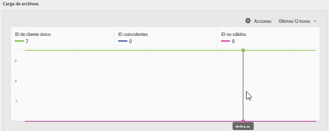
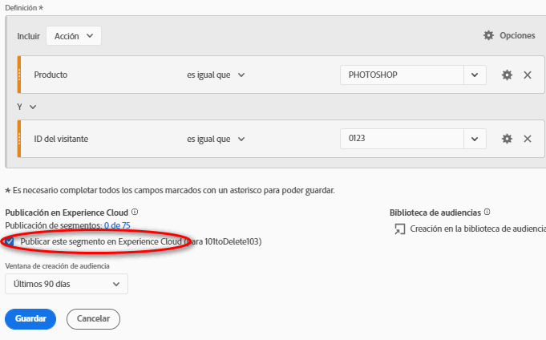
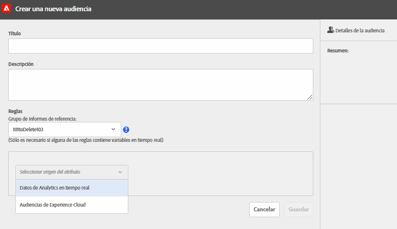

# Crear un origen de Atributo del cliente y cargar el archivo de datos

Crear un origen de atributos del cliente (archivos CSV y FIN) y cargar los datos. Puede activar el origen de los datos cuando esté preparado. Una vez que esté listo el origen de los datos, comparta los datos del atributo con Analytics y Target.

## Flujo de trabajo de atributos del cliente {#concept_BF0AF88E9EF841219ED4D10754CD7154}


1. [Crear un archivo de datos](t-crs-usecase.md#task_B5FB8C0649374C7A94C45DCF2878EA1A)
1. [Crear un origen de atributos y cargar el archivo de datos](t-crs-usecase.md#task_09DAC0F2B76141E491721C1E679AABC8)
1. [Validar el esquema](t-crs-usecase.md#task_09DAC0F2B76141E491721C1E679AABC8)
1. [Configurar suscripciones y activar el origen de atributos](t-crs-usecase.md#task_1ACA21198F0E46A897A320C244DFF6EA)

Una vez que la fuente de datos esté activa, podrá hacer lo siguiente:

* [Uso de los Atributos del cliente en Adobe Analytics](t-crs-usecase.md#task_7EB0680540CE4B65911B2C779210915D)
* [Uso de los Atributos del cliente en Adobe Target](t-crs-usecase.md#task_FC5F9D9059114027B62DB9B1C7D9E257)

>[!IMPORTANT]
>
>Para acceder a esta función, los usuarios deben estar asignados al perfil de producto Atributos del cliente (Atributos del cliente: Acceso predeterminado. Vaya a **[!UICONTROL Administración]** > **[!UICONTROL Admin Console]** > **[!UICONTROL Productos]**. Si *Atributos del cliente* se muestra como uno de los [!UICONTROL Perfiles de producto], está listo para empezar. Los usuarios que se agregan al grupo Atributos del cliente ven el menú [!UICONTROL Atributos del cliente] a la izquierda de la interfaz de Experience Cloud.
>
>Para usar la función Atributos del cliente, los usuarios también deben pertenecer a grupos de nivel de aplicación (Analytics o [!DNL Target]).

Consulte [Administración de usuarios y productos de Experience Cloud](admin-getting-started.md#task_3295A85536BF48899A1AB40D207E77E9).

## Crear un archivo de datos {#task_B5FB8C0649374C7A94C45DCF2878EA1A}

Estos datos son datos de clientes empresariales de su CRM. Los datos pueden incluir datos de suscriptores sobre productos, incluidos los ID de miembro, productos destacados, productos más utilizados, etc.

1. Cree un `.csv`.

   >[!NOTE]
   >
   >Cuando avance en este proceso podrá arrastrar y soltar el archivo `.csv` para subirlo. Sin embargo, si [lo sube a través de un FTP](t-upload-attributes-ftp.md#task_591C3B6733424718A62453D2F8ADF73B), también necesitará un archivo `.fin` con el mismo nombre que el `.csv`.

   Archivo de datos de cliente empresarial de muestra:

   

1. Antes de continuar, revise la información relevante en los [Requisitos del archivo de datos](crs-data-file.md#concept_DE908F362DF24172BFEF48E1797DAF19) antes de cargar el archivo.
1. [Cree un origen de atributos del cliente y cargue los datos](t-crs-usecase.md#task_BCC327B2A0EF4A1BBB2934013AB92B78), como se describe a continuación.

## Crear un origen de atributos y cargar el archivo de datos {#task_09DAC0F2B76141E491721C1E679AABC8}

Siga estos pasos en la página Crear nuevo origen de atributos del cliente en Experience Cloud.

>[!IMPORTANT]
>
>Al crear, modificar o eliminar orígenes de atributos del cliente, se produce un retraso de hasta una hora antes de que los identificadores empiecen a sincronizarse con la nueva fuente de datos. Debe tener derechos administrativos en Audience Manager para crear o modificar orígenes de atributos del cliente. Póngase en contacto con el servicio de atención al cliente o con la consultoría de Audience Manager para obtener derechos administrativos.

1. En [!DNL Experience Cloud], seleccione el icono Menú .
1. En **[!DNL Experience Platform]**, seleccione **[!UICONTROL Personas]** > **[!UICONTROL Atributos del cliente]**.

   En la página [!UICONTROL Atributos del cliente] se gestionan y editan los orígenes de datos de atributos existentes.

   
1. Seleccione **[!UICONTROL Nuevo]**.

   
1. En la página [!UICONTROL Editar origen de atributos del cliente], configure los siguientes campos:

   * **[!UICONTROL Nombre:]** Un nombre descriptivo para el origen de atributos de datos. Para [!DNL Adobe Target], los nombres de atributos no pueden incluir espacios. Si pasa un atributo con un espacio, [!DNL Target] lo ignorará. Otros caracteres que no se admiten son: `< , >, ', "`.

   * **[!UICONTROL Descripción:]** (Opcional) Descripción del origen del atributo de datos.

   * **[!UICONTROL ID de alias:]** Representa una fuente de datos de atributos del cliente, como un sistema CRM específico, por ejemplo. El [!UICONTROL ID de alias] es un ID único en su código de origen de atributos del cliente. El ID debe ser único, en minúsculas y sin espacios. El valor introducido en el campo [!UICONTROL ID de alias] para un origen de atributos del cliente en Experience Cloud debe coincidir con los valores que se pasan desde la implementación (ya sea mediante Recopilación de datos (Launch), Dynamic Tag Management o JavaScript del SDK móvil).

      El ID de alias corresponde a ciertas áreas en las que se configuran valores de ID de cliente adicionales. Por ejemplo:

      * **Dynamic Tag Management:** El ID de alias corresponde al valor del *código de integración* en [!UICONTROL Configuración de cliente], en la herramienta [Servicio de Experience Cloud ID](https://experienceleague.adobe.com/docs/experience-platform/tags/home.html?lang=es).

      * **API de Visitante:** El ID de alias corresponde a los [ID de cliente](https://experienceleague.adobe.com/docs/id-service/using/reference/authenticated-state.html?lang=es) adicionales que pueden asociar con cada visitante.

         Por ejemplo, *&quot;crm_id&quot;* en:

         ```
         "crm_id":"67312378756723456"
         ```

      * **iOS:** El ID de alias corresponde a *“idType”* en [visitorSyncIdentifiers:identifiers](https://experienceleague.adobe.com/docs/mobile-services/ios/overview.html?lang=es).

         Por ejemplo:

         `[ADBMobile visitorSyncIdentifiers:@{@<`**`"idType"`**`:@"idValue"}];`

      * **Android™:** El ID de alias corresponde a *“idType”* en [syncIdentifiers](https://experienceleague.adobe.com/docs/mobile-services/android/overview.html?lang=es).

         Por ejemplo:

         `identifiers.put(`**`"idType"`**`, "idValue");`

         Consulte [Aprovechamiento de varias fuentes de datos](crs-data-file.md#section_76DEB6001C614F4DB8BCC3E5D05088CB) para obtener información adicional sobre el procesamiento de datos con relación al campo ID de alias e ID de cliente.
   * **[!UICONTROL Cargar archivos:]** Puede arrastrar y soltar el archivo de datos `.csv` o cargar los datos a través de un FTP. (Si utiliza un FTP también se requiere un archivo `.fin`). Consulte [Cargar los datos mediante FTP](t-upload-attributes-ftp.md#task_591C3B6733424718A62453D2F8ADF73B).

      >[!IMPORTANT]
      >
      >Existen requisitos específicos para los archivos de datos. Consulte los [Requisitos de archivos de datos](crs-data-file.md#concept_DE908F362DF24172BFEF48E1797DAF19) para obtener más información.


      Después de cargar el archivo, los datos de la tabla se muestran en el encabezado [!UICONTROL Carga de archivos] de esta página. Puede validar el esquema, configurar suscripciones o configurar el FTP.

      **Gráfico de carga de archivos**

      

   * **[!UICONTROL ID de cliente único:]** Muestra cuántos ID únicos ha cargado en este origen de atributos.

   * **[!UICONTROL ID proporcionados por el cliente asociados a ID de visitante de Experience Cloud:]** Muestra cuántos ID se han asociado a los ID de visitante de Experience Cloud.

   * **[!UICONTROL ID proporcionados por el cliente con muchos alias:]** Muestra el recuento de ID proporcionados por el cliente con 500 o más ID de visitante de Experience Cloud asociados. Es muy probable que estos ID proporcionados por el cliente no representen a individuos sino algún tipo de inicio de sesión compartido. El sistema distribuye los atributos asociados con estos ID a los 500 ID de visitante de Experience Cloud con alias creados más recientemente, hasta que el recuento alcanza los 10 000. En este momento, el sistema invalida el ID proporcionado por el cliente y ya no puede distribuir los atributos asociados.


## Validar el esquema {#task_404AAC411B0D4E129AB3AC8B7BE85859}

El proceso de validación le permite asignar nombres para mostrar y descripciones en atributos cargados (cadenas, números enteros, números y demás). También puede eliminar atributos actualizando el esquema.

Consulte [Validar el esquema](validate-schema.md#concept_B3A01A15D04E4F998118E09B3A9B5043).

Para eliminar atributos, consulte [(Opcional) Actualizar el esquema (elimina los atributos)](t-crs-usecase.md#task_6568898BB7C44A42ABFB86532B89063C).

## (Opcional) Actualizar el esquema (elimina los atributos) {#task_6568898BB7C44A42ABFB86532B89063C}

Eliminar y reemplazar atributos en el esquema.

1. En la página [!UICONTROL Editar origen de atributos del cliente], elimine la suscripción de **[!UICONTROL Target]** o **[!UICONTROL Analytics]** (en [!UICONTROL Configurar suscripciones]).
1. [Cargue un nuevo archivo de datos con campos actualizados](t-crs-usecase.md#task_09DAC0F2B76141E491721C1E679AABC8).

## Configurar suscripciones y activar el origen de atributos {#task_1ACA21198F0E46A897A320C244DFF6EA}

La configuración de una suscripción configura el flujo de datos entre Experience Cloud y las aplicaciones. La activación del origen de atributos permite que los datos fluyan a las aplicaciones suscritas. Los registros de cliente que ha cargado coinciden con las señales de ID entrantes de su sitio web o aplicación.

Consulte [Configurar suscripciones](subscription.md#concept_ECA3C44FA6D540C89CC04BA3C49E63BF).

**Para activar un origen de atributos**

En la página [!UICONTROL Crear nuevo [o Editar] origen de atributos del cliente], busque el encabezado [!UICONTROL Activar] y luego haga clic en **[!UICONTROL Activo]**.


## Uso de los Atributos del cliente en Adobe Analytics {#task_7EB0680540CE4B65911B2C779210915D}

Ahora que los datos están disponibles en aplicaciones como Adobe Analytics, puede informar sobre los datos, analizarlos y tomar las medidas adecuadas en sus campañas de marketing.

El ejemplo siguiente muestra un segmento de [!DNL Analytics] basado en los atributos cargados. El segmento muestra los suscriptores de [!DNL Photoshop Lightroom] cuyo producto más utilizado sea Photoshop.



Cuando publica un segmento en Experience Cloud, pasa a estar disponible en las Audiencias de Experience Cloud y en Audience Manager.

## Uso de los Atributos del cliente en Adobe Target {#task_FC5F9D9059114027B62DB9B1C7D9E257}

En [!DNL Target], puede seleccionar un atributo del cliente en la sección [!UICONTROL Perfil del visitante] cuando cree una audiencia. Todos los atributos del cliente tienen el prefijo `crs.` en la lista. Combine estos atributos según sea necesario con otros atributos de datos para crear audiencias.



Consulte [Creación de una nueva audiencia](https://experienceleague.adobe.com/docs/target/using/audiences/create-audiences/audiences.html?lang=es) en la ayuda de [!DNL Target].
