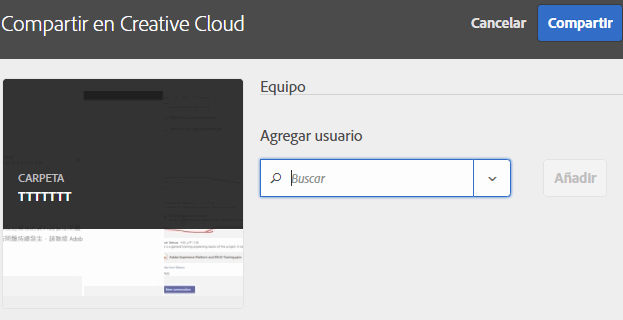

# Uso compartido de una carpeta de recursos de Experience Cloud

Comparta una carpeta de recursos de Experience Cloud con usuarios de Creative Cloud.

1. En una carpeta de recursos, seleccione **[!UICONTROL Compartir en Creative Cloud]**.

   
1. En la página Compartir en Creative Cloud, seleccione un usuario y, a continuación, **[!UICONTROL Añadir]**.

   

1. Seleccione **[!UICONTROL Compartir]**.
1. Inicie la versión local de [!DNL Creative Cloud] (o vaya a la página [!UICONTROL Creative Cloud Files] desde un explorador) y busque la notificación de solicitud.

   
1. Abra la solicitud y seleccione **[!UICONTROL Aceptar]**.

   
1. Para acceder a los contenidos de la carpeta, seleccione **[!UICONTROL Abrir carpeta]** (o **[!UICONTROL Ver en la web]**).

   
1. Siga agregando comentarios en el recurso compartido:

   En Creative Cloud, puede seleccionar en una imagen y, a continuación, seleccionar **[!UICONTROL Actividad]** para añadir un comentario en la imagen. Los comentarios se sincronizan con los recursos en [!DNL Creative Cloud] y en [!DNL Experience Cloud].

   

   En Experience Cloud, seleccione en una imagen y, a continuación, seleccione el icono de cronología para añadir un comentario a la imagen. Los comentarios se sincronizan con los recursos de Creative Cloud y Experience Cloud.

   

1. Para anular el uso compartido de una carpeta, seleccione **[!UICONTROL Compartir usando Creative Cloud]** (similar al [Paso 3](t-share-creative-cloud.md#step_BA17CFA185284641A9B878BA29551996)), quite usuarios con la X, y por último, seleccione **[!UICONTROL Compartir]**.

Una vez que haya eliminado todos los usuarios de Creative Cloud, la carpeta deja de compartirse y los usuarios de Creative Cloud ya no tendrán acceso a ella.

Otras formas de utilizar un recurso compartido:

* Utilizar recursos en el [!UICONTROL Selector de recursos] en [!DNL Adobe Social] para publicaciones sociales.
* Cargue o intercambie recursos de la [biblioteca de ofertas](https://experienceleague.adobe.com/docs/target/using/experiences/offers/manage-content.html?lang=es) en [!DNL Adobe Target] para imágenes en las actividades.

Después de compartir una carpeta con Creative Cloud, verá en la misma el logotipo de Creative Cloud.

Ayuda relacionada:

* [Ayuda de Creative Cloud: Gestionar y sincronizar archivos](https://helpx.adobe.com/es/creative-cloud/help/sync-creative-cloud-files.html)
* [Ayuda de Creative Cloud: Colaborar con otros usuarios](https://helpx.adobe.com/es/creative-cloud/help/collaboration.html)
* [Ayuda de Creative Cloud: Preguntas frecuentes sobre colaboración](https://helpx.adobe.com/es/creative-cloud/help/collaboration-faq.html)
